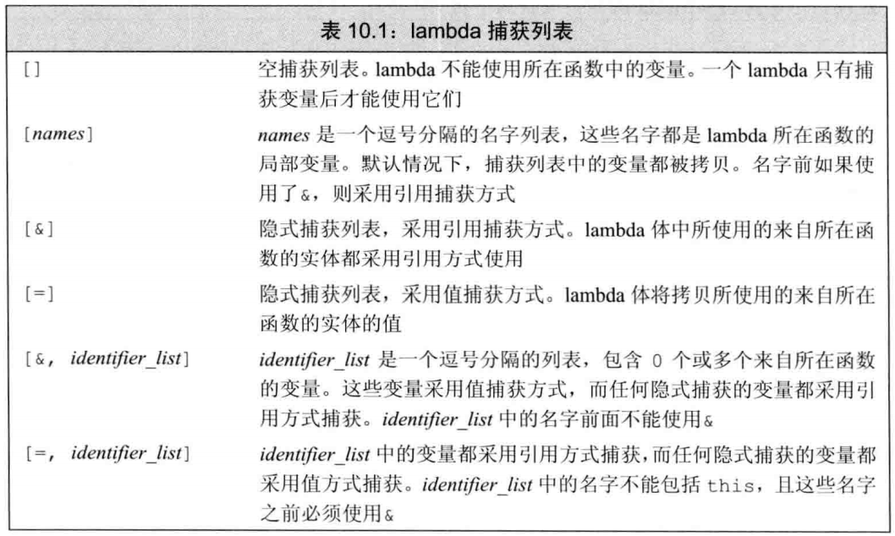

# **C-Plus-Plus**

<br>

- [**C-Plus-Plus**](#c-plus-plus)
  - [**STL**](#stl)
    - [STL 组成](#stl-组成)
    - [序列式容器](#序列式容器)
    - [关联式容器](#关联式容器)
    - [STL是线程安全的吗](#stl是线程安全的吗)
    - [list和vector有什么区别](#list和vector有什么区别)
    - [push_back和emplace_back 区别](#push_back和emplace_back-区别)
    - [STL:vector中remove和erase区别](#stlvector中remove和erase区别)
  - [**C++**](#c)
    - [多继承与多重继承？](#多继承与多重继承)
    - [C++ 什么类不能被继承？:bookmark:](#c-什么类不能被继承bookmark)
    - [多态 ？:bookmark:](#多态-bookmark)
    - [哪些函数不能定义为虚函数？](#哪些函数不能定义为虚函数)
    - [虚函数与虚函数表？](#虚函数与虚函数表)
    - [为什么析构函数必须是虚函数？C++ 默认析构函数不是虚函数？](#为什么析构函数必须是虚函数c-默认析构函数不是虚函数)
    - [使用 new 和 delete 管理动态内存常见问题](#使用-new-和-delete-管理动态内存常见问题)
    - [内存泄漏检测工具](#内存泄漏检测工具)
    - [野指针？](#野指针)
    - [深拷贝与浅拷贝？零拷贝？](#深拷贝与浅拷贝零拷贝)
    - [什么时候栈溢出？](#什么时候栈溢出)
    - [哈希表，散列函数？哈希冲突解决办法？](#哈希表散列函数哈希冲突解决办法)
    - [为什么类模板的声明和定义要放在一起](#为什么类模板的声明和定义要放在一起)
    - [C++ 中哪些运算符不能重载](#c-中哪些运算符不能重载)
    - [explict 关键词的作用](#explict-关键词的作用)
    - [restrict 关键词的作用](#restrict-关键词的作用)
  - [**C++_11 新特性**](#c_11-新特性)
    - [final 关键词](#final-关键词)
    - [override 关键词](#override-关键词)
    - [=dafult](#dafult)
    - [=delete](#delete)
    - [auto](#auto)
    - [auto 与 decltype 的区别](#auto-与-decltype-的区别)
    - [explicit关键字](#explicit关键字)
    - [Lambda 函数(匿名函数)？](#lambda-函数匿名函数)
    - [using 定义别名](#using-定义别名)
  - [**编译与底层**](#编译与底层)
    - [源文件从文本到可执行文件所经历の过程？](#源文件从文本到可执行文件所经历の过程)
    - [C++ 内存管理是咋样的？](#c-内存管理是咋样的)
    - [堆与栈の区别？](#堆与栈の区别)
    - [为什么要内存对齐](#为什么要内存对齐)
    - [struct内存对齐方式](#struct内存对齐方式)
    - [头文件中的 ifndef/define/endif 是干什么用的，该用法和 program once 的区别](#头文件中的-ifndefdefineendif-是干什么用的该用法和-program-once-的区别)
    - [当i是一个整数的时候++i和i++那个更快，区别](#当i是一个整数的时候i和i那个更快区别)


<br>


## **STL**

---

### STL 组成

* **容器、迭代器、仿函数、算法、分配器、配接器** 
* **容器（Containers）**：各种数据结构，如：序列式容器vector、list、deque、关联式容器set、map、multiset、multimap。用来存放数据。从实现的角度来看，STL容器是一种class template。
  
* **算法（algorithms）**：各种常用算法，如：sort、search、copy、erase。从实现的角度来看，STL算法是一种 function template。注意一个问题：任何的一个STL算法，都需要获得由一对迭代器所标示的区间，用来表示操作范围。这一对迭代器所标示的区间都是前闭后开区间，例如[first, last)

* **迭代器（iterators）**：容器与算法之间的胶合剂，是所谓的“泛型指针”。共有五种类型，以及其他衍生变化。从实现的角度来看，迭代器是一种将 operator * 、operator->、operator++、operator- - 等指针相关操作进行重载的class template。所有STL容器都有自己专属的迭代器，只有容器本身才知道如何遍历自己的元素。原生指针(native pointer)也是一种迭代器。

* **仿函数（functors）**：行为类似函数，可作为算法的某种策略（policy）。从实现的角度来看，仿函数是一种重载了operator()的class或class template。一般的函数指针也可视为狭义的仿函数。

* **配接器（adapters）**：一种用来修饰容器、仿函数、迭代器接口的东西。例如：STL提供的queue 和 stack，虽然看似容器，但其实只能算是一种容器配接器，因为它们的底部完全借助deque，所有操作都由底层的deque供应。改变 functors接口者，称为function adapter；改变 container 接口者，称为container adapter；改变iterator接口者，称为iterator adapter。

* **配置器（allocators）**：负责空间配置与管理。从实现的角度来看，配置器是一个实现了动态空间配置、空间管理、空间释放的class template。

 > 这六大组件的交互关系：container（容器） 通过 allocator（配置器） 取得数据储存空间，algorithm（算法）通过 iterator（迭代器）存取 container（容器） 内容，functor（仿函数） 可以协助 algorithm（算法） 完成不同的策略变化，adapter（配接器） 可以修饰或套接 functor（仿函数）

---

### 序列式容器

* vector，数组，元素不够时再重新分配内存，拷贝原来数组的元素到新分配的数组中。
* list，单链表。 
* deque，分配中央控制器map(并非map容器)，map记录着一系列的固定长度的数组的地址.记住这个map仅仅保存的是数组的地址,真正的数据在数组中存放着.deque先从map中央的位置(因为双向队列，前后都可以插入元素)找到一个数组地址，向该数组中放入数据，数组不够时继续在map中找空闲的数组来存数据。当map也不够时重新分配内存当作新的map,把原来map中的内容copy的新map中。所以使用deque的复杂度要大于vector，尽量使用vector。
* stack，基于deque；queue-基于deque。heap-完全二叉树，使用最大堆排序，以数组(vector)的形式存放。 priority_queue-基于heap。 slist-双向链表。

--- 

### 关联式容器
* set,map,multiset,multimap - 基于红黑树(RB-tree)，一种加上了额外平衡条件的二叉搜索树。
* hash_map,hash_set,hash_multiset,hash_multimap-基于hashtable。
* hash table-散列表。将待存数据的key经过映射函数变成一个数组(一般是vector)的索引，例如：数据的key%数组的大小＝数组的索引(一般文本通过算法也可以转换为数字)，然后将数据当作此索引的数组元素。有些数据的key经过算法的转换可能是同一个数组的索引值(碰撞问题，可以用线性探测，二次探测来解决)，STL是用开链的方法来解决的，每一个数组的元素维护一个list，他把相同索引值的数据存入一个list，这样当list比较短时执行删除，插入，搜索等算法比较快。

---

### STL是线程安全的吗
STL不是线程安全的；

线程安全情况：
* 多个读取者是安全的；多个线程同时读取一个容器的内容，这将正确的执行；在读取时不能有任何写入者操作这个容器；
* 对于不同容器的多个写入者是安全的；多线程可以同时写不同的容器；

线程不安全的情况：
* 在对同一个容器进行多线程的读写、写操作时；
* 在每次调用容器的成员函数期间都要锁定该容器。
* 在每个容器返回的迭代器（例如通过调用begin或end）的生存期之内都要锁定该容器。
* 在每个在容器上调用的算法执行期间锁定该容器。

---

### list和vector有什么区别
vector拥有一段连续的内存空间，因此支持随机存取，如果需要高效的随即存取，而不在乎插入和删除的效率，使用vector。 list拥有一段不连续的内存空间，因此不支持随机存取，如果需要大量的插入和删除，而不关心随即存取，则应使用list。

---

### push_back和emplace_back 区别
* 使用 push_back 函数往容器中添加新元素时，必须要有一个该对象的实例才行；
* 而 emplace_back 函数不需要，可以直接传入对象的构造函数进行构造，减少一次拷贝和赋值操作；

---
### STL:vector中remove和erase区别
vector中的remove的作用是将等于value的元素放到vector的尾部，但并不减少vector的size；

vector中erase的作用是删除掉某个位置position或一段区域（begin, end)中的元素，减少其size；

## **C++**

---
### 多继承与多重继承？
多继承：指一个子类同时继承多个父类；默认继承方式为 `private` ，也可以指定其继承方式；
* 在多继承中，任何父类的指针都可以指向子类的对象，在实例化子类时，先根据继承的顺序依次调用父类的构造函数，然后再调用该子类自己的构造函数；
* 销毁基类对象时，**如果析构函数不是虚函数**，且该基类的继承顺序在第一个，那么 delete 基类只会调用父类析构函数；但是如果不是第一位，那么就会出现内存泄漏；**如果虚构函数时虚函数**，先调用子类析构函数再调用所有父类析构函数；

多重继承：当B类从A类派生，C类从B类派生，此时称为多重继承；
* 当实例化子类时，会首先依次调用所有基类的构造函数，最后调用该子类的构造函数；销毁该子类时，则相反，先调用该子类的析构函数，再依次调用所有基类的析构函数。
* 无论继承的层级有多少层，只要它们保持着直接或间接的继承关系，那么子类都可以与其直接父类或间接父类构成 `is a` 的关系，并且能够通过父类的指针对直接子类或间接子类进行相应的操作，子类对象可以给直接父类或间接父类的对象或引用赋值或初始化。

**扩展：** 菱形继承？[:notebook:](Cpp.md)


---
### C++ 什么类不能被继承？[:bookmark:](https://blog.csdn.net/qq_34796146/article/details/108065409)
* 将自身的构造函数与析构函数放在private作用域内；
* 将自身作为一个已存在类的友元类
  - 利用友元的特性：友元不能被继承。
  - 什么是友元不能被继承性呢？利用了虚继承的一个特征就是虚基类的构造函数由最终子类负责构造。
* 使用 C++11 新特性 `final` 

---
### 多态 ？[:bookmark:](https://blog.csdn.net/qq_39412582/article/details/81628254?utm_medium=distribute.pc_relevant.none-task-blog-2%7Edefault%7EBlogCommendFromMachineLearnPai2%7Edefault-1.withoutpai&depth_1-utm_source=distribute.pc_relevant.none-task-blog-2%7Edefault%7EBlogCommendFromMachineLearnPai2%7Edefault-1.withoutpai)
* 多态分为 **静态多态** 和 **动态多态**
* **静态多态：**
  - **重载** 和 **泛型编程** ，在编译的时候就已经确定；

* **动态多态：**
  - 用 **虚函数** 机制实现，在运行期间动态绑定；
  
> 纯虚函数一定需要被继承；<br>
> 包含纯虚函数的类叫做抽象类（也叫接口类），抽象类不能实例化出对象；纯虚函数在派生类中重新定义以后，派生类才能实例化出对象；
> 
> 动态多态的条件：
> * 基类中必须包含**虚函数**，并且派生类中一定要对基类中的虚函数进行**重写**。
> * 通过基类对象的指针或者引用调用虚函数。<br>
> 
> 有虚函数的类中，类的最开始一部分是一个虚函数表的指针，表中存放的是虚函数的地址，实际的虚函数在代码段 ( `.text` 段 )


---
### 哪些函数不能定义为虚函数？

* **虚函数：**
1. 友元函数，它不是类的成员函数
2. 全局函数
3. 静态成员函数，它没有this指针
4. 构造函数，拷贝构造函数，以及赋值运算符重载（可以但是一般不建议作为虚函数）


---
### 虚函数与虚函数表？


---
### 为什么析构函数必须是虚函数？C++ 默认析构函数不是虚函数？
* 可能被继承的父类的析构函数设置为虚函数，当 new 一个子类时，使用基类指针指向该子类对象，释放基类指针时可以释放掉子类的空间，防止内存泄漏；
* 虚函数的虚函数表和虚表指针需要额外的内存，对于不被继承的类，其析构函数是虚函数就会浪费内存；需要当作父类时，析构函数可以设置虚函数；

---
### 使用 new 和 delete 管理动态内存常见问题
* 忘记 delete 内存；导致“内存泄漏”问题，泄漏的内存永远不可能被归还给自由空间；排查内存泄漏错误时非常困难的；
* 使用已经释放掉的对象；
* 同一块内存重复释放；

  使用智能指针，就可以避免这些问题；

---
### 内存泄漏检测工具
* valgrind
* mtrance

---
### 野指针？


---
### 深拷贝与浅拷贝？零拷贝？
* **深拷贝：** 深拷贝会另外创造一个一模一样的对象，新对象跟原对象不共享内存，修改新对象不会改到原对象。
* **浅拷贝：** 浅拷贝只复制指向某个对象的指针，而不复制对象本身，新旧对象还是共享同一块内存。
  - 容易出现重复释放的问题，解决办法就是采用深拷贝；
* **零拷贝：** 进程之间进行通信时采取共享内存的方式，这个时候取数据就是零拷贝；

---
### 什么时候栈溢出？
**栈溢出** 是指程序向栈中某个变量写入的字节数超过了这个变量本身所申请的字节数，因此导致栈中与其相邻的变量的值被改变；

栈溢出的原因：
* 局部数组过大：当函数内部的数组过大时，有可能导致堆栈溢出，局部变量存储在栈上；
  - 解决办法：增大栈空间；改用动态分配，代替栈使用堆；
* 递归调用层数太多；
* 指针或者数组越界；

---
### 哈希表，散列函数？哈希冲突解决办法？
散列函数：
* 除余法，就是对数进行取模运算；`h(k) = (k mod p) mod Tsize (p 是一个大于 Tsize 的素数)`
* 折叠法，将关键字分割为几个部分，这些部分组合或者折叠在一起，并且以某种特定的方式进行转换，以产生目标地址；（位移折叠 ^ 异或运算、边界折叠）
* 平方取中法，关键字被平方后，取中间部分作为地址，如果关键字时字符串，需要预先处理产生数字；
* 提取法，使用一部分关键字来计算地址；
* 基数转换法，将关键字 K 转换为另一种数字基数，就像是进制转换，然后对 Tsize 取模；

**哈希冲突：**
* 开放定址法，插入一个元素时，想通过哈希进行判断，如果发生哈希冲突，就以当前地址为基址，根据再寻址方法去寻找下一个地址；
  - 线性探查、二次探查、伪随机探测
* 链地址法；哈希值相同的通过链表进行存贮；
* 再哈希法；使用另一个哈希函数计算地址；
* 公共溢出区，采用一个溢出表存储发生冲突的关键字；

---
### 为什么类模板的声明和定义要放在一起
如果.h文件中声明，在.cpp文件中具体实现；
* 编译能够通过，参与编译的只是.cpp文件，因为可以在.h 文件中找到模板的声明；
* 链接错误，链接的时候需要实例化模板，这个时候就要找到模板的具体实现；假设在main函数中调用了一个函数模板，这时候就需要去实例化这个类型的模板，但是在main函数中只包含了.h文件，并没有具体实现，所以就会报错；在.cpp文件中，虽然有实现，但是在该文件中没有调用这个模板函数，也就不会生成一个具体化的实例；

**解决方案：**
* 将模板实现写在.h文件中；

### C++ 中哪些运算符不能重载
5个运算符`.`，`?:`、`sizeof`、`::`、`*`；

### explict 关键词的作用
* 与构造函数一起使用，explict 指明构造函数只能显式使用，目的是为了防止不必要的隐式调用类型转换构造函数；

### restrict 关键词的作用
* 只能修饰指针，restrict 修饰的指针是能够访问所指区域的唯一入口，限制多个指针指向同一地址；


<br>

## **C++_11 新特性**

---
### final 关键词
* final 关键词修饰一个类，这个类不允许被继承；final 关键词要写在类名的后面；
* 阻止一个虚函数的重写；

---
### override 关键词
* 加入这个关键词，编译器回在编译阶段做相应的检查，如果其父类不存在相同签名格式的类方法，编译器就会给出相应的错误提示；

---
### =dafult 
* 最大的作用就是在开发过程中简化了构造函数中没有实际初始化代码的写法，尤其是声明和实现分别属于 .h 和 .cpp 文件；

---
### =delete
* 如果我们想让一个类不能被拷贝，即不能调用其拷贝构造函数，则可以将拷贝构造函数和 operator= 函数定义为 private 的；
* =delete 语法就可以直接实现这个功能；

```cpp
class A {
public:
  A() = default;
  ~A() = default;
public:
  A(const A& a) = delete;
  A& operator= (const A& a) = delete;
};
```

---
### auto
* 编译根据右值的类型推导左值的数据类型；
* 在实际开发中，一般用于让编译器自动推导一些复杂的模板数据类型；
* 定义为一个auto序列的变量必须始终推导为同一类型；
* 如果初始化表达式为引用，则去除引用语义；
* 函数或者模板参数不能被声明为auto；

```cpp
for(auto iter = map0.begin(); iter != map0.end(); ++iter) {
  std::cout << iter->second << std::endl;
}
```

---
### auto 与 decltype 的区别

decltype 和 auto 的功能一样，都用来在编译时期进行自动类型推导；不同的是auto并不适用于所有的自动类型推导场景，所以引入decltype关键字；

```cpp
auto varname = value;
decltype(exp) varname = value;
```
其中，varname表示变量名，value表示赋给变量的值，exp表示一个表达式；
* auto根据=号右边的初始值value推导出变量的类型；auto要求变量必须初始化；
* decltype根据exp表达式推导出变量的类型，跟=右边的value没有关系；decltype不要求初始化；

---
### explicit关键字
explicit，阻止构造函数进行隐式转换；

在C++中，单参数或者除了第一个参数外其余参数都有默认值的多参构造函数，会发生隐式转换；

> 注意：当类的声明和定义分别在两个文件中时，explicit只能写在在声明中，不能写在定义中。

---
### Lambda 函数(匿名函数)？
[文章链接:notebook:](https://www.cnblogs.com/lidabo/p/3908663.html) 

优点：仅在调用时才临时创建函数对象，调用结束后立即释放，所以匿名函数比普通函数更节省空间；

一个 lambada 表达式形式：
```cpp
[capture list](parameter list) -> return type { function body }
```
* capture list：捕获列表是一个 lambda 所在函数中定义的局部变量的列表，通常为空；
* 与普通函数不同的是，lambda 必须使用尾置返回来指定返回类型；
* 参数列表和返回类型可以忽略，捕获列表和函数体必须有；
```cpp
auto f = [] { return 42; };
cout << f() << endl;
```
* 如果 lambda 的函数体包含任何单一 return 语句之外的内容，且未指定返回类型，则返回 void；
  
<div align=center></div>

---
### using 定义别名
using的别名语法覆盖了typedef的全部功能；
```cpp
typedef unsigned int unit_t;
using unit_t = unsigned int;

typedef std::map<std::string, int> map_int_t;
using map_int_t = std::map<std::string, int>;
```


<br>

## **编译与底层**

---

### 源文件从文本到可执行文件所经历の过程？
* 编译过程四个步骤：**编译预处理、编译 优化、汇编、链接**
* 预处理：处理#号定义的命令语句（宏、#include、预编译指令#ifdef 等），生成 .i 文件
* 编译：进行词法分析、语法分析和语义分析，生成 .s 汇编文件
* 汇编：将对应的汇编指令翻译成机器指令，生成可重定位的二进制目标文件；
* 链接


**链接：** 分为两种：静态链接 和 动态链接
* **静态链接：** 代码从所在的静态链接库中拷贝到最终的可执行程序中，在程序执行时，代码被装载到进程的虚拟地址空间中；
  - 优点：执行时运行速度快；
  - 缺点：浪费空间；
* **动态链接：** 代码被放到动态链接库或共享的某个目标文件中，链接程序只需要记录在最终的可执行文件中记录共享对象的名字等信息；程序执行时，动态链接库的全部内容被映射到相应进行的虚拟地址空间；
  - 优点：节省内存，更新方便；
  - 缺点：程序运行时需链接动态库，有性能损失；

---

### C++ 内存管理是咋样的？
* **代码段、数据段、`.bss` 段、堆区、文件映射区、栈区**
* 地址从 **低** 到 **高** ；
  - **代码段：** 包括 **只读存储区** 和 **文本区** ，分别存储的是 字符串常量 和 机器代码；
  - **Data 数据段：** 已初始化的 全局变量 和 静态变量；
  - **bss 段：** 未初始化的 全局变量 和 静态变量(全局+局部)，和 所有被初始化为 `0` 的 全局变量 和 静态变量；
  - **堆区：** 调用 `new / malloc` 函数在堆区动态分配内存，同时需要调用 `delete / free` 函数来手动释放内存；
  - **映射区：** 存储动态链接库 和 `mmap` 函数进行的文件映射；
  - **栈区：** 使用栈空间存储函数的返回地址、参数、局部变量、返回值；

---

### 堆与栈の区别？
* 申请方式：栈是系统自动分配，堆是程序员主动申请。
* 申请后系统响应：分配栈空间，如果剩余空间大于申请空间则分配成功，否则分配失败栈溢出；申请堆空间，堆在内存中呈现的方式类似于链表（记录空闲地址空间的链表），在链表上寻找第一个大于申请空间的节点分配给程序，将该节点从链表中删除，大多数系统中该块空间的首地址存放的是本次分配空间的大小，便于释放，将该块空间上的剩余空间再次连接在空闲链表上。
* 栈在内存中是连续的一块空间（向低地址扩展）最大容量是系统预定好的，堆在内存中的空间（向高地址扩展）是不连续的。
* 申请效率：栈是有系统自动分配，申请效率高，但程序员无法控制；堆是由程序员主动申请，效率低，使用起来方便但是容易产生碎片。
* 存放的内容：栈中存放的是局部变量，函数的参数；堆中存放的内容由程序员控制。

---

### 为什么要内存对齐

1. **性能原因**：内存对齐可以提高存取效率（例如，有些平台每次读都是从偶地址开始，如果一个int型存放在偶地址开始的地方，那么一个读周期就可以读出这32bit，而如果存放在奇地址开始的地方，就需要2个读周期，并且要对两次读出的结果的高低字节进行拼凑才能得到这32bit的数据）
2. **平台原因**：各个硬件平台对存储空间的处理有很大的不同，一些平台对某些特定类型的数据只能从某些特定地址开始存取，例如，有些架构的CPU在访问一个没有对齐的变量时会发生错误，那么这时候编程必须保证字节对齐 

---

### struct内存对齐方式
 
* 结构体的大小等于结构体内最大成员大小的整数倍
* 结构体内的成员的首地址相对于结构体首地址的偏移量是其类型大小的整数倍
  - (比如说double型成员相对于结构体的首地址的地址偏移量应该是8的倍数)
* 为了满足规则1和2编译器会在结构体成员之后进行字节填充
* 64位系统遵循8字节对齐，32位遵循4字节对齐

---
### 头文件中的 ifndef/define/endif 是干什么用的，该用法和 program once 的区别
相同点:

* 它们的作用是防止头文件被重复包含。
  
不同点

* ifndef 由语言本身提供支持，但是 program once 一般由编译器提供支持，也就是说，有可能出现编译器不支持的情况(主要是比较老的编译器)。
* 通常运行速度上 ifndef 一般慢于 program once，特别是在大型项目上， 区别会比较明显，所以越来越多的编译器开始支持 program once。
* ifndef 作用于某一段被包含（define 和 endif 之间）的代码， 而 program once 则是针对包含该语句的文件， 这也是为什么 program once 速度更快的原因。
* 如果用 ifndef 包含某一段宏定义，当这个宏名字出现“撞车”时，可能会出现这个宏在程序中提示宏未定义的情况（在编写大型程序时特性需要注意，因为有很多程序员在同时写代码）。相反由于program once 针对整个文件，因此它不存在宏名字“撞车”的情况，但是如果某个头文件被多次拷贝，program once 无法保证不被多次包含，因为program once 是从物理上判断是不是同一个头文件，而不是从内容上。

---

### 当i是一个整数的时候++i和i++那个更快，区别

```cpp
//i++实现代码为：
int operator++(int)
{
    int temp = *this;
    ++*this;sss
    return temp;
}//返回一个int型的对象本身

// ++i实现代码为：
int& operator++()
{
    *this += 1;
    return *this;
}//返回一个int型的对象引用
```

