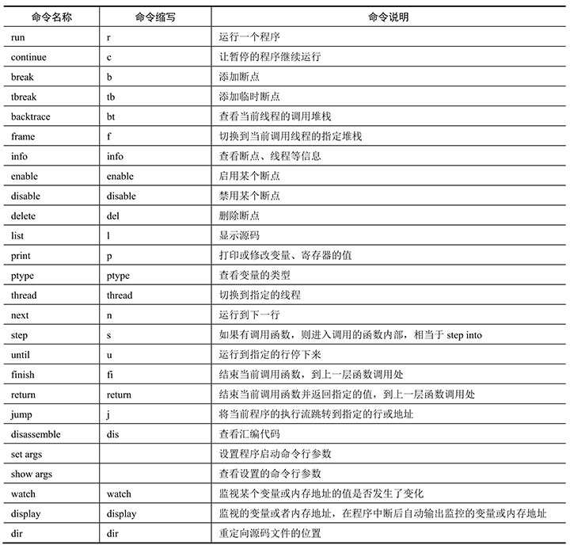

# **GDB**

## 常用手册

 

命令|简写|含义
--|--|--
break|b|设置断点
delete||清除断点
continue|c|继续终止的程序
run|r|运行程序
step|s|单步运行，进入函数
next|n|单步运行，不进入函数
list|l|显示源代码，每次显示10行
backtrace|bt|显示栈中的内容
print|p |显示queue中的内容
kill||终止正在调试的程序
file||装入将要调试的文件
quit|q|退出 gdb

  

---
# 详细介绍
## 启动GDB
* gdb program
> program也就是你的执行文件，一般在当然目录下。

* gdb program core
> 用gdb同时调试一个运行程序和core文件，core是程序非法执行后core dump后产生的文件。

* gdb pid
> 如果你的程序是一个服务程序，那么你可以指定这个服务程序运行时的进程ID。gdb会自动attach上去，并调试他。program应该在PATH环境变量中搜索得到。

* 
