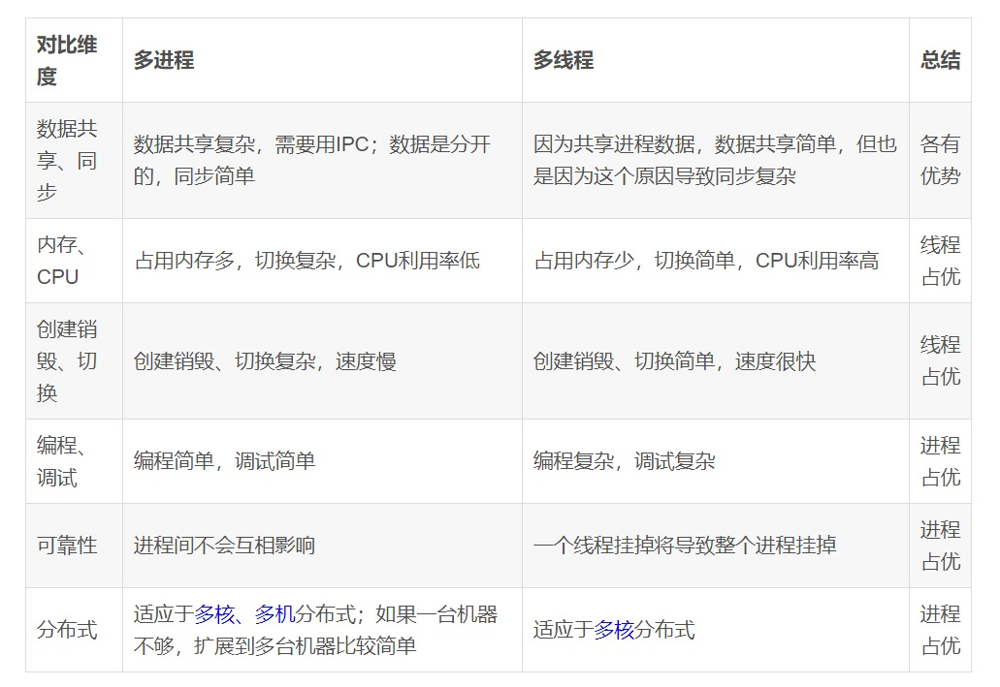

# Contents

- [Contents](#contents)
  - [前序](#前序)
  - [协程？](#协程)
  - [死锁](#死锁)
  - [动态分区分配算法？](#动态分区分配算法)
  - [进程调度算法](#进程调度算法)
  - [页面置换算法](#页面置换算法)
  - [磁盘调度算法](#磁盘调度算法)
  - [DMA 技术](#dma-技术)
  - [零拷贝技术实现](#零拷贝技术实现)
  - [fork()父子进程？](#fork父子进程)
  - [多进程、多线程的应用区别？](#多进程多线程的应用区别)
  - [程序从开始运行到结束的完整过程](#程序从开始运行到结束的完整过程)
  - [局部性原理](#局部性原理)
  - [进程终止的几种方式](#进程终止的几种方式)
  - [程序从堆中动态分配内存时，虚拟内存上怎么操作的](#程序从堆中动态分配内存时虚拟内存上怎么操作的)
  - [常见内存分配内存错误](#常见内存分配内存错误)
- [**END**](#end)

  

---
## 前序
[补充1 :notebook:](../操作系统/知识点补充.md)

---
## 协程？
协程是一种用户态的轻量级线程，协程的调度完全由用户控制。协程拥有自己的寄存器上下文和栈。

作用：保留上一次调用时的状态（即所有局部状态的一个特定组合），每次过程重入时，就相当于进入上一次调用的状态；

直接操作栈则基本没有内核切换的开销，可以不加锁的访问全局变量，所以上下文的切换非常快。

[进程、线程、协程的区别？](https://blog.csdn.net/fadbgfnbxb/article/details/88787361?utm_medium=distribute.pc_relevant.none-task-blog-2%7Edefault%7EBlogCommendFromMachineLearnPai2%7Edefault-1.base&depth_1-utm_source=distribute.pc_relevant.none-task-blog-2%7Edefault%7EBlogCommendFromMachineLearnPai2%7Edefault-1.base)

|          | 进程                                                         | 线程                                               | 协程                                                         |
| -------- | ------------------------------------------------------------ | -------------------------------------------------- | ------------------------------------------------------------ |
| 定义     | 资源分配和拥有的基本单位                                     | 程序执行的基本单位                                 | 用户态的轻量级线程，线程内部调度的基本单位                   |
| 切换情况 | 进程CPU环境(栈、寄存器、页表和文件句柄等)的保存以及新调度的进程CPU环境的设置 | 保存和设置程序计数器、少量寄存器和栈的内容         | 先将寄存器上下文和栈保存，等切换回来的时候再进行恢复         |
| 切换者   | 操作系统                                                     | 操作系统                                           | 用户                                                         |
| 切换过程 | 用户态->内核态->用户态                                       | 用户态->内核态->用户态                             | 用户态(没有陷入内核)                                         |
| 调用栈   | 内核栈                                                       | 内核栈                                             | 用户栈                                                       |
| 拥有资源 | CPU资源、内存资源、文件资源和句柄等                          | 程序计数器、寄存器、栈和状态字                     | 拥有自己的寄存器上下文和栈                                   |
| 并发性   | 不同进程之间切换实现并发，各自占有CPU实现并行                | 一个进程内部的多个线程并发执行                     | 同一时间只能执行一个协程，而其他协程处于休眠状态，适合对任务进行分时处理 |
| 系统开销 | 切换虚拟地址空间，切换内核栈和硬件上下文，CPU高速缓存失效、页表切换，开销很大 | 切换时只需保存和设置少量寄存器内容，因此开销很小   | 直接操作栈则基本没有内核切换的开销，可以不加锁的访问全局变量，所以上下文的切换非常快 |
| 通信方面 | 进程间通信需要借助操作系统                                   | 线程间可以直接读写进程数据段(如全局变量)来进行通信 | 共享内存、消息队列                                           |

---
## 死锁
>**死锁是指多个进程/线程因竞争资源而造成的一种僵局（相互等待）。**
1. 互斥条件：线程对于资源的占有必须是互斥的。
2. 占有且等待条件：线程在请求其他的资源时，会保持自己拥有的资源。
3. 不可抢占条件：不能强行剥夺线程对资源的占有权。
4. 环路等待条件：一个线程在等待另一个线程释放资源，从而形成一个循环等待链。

---
## 动态分区分配算法？

---
## 进程调度算法
* **非抢占式调度** 和 **抢占式调度**
  
⾮抢占式调度算法挑选⼀个进程，然后让该进程运⾏直到被阻塞，或者直到该进程退出，才会调⽤另
外⼀个进程，也就是说不会理时钟中断这个事情。

抢占式调度算法挑选⼀个进程，然后让该进程只运⾏某段时间，如果在该时段结束时，该进程仍然在
运⾏时，则会把它挂起，接着调度程序从就绪队列挑选另外⼀个进程。这种抢占式调度处理，需要在
时间间隔的末端发⽣时钟中断，以便把 CPU 控制返回给调度程序进⾏调度，也就是常说的时间⽚机制；

1. 先来先服务（First Come First Seved, FCFS）算法
2. 最短作业优先（Shortest Job First, SJF）调度算法
3. 高响应比优先（Highest Response Ratio Next, HRRN）调度算法
4. 时间片轮转（Round Robin, RR）调度算法
5. 最高优先级（Highest Priority First，HPF）调度算法
6. 多级反馈队列（Multilevel Feedback Queue）调度算法

---
## 页面置换算法

1. 最佳页面置换算法（OPT）   
   - 置换未来最长时间不访问的页面；很理想，但是不可实现，因为程序访问时动态的，无法预知；但是可以作为衡量你算法的的效率；

2. 先进先出置换算法（FIFO）
   - 选择在内存驻留时间最长的页面进行置换；

3. 最近最久未使⽤的置换算法（LRU）
   - 选择最长时间没有被访问的页面进行置换；但是代价高，开销大，每次访问内存时都需要更新整个链表；

4. 时钟页面置换算法（Lock）
   - LRU类似，FIFO的一种改进，将所有页面保存在一个环形链表中，一个表指针指向最老的页面；

     - 访问位为0，将该页面与新页面进行替换，指针后移一位；
     - 访问位位1，清除访问位，置为0；重复这个过程，直到遇到访问位为0页面；
  
5. 最不常用置换算法（LFU）
   - 访问次数最少的页面被置换；维护链表，计时器成本；

---
## 磁盘调度算法
1. 先来先服务（First-come First-served,FCFS）
   - 性能较差，寻道时间过长；

2. 最短寻道时间优先（Shortest Seek First, SSF）
   - 优先选择从磁头位置到所需寻道时间最短的请求；
   - 饥饿现象：始终在某一局部区域来回运动，距离较远的磁道不访问；

3. 扫描算法（Scan）-- 也叫做 电梯算法
   - 在虽短寻道时间优先算法的基础上，规定磁头在一个方向上移动，访问所有未完成的请求，直到磁头到达该方向上的最后一个磁道，然后调换方向；
   - 缺点就是访问频率不均匀，中间磁道比较占优势；

4. 循环扫描算法（Circular Scan）
   - 相对于扫描算法的优化，规定一个方向，只有磁头按照这个方向移动时才处理磁道访问请求；
   - 返回时直接快速移动到最边缘的磁道，复位磁头，途中不处理任何请求；

5. LOOK & CLOOK
   - LOOK 是对 Scan 算法的优化，磁头只需要移动到最远的请求磁道即可返回，调换方向；
   - CLOOK 也是类似，运动到最远的请求磁道，然后快速返回到另一端最开始请求的磁道处；

---
## DMA 技术
直接内存访问（Direct Memory Access） 技术：在进⾏ I/O 设备和内存的数据传输的时候，数据搬运的⼯作全部交给 DMA 控制器，⽽ CPU 不再参与任何与数据搬运相关的事情，这样 CPU 就可以去处理别的事务。

 

---
## 零拷贝技术实现
为了提高文件传输性能，就诞生了零拷贝技术
* `mmap + write` : 系统调⽤ `mmap()` 函数会直接把内核缓冲区⾥的数据映射到⽤户空间；
  - 减少了一次拷贝（剩余3次），但是仍然需要四次上下文切换；
* `sendfile` ：通过⼀次系统调⽤（ sendfile ⽅法）合并了磁盘读取与⽹络发送两个操作，降低了上下⽂切换次数。另外，拷⻉数据都是发⽣在内核中的，天然就降低了数据拷⻉的次数；

---
## fork()父子进程？
子进程完全复制父进程，复制的是虚拟地址空间；对于变量，如果父子进程只读，那么这个变量就在物理空间中只有一份，表现为共享的；如果对变量进行写，则系统会对这个变量空间复制一份，也就说此时父子进程中的这个变量是独立的，也即是写时复制；

---
## 多进程、多线程的应用区别？

---
##  程序从开始运行到结束的完整过程

**（1）预编译**

主要处理源代码文件中的以“#”开头的预编译指令。处理规则见下

1. 删除所有的 #define，展开所有的宏定义。
2. 处理所有的条件预编译指令，如“#if”、“#endif”、“#ifdef”、“#elif”和“#else”。
3. 处理“#include”预编译指令，将文件内容替换到它的位置，这个过程是递归进行的，文件中包含其他文件。
4. 删除所有的注释，“//”和“/**/”。
5. 保留所有的 #pragma 编译器指令，编译器需要用到他们，如：#pragma once 是为了防止有文件被重复引用。
6. 添加行号和文件标识，便于编译时编译器产生调试用的行号信息，和编译时产生编译错误或警告是能够显示行号。

**（2）编译**

把预编译之后生成的 xxx.i 或 xxx.ii 文件，进行一系列词法分析、语法分析、语义分析及优化后，生成相应的汇编代码文件。

1. 词法分析：利用类似于“有限状态机”的算法，将源代码程序输入到扫描机中，将其中的字符序列分割成一系列的记号。

2. 语法分析：语法分析器对由扫描器产生的记号，进行语法分析，产生语法树。由语法分析器输出的语法树是一种以表达式为节点的树。

3. 语义分析：语法分析器只是完成了对表达式语法层面的分析，语义分析器则对表达式是否有意义进行判断，其分析的语义是静态语义——在编译期能分期的语义，相对应的动态语义是在运行期才能确定的语义。

4. 优化：源代码级别的一个优化过程。

5. 目标代码生成：由代码生成器将中间代码转换成目标机器代码，生成一系列的代码序列——汇编语言表示。

6. 目标代码优化：目标代码优化器对上述的目标机器代码进行优化：寻找合适的寻址方式、使用位移来替代乘法运算、删除多余的指令等。

**（3）汇编**

将汇编代码转变成机器可以执行的指令(机器码文件)。 汇编器的汇编过程相对于编译器来说更简单，没有复杂的语法，也没有语义，更不需要做指令优化，只是根据汇编指令和机器指令的对照表一一翻译过来，汇编过程有汇编器as完成。

经汇编之后，产生目标文件(与可执行文件格式几乎一样)xxx.o(Linux下)、xxx.obj(Windows下)。

**（4）链接**

将不同的源文件产生的目标文件进行链接，从而形成一个可以执行的程序。链接分为静态链接和动态链接：

* **静态链接：**

函数和数据被编译进一个二进制文件。在使用静态库的情况下，在编译链接可执行文件时，链接器从库中复制这些函数和数据并把它们和应用程序的其它模块组合起来创建最终的可执行文件。

空间浪费：因为每个可执行程序中对所有需要的目标文件都要有一份副本，所以如果多个程序对同一个目标文件都有依赖，会出现同一个目标文件都在内存存在多个副本；

更新困难：每当库函数的代码修改了，这个时候就需要重新进行编译链接形成可执行程序。

运行速度快：但是静态链接的优点就是，在可执行程序中已经具备了所有执行程序所需要的任何东西，在执行的时候运行速度快。

* **动态链接：**

动态链接的基本思想是把程序按照模块拆分成各个相对独立部分，在程序运行时才将它们链接在一起形成一个完整的程序，而不是像静态链接一样把所有程序模块都链接成一个单独的可执行文件。

共享库：就是即使需要每个程序都依赖同一个库，但是该库不会像静态链接那样在内存中存在多份副本，而是这多个程序在执行时共享同一份副本；

更新方便：更新时只需要替换原来的目标文件，而无需将所有的程序再重新链接一遍。当程序下一次运行时，新版本的目标文件会被自动加载到内存并且链接起来，程序就完成了升级的目标。

性能损耗：因为把链接推迟到了程序运行时，所以每次执行程序都需要进行链接，所以性能会有一定损失。

---
##  局部性原理

主要分为**时间局部性**和**空间局部性**。

时间局部性:如果执行了程序中的某条指令，那么不久后这条指令很有可能再次执行;如果某个数据被访问过，不久之后该数据很可能再次被访问。(因为程序中存在大量的循环)

空间局部性:一旦程序访问了某个存储单元，在不久之后，其附近的存储单元也很有可能被访问。(因为很多数据在内存中都是连续存放的，并且程序的指令也是顺序地在内存中存放的)

---
## 进程终止的几种方式

1. main函数的自然返回，`return` 
2. 调用`exit`函数，属于c的函数库
3. 调用`_exit`函数，属于系统调用
4. 调用`abort`函数，异常程序终止，同时发送SIGABRT信号给调用进程。 
5. 接受能导致进程终止的信号：ctrl+c (^C)、SIGINT(SIGINT中断进程) 

---
## 程序从堆中动态分配内存时，虚拟内存上怎么操作的

页表：是一个存放在物理内存中的数据结构，它记录了虚拟页与物理页的映射关系

在进行动态内存分配时，例如malloc()函数或者其他高级语言中的new关键字，操作系统会在硬盘中创建或申请一段虚拟内存空间，并更新到页表（分配一个页表条目（PTE），使该PTE指向硬盘上这个新创建的虚拟页），通过PTE建立虚拟页和物理页的映射关系。

---
## 常见内存分配内存错误

（1）内存分配未成功，却使用了它。

编程新手常犯这种错误，因为他们没有意识到内存分配会不成功。常用解决办法是，在使用内存之前检查指针是否为NULL。如果指针p是函数的参数，那么在函数的入口处用assert(p!=NULL)进行检查。如果是用malloc或new来申请内存，应该用if(p==NULL) 或if(p!=NULL)进行防错处理。

（2）内存分配虽然成功，但是尚未初始化就引用它。

犯这种错误主要有两个起因：一是没有初始化的观念；二是误以为内存的缺省初值全为零，导致引用初值错误（例如数组）。内存的缺省初值究竟是什么并没有统一的标准，尽管有些时候为零值，我们宁可信其无不可信其有。所以无论用何种方式创建数组，都别忘了赋初值，即便是赋零值也不可省略，不要嫌麻烦。

（3）内存分配成功并且已经初始化，但操作越过了内存的边界。

例如在使用数组时经常发生下标“多1”或者“少1”的操作。特别是在for循环语句中，循环次数很容易搞错，导致数组操作越界。

（4）忘记了释放内存，造成内存泄露。

含有这种错误的函数每被调用一次就丢失一块内存。刚开始时系统的内存充足，你看不到错误。终有一次程序突然挂掉，系统出现提示：内存耗尽。动态内存的申请与释放必须配对，程序中malloc与free的使用次数一定要相同，否则肯定有错误（new/delete同理）。

（5）释放了内存却继续使用它。常见于以下有三种情况：

- 程序中的对象调用关系过于复杂，实在难以搞清楚某个对象究竟是否已经释放了内存，此时应该重新设计数据结构，从根本上解决对象管理的混乱局面。

- 函数的return语句写错了，注意不要返回指向“栈内存”的“指针”或者“引用”，因为该内存在函数体结束时被自动销毁。

- 使用free或delete释放了内存后，没有将指针设置为NULL。导致产生“野指针”。

---

  

---
# **END**
完结！！

