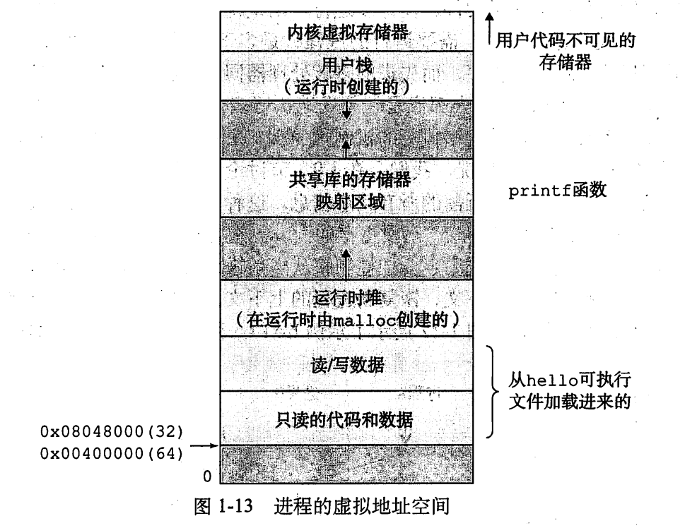

## 学习笔记


### 存储器层次

<div align="center"></div><br>

### 操作系统
两个基本功能
- 防止硬件被失控的应用程序滥用；
- 向应用程序提供简单一致的机制来控制复杂而又不同的低级硬件设备；

操作系统通过进程、虚拟存储器、文件这些抽象概念来实现这两个功能；
- 文件就是对 IO 设备的抽象表示；
- 虚拟存储器就是对主存和磁盘 IO 设备的抽象表示；
- 进程是对处理器、主存、IO 设备的抽象表示；

### 进程
进程是操作系统对一个正在运行的程序的一种抽象，在一个系统中可以同时运行多个进程，而每个进程都好像在独自使用硬件；进程的经典定义就是一个执行中的程序的实例；

并发运行也就是一个进程指令和另一个进程指令是交错执行的；

操作系统实现这种交错执行的机制就称为上下文切换；

而上下文，就是操作系统保持跟踪进程运行所需的所有状态信息；包括 PC 和寄存器文件的当前值、主存的内容；

### 线程
每个线程都运行在进程的上下文中，并共享同样的代码和全局数据；

### 虚拟存储器
系统为每个进程提供了一种假象，好像每个进程都是在独占地使用主存；每个进程看到的都是一样的存储器，称为虚拟地址空间；

<div align="center"></div><br>

提供三种重要能力：
* 它将主存看成一个存储在磁盘上的地址空间的高速缓存，在主存中值保存活动区域，并构建需要在磁盘和主存之间来回传送数据，通过这种方式，它高效地使用了主存；
* 它为每个进程提供了一致的地址空间，从而简化了存储器管理；
* 它保护了每个进程的地址空间不被其他进程破坏；

### 缓存组织结构
> 计算机的计算数据需要从磁盘调度到内存，然后再调度到L2 Cache，再到L1 Cache，最后进CPU寄存器进行计算。

SRAM（静态随机存取存储器）缓存表示位于 CPU 和主存之间的 L1、L2、L3 高速缓存；DRAM（动态随机存取存储器）缓存表示虚拟存储器系统的缓存，它在主存中缓存虚拟页；

> [直写与回写](https://blog.csdn.net/qq_42214953/article/details/103439086)

页表置换功能由许多软硬件联合提供，包括操作系统软件、MMU（存储器管理单元）中的地址翻译硬件和一个存放在物理存储器中叫做页表（page table）的数据结构，页表将虚拟页映射到物理页。

页表就是一个页表条目（page table entry, PTE）的数组；

每次 CPU 产生一个虚拟地址，MMU 就必须查阅一个 PTE，以便将虚拟地址翻译为物理地址。如果碰巧缓存在 L1 中，那么开销就下降到1个或2个周期，科学家就在 MMU 中添加了一个关于 PTE 的小缓存，称之为翻译后备缓冲器（Translation Lookaside Buffer，TLB）。

### 碎片
造成堆利用率很低的主要原因就是碎片现象，虽然有未使用的存储器但不能满足分配需求；

两种形式的碎片：
* 内部碎片：是在一个已分配块比有效载荷大时发生的；
* 外部碎片：当空闲存储器合计起来满足一个分配请求，但是没有一个单独的空闲块足够大可以来处理这个请求时发生的；

### 链接

<div align="center"></div><br>

**.data**：已初始化的全局变量；

**.bss**：未初始化的全局变量；
<div align="center"></div><br>

补充：**static**
> **static** 属性的本地过程变量都不是在栈中管理，相反，编译器在 .data 和 .bss 中为每个定义分配空间，并在符号表中创建一个有唯一名字的本地链接器符号；
> 
> 在 C 中，使用 static 属性在模块内部隐藏变量和函数声明，源代码文件扮演模块的角色，任何声明带有 static 属性的全局变量或者函数都是模块私有的；类似的，任何声明不带 static 属性的全局变量和函数都是公有的，可以被其他模块访问；（ 有点类似于 public 和 private 声明一样 ）

### 静态链接

### 动态链接
共享库（shared library）是一个目标模块，在运行时可以加载到任意的存储器位置，并和存储器中的程序链接起来，这个过程就叫做动态链接（dynamic linking）；

Linux 系统为动态链接器提供了一个简单的接口，允许应用程序在运行时加载和链接共享库；
```cpp
#include <dlfcn.h>
// dlopen() 函数加载和链接共享库 filename
void* dlopen(const char* filename, int flag);
// dlsym() 函数的输入是一个指向前面已经打开共享库的句柄和一个符号名字
void* dlsym(void* handle, char* symbol);
// dlclose() 卸载共享库
int dlclose(void* handle);
// 描述调用函数发生的错误
const char* dlerror(void);
```

### 异常
异常可以分为四类：中断（interrupt）陷阱（trap）故障（fault）终止（abort）

<div align="center"></div><br>

### 僵尸进程
当一个进程由于某种原因终止时，内核并不是立即把它从系统中清除，相反，进程被保持在一种已终止的状态中，直到被它的父进程回收（reap）；

一个终止了但是还未被回收的进程被称为僵尸进程（zombie）；

如果父进程没有回收僵尸子进程就终止了，那么内核会安排 init 进程来回收它们，init 进程的 PID 为1，是在系统初始化时由内核创建的；

僵尸进程依然消耗系统的存储器资源；
  

