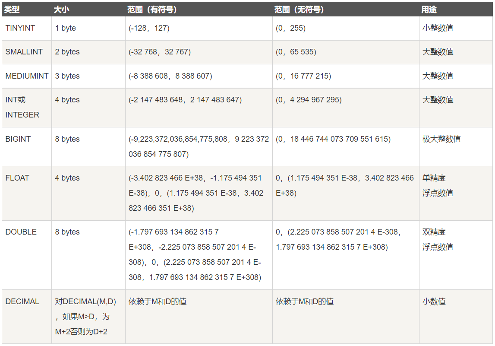
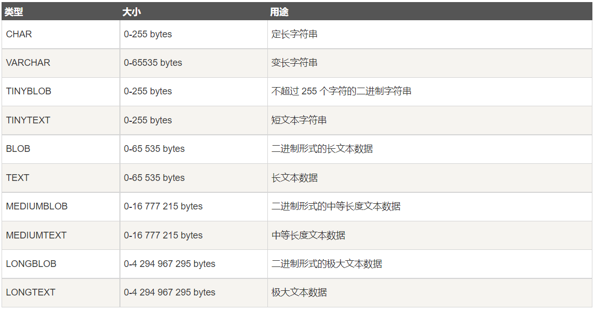
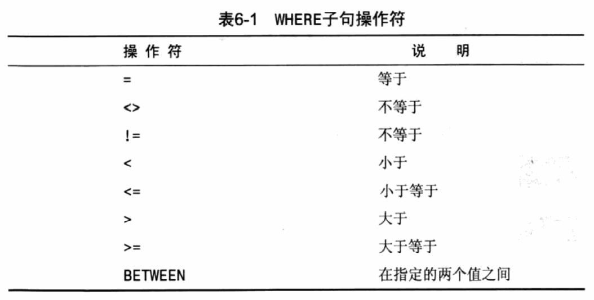
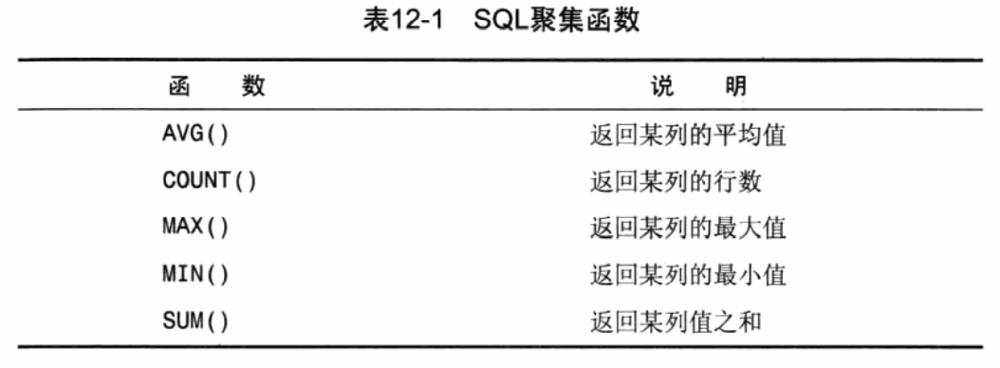

# MySQL

> [**参考**](http://c.biancheng.net/mysql/) :spider:

---
<!-- TOC -->

- [MySQL](#mysql)
- [数据库](#%E6%95%B0%E6%8D%AE%E5%BA%93)
    - [登录连接](#%E7%99%BB%E5%BD%95%E8%BF%9E%E6%8E%A5)
    - [修改密码](#%E4%BF%AE%E6%94%B9%E5%AF%86%E7%A0%81)
    - [创建数据库](#%E5%88%9B%E5%BB%BA%E6%95%B0%E6%8D%AE%E5%BA%93)
    - [查看数据库](#%E6%9F%A5%E7%9C%8B%E6%95%B0%E6%8D%AE%E5%BA%93)
    - [修改数据库](#%E4%BF%AE%E6%94%B9%E6%95%B0%E6%8D%AE%E5%BA%93)
    - [删除数据库](#%E5%88%A0%E9%99%A4%E6%95%B0%E6%8D%AE%E5%BA%93)
    - [使用数据库](#%E4%BD%BF%E7%94%A8%E6%95%B0%E6%8D%AE%E5%BA%93)
- [数据表](#%E6%95%B0%E6%8D%AE%E8%A1%A8)
    - [数据类型](#%E6%95%B0%E6%8D%AE%E7%B1%BB%E5%9E%8B)
        - [数值](#%E6%95%B0%E5%80%BC)
        - [日期时间](#%E6%97%A5%E6%9C%9F%E6%97%B6%E9%97%B4)
        - [字符串](#%E5%AD%97%E7%AC%A6%E4%B8%B2)
    - [创建数据表](#%E5%88%9B%E5%BB%BA%E6%95%B0%E6%8D%AE%E8%A1%A8)
    - [修改数据表](#%E4%BF%AE%E6%94%B9%E6%95%B0%E6%8D%AE%E8%A1%A8)
    - [修改删除字段](#%E4%BF%AE%E6%94%B9%E5%88%A0%E9%99%A4%E5%AD%97%E6%AE%B5)
    - [添加新字段](#%E6%B7%BB%E5%8A%A0%E6%96%B0%E5%AD%97%E6%AE%B5)
    - [删除数据表](#%E5%88%A0%E9%99%A4%E6%95%B0%E6%8D%AE%E8%A1%A8)
    - [删除被关联主表](#%E5%88%A0%E9%99%A4%E8%A2%AB%E5%85%B3%E8%81%94%E4%B8%BB%E8%A1%A8)
    - [查看表结构](#%E6%9F%A5%E7%9C%8B%E8%A1%A8%E7%BB%93%E6%9E%84)
- [其他](#%E5%85%B6%E4%BB%96)
    - [通配符 *](#%E9%80%9A%E9%85%8D%E7%AC%A6-)
    - [LIMIT 子句、](#limit-%E5%AD%90%E5%8F%A5)
    - [DISTINCT 关键词](#distinct-%E5%85%B3%E9%94%AE%E8%AF%8D)
    - [完全限定](#%E5%AE%8C%E5%85%A8%E9%99%90%E5%AE%9A)
    - [ORDER BY 排序](#order-by-%E6%8E%92%E5%BA%8F)
    - [过滤数据 WHERE 子句](#%E8%BF%87%E6%BB%A4%E6%95%B0%E6%8D%AE-where-%E5%AD%90%E5%8F%A5)
    - [BETWEEN 关键词](#between-%E5%85%B3%E9%94%AE%E8%AF%8D)
    - [空值检查](#%E7%A9%BA%E5%80%BC%E6%A3%80%E6%9F%A5)
    - [AND OR 关键词](#and-or-%E5%85%B3%E9%94%AE%E8%AF%8D)
    - [IN 操作符](#in-%E6%93%8D%E4%BD%9C%E7%AC%A6)
    - [NOT 操作符](#not-%E6%93%8D%E4%BD%9C%E7%AC%A6)
    - [LIKE 操作符](#like-%E6%93%8D%E4%BD%9C%E7%AC%A6)
    - [正则表达式](#%E6%AD%A3%E5%88%99%E8%A1%A8%E8%BE%BE%E5%BC%8F)
    - [拼接 Concat](#%E6%8B%BC%E6%8E%A5-concat)
    - [去空格](#%E5%8E%BB%E7%A9%BA%E6%A0%BC)
    - [别名 AS](#%E5%88%AB%E5%90%8D-as)
    - [文本转大写 Upper](#%E6%96%87%E6%9C%AC%E8%BD%AC%E5%A4%A7%E5%86%99-upper)
    - [年月日](#%E5%B9%B4%E6%9C%88%E6%97%A5)
    - [聚集函数](#%E8%81%9A%E9%9B%86%E5%87%BD%E6%95%B0)
    - [分组 GROUP BY](#%E5%88%86%E7%BB%84-group-by)
    - [过滤组 HAVING](#%E8%BF%87%E6%BB%A4%E7%BB%84-having)
    - [内联结 INNER JOIN](#%E5%86%85%E8%81%94%E7%BB%93-inner-join)

<!-- /TOC -->

# 数据库
## 登录连接
* 连接本机上的MySQL
```sql
sql -uroot -p + 回车密码
```
* 连接远程主机上的MySQL
```sql
sql -h主机地址 -u用户名 -p密码
```
* 退出
```sql
exit
```

## 修改密码
```sql
sqladmin -u用户名 -p旧密码 password 新密码
```

## 创建数据库
```sql
CREATE DATABASE 数据库名称;
```

## 查看数据库
```sql
# 查看所有数据库
SHOW DATABASES;

# 指定数据库
SHOW DATABASES 名称;

# 筛选数据库
SHOW DATABASES LIKE '**';  # 名称完全匹配筛选
SHOW DATABASES LIKE '%**%';  # 名称中包含 ** 的数据库
SHOW DATABASES LIKE '**%';  # 名称以 ** 开头的数据库
SHOW DATABASES LIKE '%**';  # 名称以 ** 结尾的数据库
```

## 修改数据库
使用 ALTER DATABASE 来修改已经被创建或者存在的数据库的相关参数
```sql
ALTER DATABASE [数据库名] { 
[ DEFAULT ] CHARACTER SET <字符集名> |
[ DEFAULT ] COLLATE <校对规则名>}
```

## 删除数据库
```sql
DROP DATABASE 数据库名
```

## 使用数据库
```sql
USE 数据库名称
```

<br><br>

# 数据表

## 数据类型
### 数值
<div align=center></div>

### 日期时间
<div align=center></div>

### 字符串
<div align=center></div>

## 创建数据表
```sql
CREATE TABLE <表名> ([表定义选项]);
```
* 其中，[表定义选项]的格式为：<列名1> <类型1> ... <列名n> <类型n>
* `primary key (A1,A2,A3,...)`：指定主键属性集
* `foreign key (A1,A2,A3,...) references T2`：声明表示关系中任意元组在属性`(A1,A2,A3,...)`上的取值必须对应于`T2`中某元组在主码属性上的取值


## 修改数据表
```sql
ALTER TABLE <表名> [修改选项]

其中，修改选项如下：
{ ADD COLUMN <列名> <类型>
| CHANGE COLUMN <旧列名> <新列名> <新列类型>
| ALTER COLUMN <列名> { SET DEFAULT <默认值> | DROP DEFAULT }
| MODIFY COLUMN <列名> <类型>
| DROP COLUMN <列名>
| RENAME TO <新表名>
| CHARACTER SET <字符集名>
| COLLATE <校对规则名> }
```

## 修改删除字段
```sql
# 修改字段名
ALTER TABLE <表名> CHANGE <旧字段名> <新字段名> <新数据类型>;

# 修改字段数据类型
ALTER TABLE <表名> MODIFY <字段名> <新数据类型>;

# 删除字段
ALTER TABLE <表名> DROP <字段名>;
```

## 添加新字段
MySQL 数据表是由行和列构成的，通常把表的“列”称为字段（Field），把表的“行”称为记录（Record）;
```sql
# 默认末尾
ALTER TABLE <表名> ADD <新字段名><数据类型>[约束条件];

# 开头添加
ALTER TABLE <表名> ADD <新字段名> <数据类型> [约束条件] FIRST;

# 中间添加
ALTER TABLE <表名> ADD <新字段名> <数据类型> [约束条件] AFTER <已经存在的字段名>;
```

## 删除数据表
```sql
DROP TABLE 表名1 [表名2, 表名3 ...];
```

## 删除被关联主表
数据表之间经常存在外键关联的情况，这时如果直接删除父表，会破坏数据表的完整性，也会删除失败。

删除父表有以下两种方法：
* 先删除与它关联的子表，再删除父表；但是这样会同时删除两个表中的数据。
* 将关联表的外键约束取消，再删除父表；适用于需要保留子表的数据，只删除父表的情况。

## 查看表结构
```sql
DESC <表名>;  # 可以查看包括字段名、字段数据类型、是否为主键、是否有默认值等基础信息
SHOW CREATE TABLE <表名>;  # 查看信息更丰富，编码等
```

# 其他
## 通配符 *
```sql
SELECT * FROM 表；
```

## LIMIT 子句、
```sql
# 表示从第3行开始 输出4行
LIMIT 4 OFFSET 3; 
```

## DISTINCT 关键词
```sql
# 只返回不同的值
SELECT DISTINCT ID FROM product;
```

## 完全限定
```sql
SELECT product.ID FROM base.product;
```

## ORDER BY 排序
```sql
# 默认A-Z，逆序 DESC；升序 ASC；
SELECT ID FROM product ORDER BY ID DESC;
```

## 过滤数据 WHERE 子句
```sql
SELECT ID FROM product WHERE ID = 009;
```
* ORDER BY 与 WHERE 同时使用时，ORDER BY 位于 WHERE 之后；



## BETWEEN 关键词
```sql
SELECT ID FROM product BETWEEN 007 AND 009;
```

## 空值检查
```sql
# 返回没有编号的产品；
SELECT `name` FROM product WHERE ID IS NULL 
```

## AND OR 关键词
```sql
SELECT `name` FROM product WHERE ID = 002 AND ID = 008;
SELECT `name` FROM product WHERE ID = 002 OR ID = 008;
```

## IN 操作符
```sql
SELECT `name` FROM product WHERE ID IN (003,004) ORDER BY `name`;
```

## NOT 操作符
```sql
SELECT `name` FROM product WHERE ID NOT IN (003,004) ORDER BY `name`;
```

## LIKE 操作符
```sql
# ZHANG 开头的名字
SELECT ID FROM product WHERE `name` LIKE 'ZHANG%';
```
## 正则表达式
```sql
# LIKE 被 REGEXP 替换，如果区分大小写 + BINARY;
# 也可以 + | 或者 [] 来进行选择;
```

## 拼接 Concat()
## 去空格 
```sql
LTrim(); # 去左边空格
RTrim(); # 去右边空格
Trim(); # 去两边空格
```
## 别名 AS

## 文本转大写 Upper()

## 年月日
```sql
Year();
Month();
Date();
```

## 聚集函数


## 分组 GROUP BY

## 过滤组 HAVING
```sql
HAVING # 过滤分组
WHERE # 过滤行
```

## 内联结 INNER JOIN


