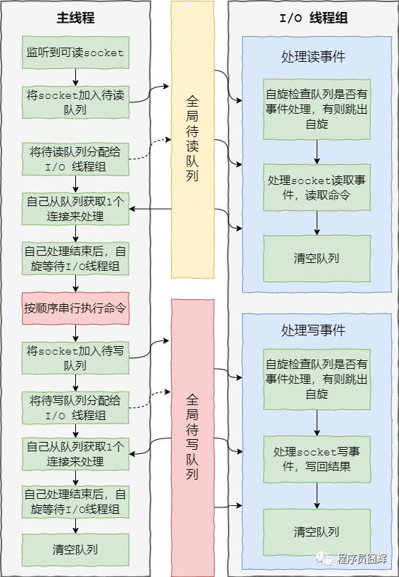

# Redis
<!-- TOC -->

- [Redis](#redis)
  - [概述](#概述)
  - [数据类型](#数据类型)
  - [数据结构](#数据结构)
  - [Redis 的字符串（SDS）和 C 语言的字符串区别](#redis-的字符串sds和-c-语言的字符串区别)
  - [有序集合底层数据结构](#有序集合底层数据结构)
  - [Hash 对象底层结构](#hash-对象底层结构)
  - [为什么使用 Redis 数据库](#为什么使用-redis-数据库)
  - [持久化](#持久化)
    - [RDB 持久化](#rdb-持久化)
    - [AOF 持久化](#aof-持久化)
    - [混合持久化](#混合持久化)
    - [两种持久化优缺点](#两种持久化优缺点)
  - [缓存雪崩、缓存穿透、缓存击穿](#缓存雪崩缓存穿透缓存击穿)
    - [缓存雪崩](#缓存雪崩)
    - [缓存穿透](#缓存穿透)
    - [缓存击穿](#缓存击穿)
  - [Redis 为什么是单线程的而不采用多线程方案？](#redis-为什么是单线程的而不采用多线程方案)
  - [单线程的 Redis 为什么这么快？](#单线程的-redis-为什么这么快)
  - [Redis 的线程模型](#redis-的线程模型)
  - [Redis 应用场景](#redis-应用场景)
  - [Redis 和 Memcached 的比较](#redis-和-memcached-的比较)
  - [Redis 设置过期时间的两种方案是什么？](#redis-设置过期时间的两种方案是什么)
  - [定期和惰性一定能保证删除数据吗？如果不能，Redis会有什么应对措施？](#定期和惰性一定能保证删除数据吗如果不能redis会有什么应对措施)
  - [Redis对于大量的请求，是怎样处理的？](#redis对于大量的请求是怎样处理的)
  - [假如 MySQL 有1000万数据，采用 Redis 作为中间缓存，取其中的10万，如何保证Redis中的数据都是热点数据？](#假如-mysql-有1000万数据采用-redis-作为中间缓存取其中的10万如何保证redis中的数据都是热点数据)
  - [如何解决Redis的并发竞争Key问题](#如何解决redis的并发竞争key问题)
  - [Redis集群，集群的原理是什么](#redis集群集群的原理是什么)
  - [分布式锁](#分布式锁)
  - [如何保证缓存与数据库双写时的数据一致性，为何会出现不一致？](#如何保证缓存与数据库双写时的数据一致性为何会出现不一致)
  - [数据不一致](#数据不一致)
- [参考文献](#参考文献)


<br><br>

---
## 概述
Redis 是速度非常快的非关系型（NoSQL）内存键值数据库，可以存储键和五种不同类型的值之间的映射。

键 Key 的类型只能为字符串，值 Value 支持五种数据类型：字符串、列表、集合、散列表、有序集合。

Redis 支持很多特性，例如将内存中的数据持久化到硬盘中，使用复制来扩展读性能，使用分片来扩展写性能。

---
## 数据类型

| 数据类型 | 可以存储的值 | 操作 |
| :--: | :--: | :--: |
| STRING | 字符串、整数或者浮点数 | 对整个字符串或者字符串的其中一部分执行操作 <br> 对整数和浮点数执行自增或者自减操作 |
| LIST | 列表 | 从两端压入或者弹出元素 <br> 对单个或者多个元素进行修剪 <br> 只保留一个范围内的元素 |
| SET | 无序集合 | 添加、获取、移除单个元素 <br> 检查一个元素是否存在于集合中 <br> 计算交集、并集、差集 <br> 从集合里面随机获取元素 |
| HASH | 包含键值对的无序散列表 | 添加、获取、移除单个键值对 <br> 获取所有键值对 <br> 检查某个键是否存在|
| ZSET | 有序集合 | 添加、获取、删除元素 <br> 根据分值范围或者成员来获取元素 <br> 计算一个键的排名 |

高级数据类型：
* HyperLogLog：通常用于基数统计，使用少量固定内存来统计集合中唯一元素的数量；统计结果不是精确值，而是近似值；
* Geo：可以将用户给定的地理位置信息储存起来， 并对这些信息进行操作：获取2个位置的距离、根据给定地理位置坐标获取指定范围内的地理位置集合
* Bitmap：位图；
* Stream：主要用于消息队列，类似于 kafka，可以认为是 pub/sub 的改进版。提供了消息的持久化和主备复制功能，可以让任何客户端访问任何时刻的数据，并且能记住每一个客户端的访问位置，还能保证消息不丢失；
  
---
## 数据结构
* 跳表

---
## Redis 的字符串（SDS）和 C 语言的字符串区别

<center> 对比表格 </center>

|C字符串 | SDS|
|:--:|:--:|
获取字符串长度的复杂度为O(N)|获取字符串长度的复杂度为O(1)
API是不安全的，可能会造成缓冲区溢出|API是安全的，不会造成缓冲区溢出
修改字符串长度N次必然需要执行N次内存重分配|修改字符串长度N次最多需要执行N次内存重分配
只能保存文本数据|可以保存文本数据或者二进制数据
可以使用所有的<string.h>库中的函数|可以使用一部分<string.h>库中的函数

<br>

---
## 有序集合底层数据结构
Sorted Set，当前有两种编码方式：ziplist 和 skiplist

* ziplist：使用压缩列表实现，当保存的元素长度都小于64字节，同时数量小于128时，使用该编码方式，否则会使用 skiplist。这两个参数可以通过 zset-max-ziplist-entries、zset-max-ziplist-value 来自定义修改。
* skiplist：zset实现，一个zset同时包含一个字典（dict）和一个跳跃表（zskiplist）

---
## Hash 对象底层结构
Hash 对象当前有两种编码：ziplist、hashtable

ziplist：使用压缩列表实现，每当有新的键值对要加入到哈希对象时，程序会先将保存了键的节点推入到压缩列表的表尾，然后再将保存了值的节点推入到压缩列表表尾。

因此：1）保存了同一键值对的两个节点总是紧挨在一起，保存键的节点在前，保存值的节点在后；2）先添加到哈希对象中的键值对会被放在压缩列表的表头方向，而后来添加的会被放在表尾方向。

hashtable：使用字典作为底层实现，哈希对象中的每个键值对都使用一个字典键值来保存，跟 java 中的 HashMap 类似。

---
## 为什么使用 Redis 数据库
因为 Redis 具备高性能和高并发两种特性。

- **高性能**：假如用户第一次访问数据库中的某些数据。这个过程会比较慢，因为是从硬盘上读取的。将该用户访问的数据存在缓存中，这样下一次再访问这些数据的时候就可以直接从缓存中获取了。操作缓存就是直接操作内存，所以速度相当快。如果数据库中的对应数据改变的之后，同步改变缓存中相应的数据即可！
- **高并发**：直接操作缓存能够承受的请求是远远大于直接访问数据库的，所以我们可以考虑把数据库中的部分数据转移到缓存中去，这样用户的一部分请求会直接到缓存这里而不用经过数据库。

---
## 持久化

Redis是一个支持持久化的内存数据库，通过持久化机制把内存中的数据同步到硬盘文件来保证数据持久化。当Redis重启后通过把硬盘文件重新加载到内存，就能达到恢复数据的目的。

很多时候我们需要持久化数据也就是将内存中的数据写入到硬盘里面，大部分原因是为了之后重用数据（比如重启机 器、机器故障之后回复数据），或者是为了防止系统故障而将数据备份到一个远程位置。

实现：单独创建fork()一个子进程，将当前父进程的数据库数据复制到子进程的内存中，然后由子进程写入到临时文件中，持久化的过程结束了，再用这个临时文件替换上次的快照文件，然后子进程退出，内存释放。

### RDB 持久化
也就是快照持久化；RDB 文件是经过压缩的二进制文件；

命令：SAVE 和 BGSAVE；

> SAVE：生成 RDB 快照文件，但是会阻塞主进程，服务器将无法处理客户端发来的命令请求，所以通常不会直接使用该命令。<br>
> BGSAVE：fork 子进程来生成 RDB 快照文件，阻塞只会发生在 fork 子进程的时候，之后主进程可以正常处理请求。

Redis可以通过创建快照来获得存储在内存里面的数据在某个时间点上的副本。Redis创建快照之后，可以对快照进行备份，可以将快照复制到其他服务器从而创建具有相同数据的服务器副本（Redis主从结构，主要用来提高Redis性能），还可以将快照留在原地以便重启服务器的时候使用。

快照持久化是Redis默认采用的持久化方式；

### AOF 持久化
与快照持久化相比，AOF**持久化的实时性更好**，因此已成为主流的持久化方案。默认情况下Redis没有开启 AOF（append only file）方式的持久化，可以通过appendonly参数开启：`appendonly yes`

`开启AOF持久化后每执行一条会更改Redis中的数据的命令，Redis就会将该命令写入硬盘中的AOF文件`。AOF文件的保存位置和RDB文件的位置相同，都是通过dir参数设置的，默认的文件名是appendonly.aof。

在Redis的配置文件中存在三种不同的 AOF 持久化方式，它们分别是：

```shell
appendfsync always #每次有数据修改发生时都会写入AOF文件,这样会严重降低Redis的速度
appendfsync everysec  #每秒钟同步一次，显示地将多个写命令同步到硬盘
appendfsync no  #让操作系统决定何时进行同步
```

为了兼顾数据和写入性能，用户可以考虑 appendfsync everysec选项 ，让Redis每秒同步一次AOF文件，Redis性能几乎没受到任何影响。而且这样即使出现系统崩溃，用户最多只会丢失一秒之内产生的数据。当硬盘忙于执行写入操作的时候，Redis还会优雅的放慢自己的速度以便适应硬盘的最大写入速度。

随着服务器写请求的增多，AOF 文件会越来越大。Redis 提供了一种将 AOF 重写的特性，能够去除 AOF 文件中的冗余写命令。

### 混合持久化
Redis 4.0 开始支持 RDB 和 AOF 的混合持久化（默认关闭，可以通过配置项 aof-use-rdb-preamble 开启），混合持久化并不是一种新的持久化方式，而是对于已有方式的一种优化，只发生在 AOF 持久化重写过程中；

使用了混合持久化，重写的新 AOF 文件前半段是 RDB 格式的全量文件，后半段是 AOF 格式的增量数据；

步骤：
* 由 RDB 持久化定期完成内存快照的备份
* AOF 持久化完成两次 RDB 持久化之间的数据备份
* 这两部分共同构成持久化文件

优点：结合两种持久化各自的优点，RDB 持久化加载快、备份文件小；AOF 持久化 尽可能不丢失数据；
缺点：4.0 之前的版本不能识别持久化文件；阅读性低；

### 两种持久化优缺点
* RDB 持久化
  - 文件体积小，网络传输快，适合全量复制；恢复速度快；对性能影响较小；
  - 做不到实时持久化；文件格式兼容性差；fork 子进程采用 copy-on-write，客户端写入数据频繁，极端情况下占用内存是原来的2倍；

* AOF 持久化
  - 支持秒级持久化，兼容性好；
  - 文件体积大，恢复速度慢，对性能影响较大；

## 缓存雪崩、缓存穿透、缓存击穿
### 缓存雪崩
缓存雪崩指的是缓存同一时间大面积的失效，后面的请求都会落到数据库上，造成数据库短时间内承受大量请求而崩掉。`与缓存击穿不同点：雪崩是很多 Key ，击穿是某一个 Key 缓存`

**解决方案：**
- 事前：尽量保证整个 Redis 集群的高可用性，发现机器宕机尽快补上，选择合适的内存淘汰策略。
- 事中：本地ehcache缓存 + hystrix限流&降级，避免MySQL崩掉， 通过加锁或者队列来控制读数据库写缓存的线程数量。比如对某个key只允许一个线程查询数据和写缓存，其他线程等待。 
- 事后：利用 Redis 持久化机制保存的数据尽快恢复缓存

### 缓存穿透
请求缓存和数据库中都不存在的数据，导致所有的请求都落到数据库上，而数据库查不到数据无法写缓存，下一次同样请求落在数据库上；

缓存起不到作用，就像被“穿透了”一样；

**解决方案：**
* 布隆过滤器：将所有可能存在的数据哈希到一个足够大的**bitmap**中，一个一定不存在的数据会被 这个bitmap拦截掉，从而避免了对底层存储系统的查询压力。
* 缓存空对象：当存储层不命中后，即使返回的空对象也将其缓存起来，同时会设置一个过期时间，之后再访问这个数据将会从缓存中获取，保护了后端数据源；如果一个**查询返回的数据为空**（不管是数据不存在，还是系统故障），我们仍然把这个空结果进行缓存，但它的**过期时间会很短**，最长不超过五分钟。
  - 这种方法会存在两个问题：
  - 如果空值能够被缓存起来，这就意味着缓存需要更多的空间存储更多的键，因为这当中可能会有很多的空值的键；
  - 即使对空值设置了过期时间，还是会存在缓存层和存储层的数据会有一段时间窗口的不一致，这对于需要保持一致性的业务会有影响。

**两种方案比较：**

* **适用场景**：
  - 缓存空对象
    - 1、数据命中不高 
    - 2、数据频繁变化且实时性较高
  - 布隆过滤器适用
    - 1、数据命中不高 
    - 2、数据相对固定即实时性较低

* **维护成本**：
  - 缓存空对象的方法适合
    - 1、代码维护简单 
    - 2、需要较多的缓存空间 
    - 3、数据会出现不一致的现象；
  - 布隆过滤器适合 
    - 1、代码维护较复杂
    - 2、缓存空间要少一些

> 布隆过滤器？
> 引入了k(k>1)k(k>1)个相互独立的哈希函数，保证在给定的空间、误判率下，完成元素判重的过程。
> 它的优点是空间效率和查询时间都远远超过一般的算法，缺点是有一定的误识别率和删除困难。
>
> 该算法的**核心思想**就是利用多个不同的Hash函数来解决“冲突”。Hash存在一个冲突（碰撞）的问题，用同一个Hash得到的两个URL的值有可能相同。为了减少冲突，我们可以多引入几个Hash，如果通过其中的一个Hash值我们得出某元素不在集合中，那么该元素肯定不在集合中。只有在所有的Hash函数告诉我们该元素在集合中时，才能确定该元素存在于集合中。这便是布隆过滤器的基本思想，一般用于在大数据量的集合中判定某元素是否存在。

### 缓存击穿
缓存击穿，是指一个key非常热点，在不停的扛着大并发，大并发集中对这一个点进行访问，当这个key在失效的瞬间，持续的大并发就穿破缓存，直接请求数据库，就像在一个屏障上凿开了一个洞。

**解决方案：**
* 设置热点 Key 不过期

---
## Redis 为什么是单线程的而不采用多线程方案？
这主要是基于一种客观原因来考虑的。因为Redis是基于内存的操作，CPU不是Redis的瓶颈，Redis的瓶颈最有可能是机器内存的大小或者网络带宽。单线程容易实现，而且CPU不会成为瓶颈，那就采用单线程；

但是 redis 6.0 就开始在核心流程中引入了多线程，用于解决在网络IO上的性能瓶颈；

> redis 4.0 之前完全单线程；<br>
> redis 4.0 时引入了多线程，但是额外的线程只是用于处理后台处理，核心流程还是基于单线程的；（核心流程就是指：接受命令、解析命令、执行命令、返回结果等）<br>
> redis 6.0 时，多线程用于网络IO阶段，即接受命令和返回结果；

> 核心流程大致流程图:

<div align=center></div>

---
## 单线程的 Redis 为什么这么快？
主要是有三个原因：1、Redis的全部操作都是纯内存的操作；2、Redis采用单线程，有效避免了频繁的上下文切换；3，采用了非阻塞I/O多路复用机制。

---
## Redis 的线程模型

如果你打开看过 Redis 的源码就会发现Redis 内部使用文件事件处理器 file event handler，这个文件事件处理器是单线程的，所以 Redis 才叫做单线程的模型。它采用 IO 多路复用机制同时监听多个 socket，根据 socket 上的事件来选择对应的事件处理器进行处理。


文件事件处理器的结构包含 4 个部分：

- 多个 socket
- IO多路复用程序
- 文件事件分派器
- 事件处理器（连接应答处理器、命令请求处理器、命令回复处理器）

使用 I/O 多路复用程序来同时监听多个套接字， 并根据套接字目前执行的任务来为套接字关联不同的事件处理器。当被监听的套接字准备好执行连接应答（accept）、读取（read）、写入（write）、关闭（close）等操作时，与操作相对应的文件事件就会产生， 这时文件事件处理器就会调用套接字之前关联好的事件处理器来处理这些事件。

多个 socket 可能会并发产生不同的操作，每个操作对应不同的文件事件，但是 IO 多路复用程序会监听多个 socket，会将 socket 产生的事件放入队列中排队，事件分派器每次从队列中取出一个事件，把该事件交给对应的事件处理器进行处理。

一句话总结就是：“I/O 多路复用程序负责监听多个套接字， 并向文件事件分派器传送那些产生了事件的套接字。”

---
## Redis 应用场景
缓存（核心）、分布式锁（set + lua 脚本）、排行榜（zset）、计数（incrby）、消息队列（stream）、地理位置（geo）、访客统计（hyperloglog）等。

---
## Redis 和 Memcached 的比较

1）`数据结构`：memcached 支持简单的 key-value 数据结构，而 redis 支持丰富的数据结构：String、List、Set、Hash、SortedSet 等。

2）`数据存储`：memcached 和 redis 的数据都是全部在内存中。

> 网上有一种说法 “当物理内存用完时，Redis可以将一些很久没用到的 value 交换到磁盘，同时在内存中清除”，这边指的是 redis 里的虚拟内存（Virtual Memory）功能，该功能在 Redis 2.0 被引入，但是在 Redis 2.4 中被默认关闭，并标记为废弃，而在后续版中被完全移除。

3）`持久化`：memcached 不支持持久化，redis 支持将数据持久化到磁盘

4）`灾难恢复`：实例挂掉后，memcached 数据不可恢复，redis 可通过 RDB、AOF 恢复，但是还是会有数据丢失问题

5）`事件库`：memcached 使用 Libevent 事件库，redis 自己封装了简易事件库 AeEvent

6）`过期键删除策略`：memcached 使用惰性删除，redis 使用惰性删除+定期删除

7）`内存驱逐（淘汰）策略`：memcached 主要为 LRU 算法，redis 当前支持8种淘汰策略

8）`性能比较`
* 按“CPU 单核” 维度比较：由于 Redis 只使用单核，而 Memcached 可以使用多核，所以在比较上：在处理小数据时，平均每一个核上 Redis 比 Memcached 性能更高，而在 100k 左右的大数据时， Memcached 性能要高于 Redis。
* 按“实例”维度进行比较：由于 Memcached 多线程的特性，在 Redis 6.0 之前，通常情况下 Memcached 性能是要高于 Redis 的，同时实例的 CPU 核数越多，Memcached 的性能优势越大。
* 至于网上说的 redis 的性能比 memcached 快很多，这个说法就离谱。

---
## Redis 设置过期时间的两种方案是什么？

Redis中有个设置时间过期的功能，即对存储在 Redis 数据库中的值可以设置一个过期时间。

作为一个缓存数据库，这是非常实用的，比如一些 token 或者登录信息，尤其是短信验证码都是有时间限制的，按照传统的数据库处理方式，一般都是自己判断过期，这样无疑会严重影响项目性能。

我们 set key 的时候，都可以给一个 expire time，就是过期时间，通过过期时间我们可以指定这个 key 可以存活的时间，主要可采用 **定期删除 和 惰性删除** 两种方案。

- 定期删除：Redis默认是每隔 100ms 就随机抽取一些设置了过期时间的key，检查其是否过期，如果过期就删 除。注意这里是随机抽取的。为什么要随机呢？你想一想假如 Redis 存了几十万个 key ，每隔100ms就遍历所有的设置过期时间的 key 的话，就会给 CPU 带来很大的负载！
- 惰性删除 ：定期删除可能会导致很多过期 key 到了时间并没有被删除掉。所以就有了惰性删除。它是指某个键值过期后,此键值不会马上被删除,而是等到下次被使用的时候,才会被检查到过期,此时才能得到删除,惰性删除的缺点很明显是浪费内存。 除非你的系统去查一下那个 key，才会被Redis给删除掉。这就是所谓的惰性删除！

---
## 定期和惰性一定能保证删除数据吗？如果不能，Redis会有什么应对措施？

并不能保证一定删除，Redsi有一个Redis 内存淘汰机制来确保数据一定会被删除。

首先介一下定期删除和惰性删除的工作流程：

1、定期删除，Redis默认每个100ms检查，是否有过期的key,有过期key则删除。需要说明的是，Redis不是每个100ms将所有的key检查一次，而是随机抽取进行检查(如果每隔100ms,全部key进行检查，Redis岂不是卡死)。因此，如果只采用定期删除策略，会导致很多key到时间没有删除。

2、于是，惰性删除派上用场。也就是说在你获取某个key的时候，Redis会检查一下，这个key如果设置了过期时间那么是否过期了？如果过期了此时就会删除。

3、采用定期删除+惰性删除就没其他问题了么?
不是的，如果定期删除没删除key。然后你也没即时去请求key，也就是说惰性删除也没生效。这样，Redis

4、内存会越来越高。那么就应该采用内存淘汰机制。

在Redis.conf中有一行配置:maxmemory-policy volatile-lru

该配置就是配内存淘汰策略的，主要有以下六种方案：

* **volatile-lru**：从已设置过期时间的数据集（server.db[i].expires）中挑选最近最少使用的数据淘汰
* **volatile-ttl**：从已设置过期时间的数据集（server.db[i].expires）中挑选将要过期的数据淘汰
* **volatile-random**：从已设置过期时间的数据集（server.db[i].expires）中任意选择数据淘汰
* **allkeys-lru**：从数据集（server.db[i].dict）中挑选最近最少使用的数据淘汰
* **allkeys-random**：从数据集（server.db[i].dict）中任意选择数据淘汰
* **no-enviction**（驱逐）：禁止驱逐数据，新写入操作会报错
* **allkeys-lfu**：从数据集中使用 LFU (最不常使用) 算法挑选数据淘汰；（redis 4.0 新增）
* **volatile-lfu**：在已设置过期时间的数据集中使用 LFU 算法挑选数据淘汰；（redis 4.0 新增）

ps：如果没有设置 expire 的key, 不满足先决条件(prerequisites); 那么 volatile-lru, volatile-random 和 volatile-ttl 策略的行为, 和 noeviction(不删除) 基本上一致。

---
## Redis对于大量的请求，是怎样处理的？

1. Redis是一个单线程程序，也就说同一时刻它只能处理一个客户端请求；
2. Redis是通过IO多路复用（select，epoll，kqueue，依据不同的平台，采取不同的实现）来处理多个客户端请求。
3. 通过事件分派器根据事件类型分派给不同的事件处理器进行处理；

---
## 假如 MySQL 有1000万数据，采用 Redis 作为中间缓存，取其中的10万，如何保证Redis中的数据都是热点数据？

可以使用Redis的**数据淘汰策略**，Redis 内存数据集大小上升到一定大小的时候，就会施行这种策略。具体说来，主要有6种内存淘汰策略：

- voltile-lru：从已设置过期时间的数据集（server.db[i].expires）中挑选最近最少使用的数据淘汰

- volatile-ttl：从已设置过期时间的数据集（server.db[i].expires）中挑选将要过期的数据淘汰

- volatile-random：从已设置过期时间的数据集（server.db[i].expires）中任意选择数据淘汰

- allkeys-lru：从数据集（server.db[i].dict）中挑选最近最少使用的数据淘汰

- allkeys-random：从数据集（server.db[i].dict）中任意选择数据淘汰

- no-enviction（驱逐）：禁止驱逐数据

`volatile` 和 `allkeys` 规定了对已设置过期时间的数据集还是全部数据集淘汰数据；`lru、ttl、random` 三种不同的淘汰策略；

**使用策略：**
* 如果数据呈现幂律分布，也就是部分数据访问频率高，部分数据访问频率低，则使用`allkeys-lru`
* 如果数据呈现平等分布，那就使用`allkeys-random`

---
## 如何解决Redis的并发竞争Key问题

所谓 Redis 的并发竞争 Key 的问题也就是多个系统同时对一个 key 进行操作，但是最后执行的顺序和我们期望的顺序不同，这样也就导致了结果的不同！

推荐一种方案：分布式锁（zookeeper 和 Redis 都可以实现分布式锁）。（如果不存在 Redis 的并发竞争 Key 问 题，不要使用分布式锁，这样会影响性能）

基于zookeeper临时有序节点可以实现的分布式锁。大致思想为：每个客户端对某个方法加锁时，在zookeeper上的 与该方法对应的指定节点的目录下，生成一个唯一的瞬时有序节点。 判断是否获取锁的方式很简单，只需要判断有 序节点中序号最小的一个。 当释放锁的时候，只需将这个瞬时节点删除即可。同时，其可以避免服务宕机导致的锁无法释放，而产生的死锁问题。完成业务流程后，删除对应的子节点释放锁。

在实践中，当然是从以可靠性为主。所以首推Zookeeper。

---
## Redis集群，集群的原理是什么

Redis Sentinel（哨兵）着眼于高可用，在master宕机时会自动将slave提升为master，继续提供服务。

Sentinel（哨兵）可以监听集群中的服务器，并在主服务器进入下线状态时，自动从服务器中选举出新的主服务器。

Redis Cluster（集群）着眼于扩展性，在单个Redis内存不足时，使用Cluster进行分片存储。

主从复制、哨兵、集群等参见文献1；

---
## 分布式锁
1）加锁

加锁通常使用 set 命令来实现，伪代码如下：

```
set key value PX milliseconds NX
```

参数的意义如下：
* key、value：键值对
* PX milliseconds：设置键的过期时间为 milliseconds 毫秒。
* NX：只在键不存在时，才对键进行设置操作。SET key value NX 效果等同于 SETNX key value。
* PX、expireTime 参数则是用于解决没有解锁导致的死锁问题。因为如果没有过期时间，万一程序员写的代码有 bug 导致没有解锁操作，则就出现了死锁，因此该参数起到了一个“兜底”的作用。
* NX 参数用于保证在多个线程并发 set 下，只会有1个线程成功，起到了锁的“唯一”性。

2）解锁

解锁需要两步操作：

1）查询当前“锁”是否还是我们持有，因为存在过期时间，所以可能等你想解锁的时候，“锁”已经到期，然后被其他线程获取了，所以我们在解锁前需要先判断自己是否还持有“锁”

2）如果“锁”还是我们持有，则执行解锁操作，也就是删除该键值对，并返回成功；否则，直接返回失败。

由于当前 Redis 还没有原子命令直接支持这两步操作，所以当前通常是使用 Lua 脚本来执行解锁操作，Redis 会保证脚本里的内容执行是一个原子操作。

脚本代码如下，逻辑比较简单：
```
if redis.call("get",KEYS[1]) == ARGV[1]
then
    return redis.call("del",KEYS[1])
else
    return 0
end
```
两个参数的意义如下：

KEYS[1]：我们要解锁的 key

ARGV[1]：我们加锁时的 value，用于判断当“锁”是否还是我们持有，如果被其他线程持有了，value 就会发生变化。

---
## 如何保证缓存与数据库双写时的数据一致性，为何会出现不一致？
最经典的缓存+数据库读写的模式，就是 **预留缓存模式** Cache Aside Pattern。

- 读的时候，先读缓存，缓存没有的话，就读数据库，然后取出数据后放入缓存，同时返回响应。
- 更新的时候，**先删除缓存，然后再更新数据库，这样读的时候就会发现缓存中没有数据而直接去数据库中拿数据了**。

---
## 数据不一致
这样的问题主要是在并发读写访问的时候，缓存和数据相互交叉执行。

**一、单库情况下**

同一时刻发生了并发读写请求，**例如为A(写) B (读)2个请求**


1. A请求发送一个写操作到服务端，第一步会淘汰cache，然后因为各种原因卡主了，不在执行后面业务(例：大量的业务操作、调用其他服务处理消耗了1s）。

2. B请求发送一个读操作，读cache，因为cache淘汰，所以为空

3. B请求继续读DB，读出一个脏数据，并写入cache

4. A请求终于执行完全，在写入数据到DB

总结：因最后才把写操作数据入DB，并没同步。cache里面一直保持脏数据

脏数据是指源系统中的数据不在给定的范围内或对于实际业务毫无意义，或是数据格式非法，以及在源系统中存在不规范的编码和含糊的业务逻辑。

**二、主从同步，读写分离的情况下，读从库而产生脏数据**


1. A请求发送一个写操作到服务端，第一步会淘汰cache

2. A请求写主数据库，写了最新的数据。

3. B请求发送一个读操作，读cache，因为cache淘汰，所以为空

4. B请求继续读DB，读的是从库，此时主从同步还没同步成功。读出脏数据，然后脏数据入cache

5. 最后数据库主从同步完成

总结：这种情况下请求A和请求B操作时序没问题，是主从同步的时延问题(假设1s)，导致读请求读取从库读到脏数据导致的数据不一致

**根本原因:**

单库下，逻辑处理中消耗1s，可能读到旧数据入缓存

主从+读写分离，在1s的主从同步时延中，到从库的旧数据入缓存

<br><br>

# 参考文献
- [x] https://blog.csdn.net/v123411739/article/details/116109674
- [x] https://blog.csdn.net/Butterfly_resting/article/details/89668661
- [x] 