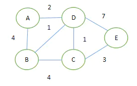

## KMP 字符串算法
---

kmp 算法的优势在于可以避免挨个顺序匹配，什么意思尼？

对于暴力解法，就是当两个字符串中的元素开始不相同时，则从子串在主串起始匹配位置的下一个位置开始重新匹配；

而 kmp 算法可以在不匹配的元素位置处，根据前缀表的值跳转到相应的位置接着匹配；

* 例如： 

主串：aabaabaaf，子串：aabaaf，子串的前缀表为 [0,1,0,1,2,0]，子串与主串匹配到第六位时不相同，此时看前一位，即第五位对应的前缀表2，所以，子串可以回到下标2位置接着匹配；

通常前缀表集体-1；（疑似原因是可以避免陷入死循环）

* 动图：


* 前缀表如何构造尼？
以 aabaaf 为例：

对于第一位：a，前缀后缀不存在，所以为0；

对于第二位：aa，前缀a，后缀a，最长相同为1；

对于第三位：aab，前缀a、aa，后缀b、ab，最长相同为0；

...

所以前缀表为 [0 1 0 1 2 0]，在使用前缀表时为 [-1 0 -1 0 1 -1]，跳转位置时需要把 1 加回来；

* 前缀表cpp代码实现
```cpp
void getNext(int* next,string s) {
    int j = -1;
    next[0] = j;

    for(int i = 1; i < s.size(); ++i) {
        while(j >= 0 && s[i] != s[j+1]) {
            j = next[j];
        }
        if(s[i] == s[j+1]) {
            ++j;
        }
        next[i] = j;
    }
}
```
* 字符串匹配主体函数实现
```cpp
bool kmp(string& main,string& son) {
    int next[son.size()];
    int j = -1;

    getNext(next,son);
    for(int i = 0; i < main.size(); ++i) {
        while(j >= 0 && main[i] != son[j+1]) {
            j = next[j];
        }
        if(main[i] == son[j+1]) {
            ++j;
        }
        if(j == son.size()-1) {
            return true;
        }
    }
    return false;
}
```

<br><br>

## Dijkstra 算法 - 迪杰斯特拉最短路径算法
---



* 原理：
* 指定一个节点，例如我们要计算 'A' 到其他节点的最短路径
* 引入两个集合（S、U），S 集合包含已求出的最短路径的点（以及相应的最短长度），U 集合包含未求出最短路径的点（以及A到该点的路径）
* 步骤：
  - 初始化两个集合，S 集合初始时只有当前要计算的节点A：{ A(0) }，U 集合初始时为 { B(4) , C(∞) , D(2) , E(∞) } 
  - **S** { A(0) , D(2) } ，**U** { B(3) , C(3) , E(9) }
  - **S** { A(0) , D(2) , B(3) } ，**U** { C(3)  , E(6) }
  - **S** { A(0) , D(2) , B(3) , C(3)} ，**U** { E(6) }
  - **S** { A(0) , D(2) , B(3) , C(4) , E(6) } ，**U** {  }

