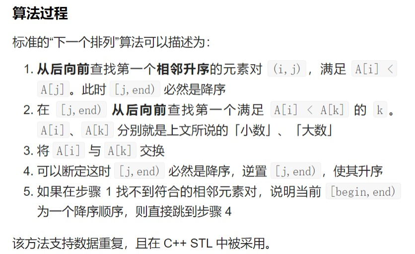
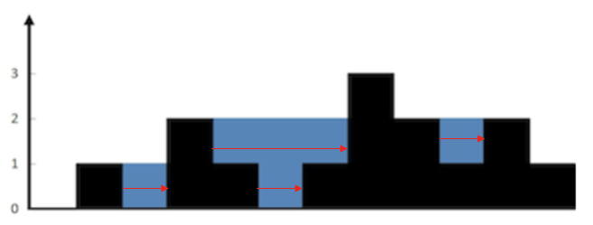
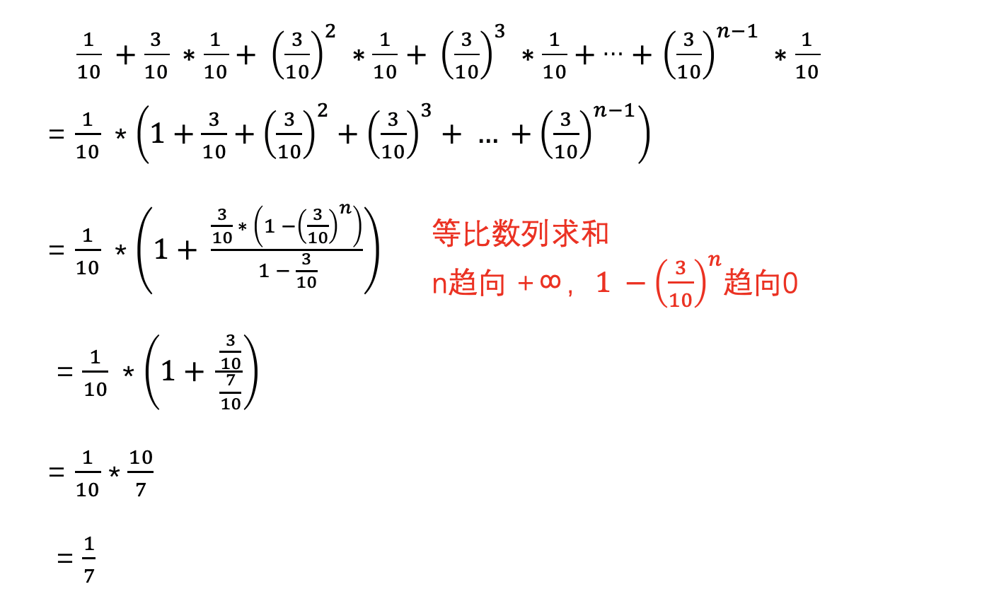

<center><strong><font size = 6>总目录</font></strong></center>

<br>

- [Leetcode-篇](#leetcode-篇)
  - [LRU缓存机制](#lru缓存机制)
  - [两两交换链表中的节点](#两两交换链表中的节点)
  - [最小路径和](#最小路径和)
  - [最长回文子串](#最长回文子串)
  - [三数之和](#三数之和)
  - [两数之和](#两数之和)
  - [跳跃游戏](#跳跃游戏)
  - [跳跃游戏Ⅱ](#跳跃游戏ⅱ)
  - [岛屿数量](#岛屿数量)
  - [最大岛屿面积](#最大岛屿面积)
  - [删除链表倒数第N个节点](#删除链表倒数第n个节点)
  - [盛最多的水](#盛最多的水)
  - [有效の括号](#有效の括号)
  - [排序数组中查找元素的第一个和最后一个位置](#排序数组中查找元素的第一个和最后一个位置)
  - [不同路径](#不同路径)
  - [搜索旋转排序数组](#搜索旋转排序数组)
  - [最大子序和](#最大子序和)
  - [下一个排列](#下一个排列)
  - [合并区间](#合并区间)
  - [买卖股票的最佳时机](#买卖股票的最佳时机)
  - [买卖股票的最佳时机II](#买卖股票的最佳时机ii)
  - [环形链表Ⅱ](#环形链表ⅱ)
  - [电话号码字母组合](#电话号码字母组合)
  - [数组中的第K个最大元素](#数组中的第k个最大元素)
  - [接雨水](#接雨水)
  - [柱状图中最大的矩形](#柱状图中最大的矩形)
  - [组合总和](#组合总和)
  - [单词搜索](#单词搜索)
  - [颜色分类](#颜色分类)
  - [每日温度](#每日温度)
  - [和为K的子数组](#和为k的子数组)
  - [排序链表](#排序链表)
  - [反转链表Ⅱ](#反转链表ⅱ)
  - [K个一组翻转链表](#k个一组翻转链表)
  - [螺旋矩阵](#螺旋矩阵)
  - [括号生成](#括号生成)
  - [字符串相加](#字符串相加)
  - [打家劫舍](#打家劫舍)
  - [字符串转换整数 (atoi)](#字符串转换整数-atoi)
  - [最长递增子序列](#最长递增子序列)
  - [二叉树右视图](#二叉树右视图)
  - [平方根](#平方根)
  - [反转字符串中的单词](#反转字符串中的单词)
  - [路径总和Ⅱ](#路径总和ⅱ)
  - [重排链表](#重排链表)
  - [分隔链表](#分隔链表)
  - [二叉树展开为链表](#二叉树展开为链表)
  - [单词拆分](#单词拆分)
  - [回文链表](#回文链表)
  - [二叉树中的最大路径和](#二叉树中的最大路径和)
  - [二叉树的直径](#二叉树的直径)
  - [最长重复子数组](#最长重复子数组)
  - [斐波那契数](#斐波那契数)
  - [爬楼梯](#爬楼梯)
  - [最小花费爬楼梯](#最小花费爬楼梯)
  - [不同路径Ⅱ](#不同路径ⅱ)
  - [从前序与中序遍历序列构造二叉树](#从前序与中序遍历序列构造二叉树)
  - [用 Rand7() 实现 Rand10()](#用-rand7-实现-rand10)
  - [寻找峰值](#寻找峰值)
  - [对角线遍历](#对角线遍历)
  - [最小栈](#最小栈)
  - [求根节点到叶节点数字之和](#求根节点到叶节点数字之和)
  - [最长公共子序列](#最长公共子序列)
  - [多数元素](#多数元素)
  - [子集](#子集)
  - [复原IP地址](#复原ip地址)
  - [滑动窗口最大值](#滑动窗口最大值)
  - [分发饼干](#分发饼干)
  - [摆动序列](#摆动序列)
  - [加油站](#加油站)
  - [全排列](#全排列)
  - [分发糖果](#分发糖果)
  - [验证IP地址](#验证ip地址)
- [剑指Offer-篇](#剑指offer-篇)
  - [斐波那契数列](#斐波那契数列)
  - [数组中重复的数字](#数组中重复的数字)
  - [二维数组中的查找](#二维数组中的查找)
  - [替换空格](#替换空格)
  - [反转链表](#反转链表)
  - [字符串中不重复的最长子串](#字符串中不重复的最长子串)
  - [从尾到头打印链表](#从尾到头打印链表)
  - [重建二叉树](#重建二叉树)
  - [用两个栈实现队列](#用两个栈实现队列)
  - [两个队列实现栈](#两个队列实现栈)
  - [对称二叉树](#对称二叉树)
  - [平衡二叉树](#平衡二叉树)
  - [二叉树的最大深度](#二叉树的最大深度)
  - [二叉搜索树中第K大节点](#二叉搜索树中第k大节点)
  - [合并两个有序链表](#合并两个有序链表)
  - [二叉树的最近公共祖先](#二叉树的最近公共祖先)
  - [旋转数组的最小数字](#旋转数组的最小数字)
  - [矩阵中的路径](#矩阵中的路径)
  - [机器人的运动范围](#机器人的运动范围)
  - [剪绳子](#剪绳子)
  - [打印从1到最大的n位数](#打印从1到最大的n位数)
  - [字符串的排列](#字符串的排列)
  - [链表中倒数第K个节点](#链表中倒数第k个节点)
  - [二叉搜索树与双向链表](#二叉搜索树与双向链表)

<br>

<center><strong><font size = 6>分类目录</font></strong></center>

---

**等级划分说明：** 概率纯属个人划分，表示面试官能出这题的可能性

:fire::fire::fire::fire::fire: 100 %

---

**二叉树**
* [重建二叉树](#重建二叉树)
* [从前序与中序遍历序列构造二叉树](#从前序与中序遍历序列构造二叉树)
* [二叉树右视图](#二叉树右视图)
* [对称二叉树](#对称二叉树)
* [二叉树的最大深度](#二叉树的最大深度)
* [二叉搜索树与双向链表](#二叉搜索树与双向链表)


**动态规划**
* [斐波那契数](#斐波那契数)
* [爬楼梯](#爬楼梯)
* [最小花费爬楼梯](#最小花费爬楼梯)
* [不同路径](#不同路径)
* [不同路径ⅱ](#不同路径ⅱ)
* [最长递增子序列](#最长递增子序列)

**贪心算法**
* [跳跃游戏](#跳跃游戏)
* [分发饼干](#分发饼干)
* [摆动序列](#摆动序列)
* [最大子序和](#最大子序和)
* [买卖股票的最佳时机](#买卖股票的最佳时机)
* [买卖股票的最佳时机ii](#买卖股票的最佳时机ii)
* [加油站](#加油站)
* [分发糖果](#分发糖果)

**回溯算法**
* [复原ip地址](#复原ip地址)
* [路径总和ⅱ](#路径总和ⅱ)
* [子集](#子集)
* [全排列](#全排列)

**BFS/DFS**
* [岛屿数量](#岛屿数量)
* [最大岛屿面积](#最大岛屿面积)
* [二叉树中的最大路径和](#二叉树中的最大路径和)
* [二叉树的直径](#二叉树的直径)

**双指针**
* [反转链表](#反转链表) :fire::fire::fire::fire::fire:
* [反转链表ⅱ](#反转链表ⅱ)
* [k个一组翻转链表](#k个一组翻转链表)
* [删除链表倒数第n个节点](#删除链表倒数第n个节点)
* [盛最多的水](#盛最多的水)
* [链表中倒数第k个节点](#链表中倒数第k个节点)
* [两两交换链表中的节点](#两两交换链表中的节点)

**二分查找**
* [搜索旋转排序数组](#搜索旋转排序数组)

**C++ 基础**
* [memcpy](../相关实现/myMemcpy.h)
* [memmove](../相关实现/myMemmove.h)

**链表相关**
* [重排链表](#重排链表)
* [分隔链表](#分隔链表)

**数组相关**
* [下一个排列](#下一个排列)

**海量数据**
* [海量数据处理](../../智力题/海量数据处理.pdf)

**其他**
* [LRU缓存机制](#lru缓存机制)
* [栈实现队列](#用两个栈实现队列)
* [两个队列实现栈](#两个队列实现栈)
* [最小栈](#最小栈)
* [验证ip地址](#验证ip地址)


<br>

---
# Leetcode-篇

<div align="center">  </div><br>

<br>

---
## [LRU缓存机制]()

```cpp
struct node {
    int key,value;
    node* prev,*next;
    node():key(0),value(0),prev(NULL),next(NULL) {}
    node(int _key,int _value):key(_key),value(_value),prev(NULL),next(NULL) {}
};
class LRUCache {
private:
    unordered_map<int,node*> cache;
    node* head,*tail;
    int size;
    int cap;
public:
    LRUCache(int capacity):cap(capacity),size(0) {
        head = new node();
        tail = new node();
        head->next = tail;
        tail->prev = head;
    }
    
    int get(int key) {
        if(!cache.count(key)) return -1;
        node* _node = cache[key];
        moveToHead(_node);
        return _node->value;
    }
    
    void put(int key, int value) {
        // 如果不存在
        if(!cache.count(key)) {
            node* _node = new node(key,value);
            cache[key] = _node;
            addToHead(_node);
            ++size;
            if(size > cap) {
                node* lastNode = removeTail();
                cache.erase(lastNode->key);
                delete lastNode;
                --size;
            }
        } else {
            node* _node = cache[key];
            _node->value = value;
            moveToHead(_node);
        }
    }
    void addToHead(node* _node) {
        _node->prev = head;
        _node->next = head->next;
        head->next->prev = _node;
        head->next = _node;
    }
    void removeNode(node* _node) {
        _node->prev->next = _node->next;
        _node->next->prev = _node->prev;
    }
    void moveToHead(node* _node) {
        removeNode(_node);
        addToHead(_node);
    }
    node* removeTail() {
        node* _node = tail->prev;
        removeNode(_node);
        return _node;
    }
};
```
* 哈希 + 双向链表，哈希用于查找节点，双向链表用于删除、添加节点等 ( **O(1)** 实现 )
* `addToHead` 函数部分实现添加节点需要再掌握；

---

## [两两交换链表中的节点](https://leetcode-cn.com/problems/swap-nodes-in-pairs/)

```cpp
class Solution {
public:
    ListNode* swapPairs(ListNode* head) {
        if(head == nullptr || head->next == nullptr) return head;

        ListNode* one = head;
        ListNode* two = head->next;
        ListNode* pre = new ListNode(0);
        ListNode* pree = pre;
        pre->next = one;
        while(one && two) {
            ListNode* tmp = two->next;
            two->next = one;
            one->next = tmp;
            pre->next = two;
            pre = one;
            one = one->next;
            if(!one) break;
            two = one->next;
        }
        return pree->next;
    }
};
```
* 自己写的

```cpp
/**
 * Definition for singly-linked list.
 * struct ListNode {
 *     int val;
 *     ListNode *next;
 *     ListNode() : val(0), next(nullptr) {}
 *     ListNode(int x) : val(x), next(nullptr) {}
 *     ListNode(int x, ListNode *next) : val(x), next(next) {}
 * };
 */
class Solution {
public:
    ListNode* swapPairs(ListNode* head) {
        ListNode* dummyHead = new ListNode(0);
        dummyHead->next = head;
        ListNode* cur = dummyHead;
        while(cur->next != nullptr  && cur->next->next != nullptr) {
            ListNode* one = cur->next;
            ListNode* nextNode = cur->next->next->next;

            cur->next = cur->next->next; // 和前一节点进行连接
            cur->next->next = one; // 交换节点
            cur->next->next->next = nextNode; // 和后一节点进行连接

            cur = cur->next->next;
        }
        return dummyHead->next;
    }
};
```

---

## [最小路径和](https://leetcode-cn.com/problems/minimum-path-sum/)

```cpp
class Solution {
public:
    int minPathSum(vector<vector<int>>& grid) {
        int row = grid.size(),col = grid[0].size();
        if(row == 0 && col == 0) return 0;

        for(int i = 0;i < row;++i) {
            for(int j = 0;j < col;++j) {
                if(i == 0 && j == 0) continue;
                else if(i == 0) {
                    grid[i][j] = grid[i][j-1] + grid[i][j];
                }else if(j == 0) {
                    grid[i][j] = grid[i-1][j] + grid[i][j];
                } else {
                    grid[i][j] = min(grid[i-1][j],grid[i][j-1]) + grid[i][j];
                }
            }
        }
        return grid[row-1][col-1];
    }
};
```

---
## [最长回文子串]()

```cpp
class Solution {
public:
    string longestPalindrome(string s) {
        int strSize = s.size();
        if(strSize < 2) return s;
        vector<vector<bool>> res(strSize,vector<bool>(strSize));
        int len = 1,begin = 0;

        for(int i = 0;i < strSize;++i) res[i][i] = true;
        
        for(int L = 2;L <= strSize;++L) {
            for(int i = 0;i < strSize;++i) {
                int j = L - 1 + i; // 右边界
                if(j >= strSize) break;

                if(s[i] != s[j]) res[i][j] = false;
                else if(j - i < 3) res[i][j] = true;
                else res[i][j] = res[i+1][j-1];

                if(res[i][j] && j-i+1 > len) {
                    len = j - i + 1;
                    begin = i;
                }
            }
        }
        return s.substr(begin,len);
    }
};
```
* 采用 **动态规划** ；( 再复习 )
* **分割回文串** [:bookmark:](../回溯算法/分割回文串.md)

## [三数之和](https://leetcode-cn.com/problems/3sum/)

```cpp
class Solution {
public:
    vector<vector<int>> threeSum(vector<int>& nums) {
        vector<vector<int>> res({});
        if(nums.size()<3) return res;
        sort(nums.begin(),nums.end());

        for(int first = 0;first < nums.size()-2;++first) {
            if(nums[first] > 0) break;
            if(first > 0 && nums[first] == nums[first-1]) continue;
            int second = first + 1,end = nums.size()-1;
            while(second < end) {
                int sum = nums[first] + nums[second] + nums[end];
                if(sum < 0) {
                    while(second < end && nums[second] == nums[++second]);
                } else if(sum > 0) {
                    while(second < end && nums[end] == nums[--end]);
                } else {
                    res.push_back({nums[first],nums[second],nums[end]});
                    while(second < end && nums[second] == nums[++second]);
                    while(second < end && nums[end] == nums[--end]);
                }
            }
        }
        return res;
    }
};
```
* 本题采用 **排序 + 双指针** ，时间复杂度 `O(n^2)` ;


## [两数之和](https://leetcode-cn.com/problems/two-sum/)

```cpp
class Solution {
public:
    vector<int> twoSum(vector<int>& nums, int target) {
        unordered_map<int,int> hashTable;
        for(int i = 0;i < nums.size();i++) {
            auto it = hashTable.find(target-nums[i]);
            if(it != hashTable.end()) return {it->second,i};
            hashTable[nums[i]] = i;
        }
        return {};
    }
};
```
* 采用 **哈希** 查找，时间复杂度 `O(n)`
* 此题与 **三数之和** の区别在于：本题返回的时下标，因此不能进行排序，而 **三数之和** 返回的时 数本身，因此可以进行排序，然后利用 **双指针** 进行查找；

<br>

## [跳跃游戏](https://leetcode-cn.com/problems/jump-game/)

```cpp
class Solution {
public:
    bool canJump(vector<int>& nums) {
        int len = nums.size();
        int furthest = 0;
        for(int i = 0;i < len;++i) {
            if(i <= furthest) {
                furthest = max(furthest,i + nums[i]);
                if(furthest >= len-1) return true; // 退出条件
                //if(furthest <= i) return false;
            }
        }
        return false;    
    }
};
```
* **贪心算法** ，遍历数组，记录走到最远的下标；

## [跳跃游戏Ⅱ](https://leetcode-cn.com/problems/jump-game-ii/)

```cpp
class Solution {
public:
    int jump(vector<int>& nums) {
        int step = 0;
        int curFarthest = 0;
        int nextFarthest = 0;

        for(int i = 0; i < nums.size()-1; ++i) {
            nextFarthest = max(nextFarthest, nums[i]+i);
            if(i == curFarthest) {
                curFarthest = nextFarthest;
                step++;
            }
        }
        return step;
    }
};
```

<br><br>

<h2 id="岛屿数量"></h2>

## [岛屿数量](https://leetcode-cn.com/problems/number-of-islands/)
* [岛屿最大面积:link:](https://leetcode-cn.com/problems/max-area-of-island/)<br>
* [岛屿周长:link:](https://leetcode-cn.com/problems/island-perimeter/)<br>
* [最大人工岛:link:](https://leetcode-cn.com/problems/making-a-large-island/)<br>

```cpp
class Solution {
public:
    int numIslands(vector<vector<char>>& grid) {
        int numIslands = 0;
        int row = grid.size(),col = grid[0].size();

        for(int i = 0;i < row;++i) {
            for(int j = 0;j < col;++j) {
                if(grid[i][j] == '1'){
                    DFS(grid,i,j);
                    ++numIslands;
                }
            }
        }  
        return numIslands;     
    }
private:
    void DFS(vector<vector<char>>& grid,int i,int j) {
        if(i < 0 || i >= grid.size() || j < 0 || j >= grid[0].size() || grid[i][j] == '0' || grid[i][j] == '2')
            return;
        grid[i][j] = '2';
        DFS(grid,i+1,j);
        DFS(grid,i-1,j);
        DFS(grid,i,j-1);
        DFS(grid,i,j+1);
    }
};
```
* **DFS 深度优先遍历 ( 递归 )** 实现；

## 最大岛屿面积

```cpp
/* 陆地沉没法 */
class Solution {
public:
    int maxAreaOfIsland(vector<vector<int>>& grid) {
        if(grid.size() == 0) return 0;

        int res = 0;
        for(int i = 0; i < grid.size(); ++i) {
            for(int j = 0; j < grid[0].size(); ++j) {
                if(grid[i][j] == 1) {
                    int area = DFS(grid, i, j, grid.size(), grid[0].size());
                    res = max(area, res);
                }
            }
        }
        return res;
    }
private:
    int DFS(vector<vector<int>>& grid, int row, int col, int rows, int cols) {
        if(row < 0 || row >= rows || col < 0 || col >= cols || grid[row][col] == 0) {
            return 0;
        }
        int count = 1;
        grid[row][col] = 0;

        count += DFS(grid, row-1, col, rows, cols);
        count += DFS(grid, row+1, col, rows, cols);
        count += DFS(grid, row, col-1, rows, cols);
        count += DFS(grid, row, col+1, rows, cols);

        return count;
    }
};
```
* 陆地沉没法，这样可以避免大量的重复计算量，也能避免重复计算岛屿数量；

---

## [删除链表倒数第N个节点](https://leetcode-cn.com/problems/remove-nth-node-from-end-of-list/)


```cpp
class Solution {
public:
    ListNode* removeNthFromEnd(ListNode* head, int n) {
        if(head->next == NULL) return NULL;

        ListNode* pre = head;
        ListNode* cur = head;
        for(int i = 0; i < n-1; ++i) {
            pre = pre->next;
        }
        if(pre->next == NULL) { // 删除头节点
            head = cur->next;
            return head;
        }
        while(pre->next->next != NULL) {
            pre = pre->next;
            cur = cur->next;
        }
        cur->next = cur->next->next; // 删除尾节点或者中间节点
        return head;
    }
};
```
* **双指针法**

<br><br>

## [盛最多的水](https://leetcode-cn.com/problems/container-with-most-water/)

```cpp
class Solution {
public:
    int maxArea(vector<int>& height) {
        int inMoreWater = 0;
        int left = 0;
        int right = height.size()-1;

        while(left < right) {
            inMoreWater = height[left] < height[right] ? 
            max(inMoreWater,(right-left)*height[left++]) : 
            max(inMoreWater,(right-left)*height[right--]);
        }
        return inMoreWater;
    }
};
```
* 利用**双指针**，充当水池的两个边界，一步一步挪动，比较出最大值；

<br><br>

## [有效の括号](https://leetcode-cn.com/problems/valid-parentheses/)

```cpp
class Solution {
public:
    bool isValid(string s) {
        int strSize = s.length();
        if(strSize % 2 == 1) return false;
        
        stack<char> st;
        int flag = 0;

        for(int i = 0; i < strSize; ++i) {
            if(s[i] == '(' || s[i] == '[' || s[i] == '{') {
                st.push(s[i]);
                flag++;
            }else if(st.empty()) {
                return false;
            }else if((st.top() == '(' && s[i] == ')') || (st.top() == '[' && s[i] == ']') ||
            (st.top() == '{' && s[i] == '}')) {
                st.pop();
                flag--;
            }else {
                return false;
            }               

        }
        if(flag != 0) return false;
        return true;
    }
};
```
* 利用 **栈** 的特性；

<br><br>

## [排序数组中查找元素的第一个和最后一个位置](https://leetcode-cn.com/problems/find-first-and-last-position-of-element-in-sorted-array/)

```cpp
class Solution {
public:
    int findLeft(vector<int>& nums,int& target) {
        int left = 0, right = nums.size()-1;
        while(left < right) {
            int mid = left + (right - left) / 2;
            if(nums[mid] < target) {
                left = mid + 1;
            } else {
                right = mid;
            }
        }
        if(nums[left] == target) return left;
        return -1;
    }
    int findRight(vector<int>& nums,int& target) {
        int left = 0,right = nums.size()-1;
        while(left < right) {
            int mid = left + (right - left + 1)/2;
            if(nums[mid] > target) {
                right = mid - 1;
            } else {
                left = mid;
            }
        }
        return left;
    }
    vector<int> searchRange(vector<int>& nums, int target) {
        vector<int> res(2,-1);
        if(nums.size() == 0) return res;

        int left = findLeft(nums,target);
        if(left == -1) return res;
        res[0] = left;
        int right = findRight(nums,target);
        res[1] = right;

        return res; 
    }
};
```
* 二分查找也分为 **递归** 和 **非递归**；
* 本方法使用非递归方式，有效提高速度，内存空间占用也小；

---

## [不同路径](https://leetcode-cn.com/problems/unique-paths/)

二维数组：

```cpp
class Solution {
public:
    int uniquePaths(int m, int n) {
        vector<vector<int>> dp(m, vector<int>(n, 0));
        for(int i = 0; i < n; ++i) {
            dp[0][i] = 1;
        }
        for(int i = 0; i < m; ++i) {
            dp[i][0] = 1;
        }
        for(int i = 1; i < m; ++i) {
            for(int j = 1; j < n; ++j) {
                dp[i][j] = dp[i-1][j] + dp[i][j-1];
            }
        }
        return dp[m-1][n-1];
    }
};
````
* 根据题意，一个网格只能向右或者向下，所以对于网格图来说，上边界一排和左边界一列的网格只有一种走法，那就是直走，因此，我们将这些网格的走法初始化为1；


```cpp
class Solution {
public:
    int uniquePaths(int m, int n) {
        vector<int> dp(n);
        for(int i = 0; i < n; ++i) {
            dp[i] = 1;
        }
        for(int j = 1; j < m; ++j) {
            for(int i = 1; i < n; ++i) {
                dp[i] += dp[i-1];
            }
        }
        return dp[n-1];
    }
};
```
* 采用 **动态规划**, 此外内存优化版本，一维数组也可以理解为滚动数组；
* 本题与 **最小路径和** 类似，倒推问题。

<br><br>

## [搜索旋转排序数组](https://leetcode-cn.com/problems/search-in-rotated-sorted-array/ )

```cpp
class Solution {
public:
    int search(vector<int>& nums, int target) {
        if(nums.size() == 1) return nums[0] == target ? 0 : -1;
        return aHalf(nums,target);
    }
private:
    int aHalf(vector<int>& nums,int target) {
        int left = 0;
        int right = nums.size()-1;
        while(left <= right) {
            int mid = (left + right)/2;
            if(nums[mid] == target) return mid;
            if(nums[mid] > target) {
                // 和目标值比较需要加 = 号
                if(nums[right] >= target && nums[right] < nums[mid]) left = mid+1; 
                else right = mid-1;
            } else {
                if(nums[left] <= target && nums[left] > nums[mid]) right = mid-1;
                else left = mid+1;
            }
        }
        return -1;
    }
};
```
* 注意 `= 号`

<br><br>

## [最大子序和](https://leetcode-cn.com/problems/maximum-subarray/)

```cpp
class Solution {
public:
    int maxSubArray(vector<int>& nums) {
        int maxValue = nums[0];
        int pre = nums[0];
        int vecSize = nums.size();

        for(int i = 1; i < vecSize; ++i) {
            pre = max(pre + nums[i],nums[i]); // 选择起始点的作用，如果原来的和值小于零，则开始换新的起始点，如果新的起始点小于max，继续前进，当累计的和大于原来的max时，就更新max值
            maxValue = max(maxValue, pre);
        }
        return maxValue;
    }
};
```
* **动态规划** ，重点在于更新新的起始点；


```cpp
class Solution {
public:
    int maxSubArray(vector<int>& nums) {
        if(nums.size() == 1) return nums[0];
        int sum = 0;
        int res = INT_MIN;

        for(int i = 0; i < nums.size(); i++) {
            sum += nums[i];       
            if(sum > res) res = sum;
            if(sum <= 0) sum = 0;
        }
        return res;
    }
};
```
* 贪心算法，如果和 sum 小于0，就把和重新置为0；

<br><br>

## [下一个排列](https://leetcode-cn.com/problems/next-permutation/)

```cpp
class Solution {
public:
    void nextPermutation(vector<int>& nums) {
        int vecSize = nums.size();
        if(vecSize <= 1) return;
        int i = vecSize-2, j = vecSize-1, k = vecSize-1;

        while(i >= 0 && nums[i] >= nums[j]) {
            --i;
            --j;
        }
        if(i >= 0) {
            while(nums[i] >= nums[k]) --k;
            swap(nums[i],nums[k]);
        }
        reverse(nums.begin()+j,nums.end());
    }
};
```

 

* 再复习

<br><br>

## [合并区间](https://leetcode-cn.com/problems/merge-intervals/)

```cpp
class Solution {
public:
    vector<vector<int>> merge(vector<vector<int>>& intervals) {
        int numIV = intervals.size();
        int maxVal = -1;
        int index = -1;
        vector<vector<int>> res;
        sort(intervals.begin(),intervals.end());
        for(int i = 0; i < numIV; ++i) {
            if(intervals[i][0] > maxVal) {
                res.push_back(intervals[i]);
                index++;
                maxVal = intervals[i][1];
                
            } else {
                res[index][1] = max(res[index][1],intervals[i][1]);
                maxVal = res[index][1];
            }
        }
        return res;
    }
};
```

<br><br>

## [买卖股票的最佳时机](https://leetcode-cn.com/problems/best-time-to-buy-and-sell-stock/)

```cpp
class Solution {
public:
    int maxProfit(vector<int>& prices) {
        int days = prices.size();
        int minVal = 0,maxVal = 0;
        int minIndex = 0,maxIndex = days-1;
        int maxMoney = 0;

        for(int i = 0; i < days; ++i) {
            if(i == 0 || prices[i] < minVal) {
                minVal = prices[i];
                if(i < maxIndex) {
                   minIndex = i;      
                } 
                else {
                    minIndex = i;
                    maxIndex = days-1;
                }
                
            }
            if(prices[i] > minVal) {
                maxVal = prices[i];
                maxIndex = i;
            }
            maxMoney = max(maxMoney,prices[maxIndex]-prices[minIndex]);
        }
        return maxMoney;
    }
};
```
* 从第一天开始购买，如果价格更低且下标小于最大价格下标，则更新价格，否则更新下标并将最大下标重置为尾下标；
* 当价格大于目前最小价格时，标记为最大价格下标；


```cpp
class Solution {
public:
    int maxProfit(vector<int>& prices) {
        int ans = 0;
        vector<int> num;
        prices.emplace_back(-1);

        for(int i = 0; i < prices.size(); ++i) {
            while(!num.empty() && prices[i] < num.back()) {
                ans = max(ans, num.back() - num.front());
                num.pop_back();
            }
            num.emplace_back(prices[i]);
        }
        return ans;
    }
};
```
* 单调栈；


```cpp
class Solution {
public:
    int maxProfit(vector<int>& prices) {
        int profit = 0;
        int minPrice = INT_MAX;

        for(int& num:prices) {
            profit = max(profit, num - minPrice);
            minPrice = min(minPrice, num);
        }
        return profit;
    }
};
```
* 在遍历数组过程中维最小值，并且比较最大收益；

## [买卖股票的最佳时机II](https://leetcode-cn.com/problems/best-time-to-buy-and-sell-stock-ii/)

```cpp
class Solution {
public:
    int maxProfit(vector<int>& prices) {
        int profit = 0;

        for(int i = 1; i < prices.size(); i++) {
            int num = prices[i] - prices[i-1];
            if(num <= 0) continue;
            else profit += num;
        }
        return profit;
    }
};
```
* 在可以多次买卖的情况下，将当前价格和前一天的价格进行比较，如果大于0，则进行收益累加，如果小于0，不累计；

<br>

---

## [环形链表Ⅱ](https://leetcode-cn.com/problems/linked-list-cycle-ii/)  

[环形链表Ⅰ](https://leetcode-cn.com/problems/linked-list-cycle/) 


```cpp
/**
 * Definition for singly-linked list.
 * struct ListNode {
 *     int val;
 *     ListNode *next;
 *     ListNode(int x) : val(x), next(NULL) {}
 * };
 */
class Solution {
public:
    ListNode *detectCycle(ListNode *head) {

        ListNode* fast = head;
        ListNode* slow = head;
        while(true) {
            if(fast == NULL || fast->next == NULL) return NULL;
            fast = fast->next->next;
            slow = slow->next;
            if(fast == slow)
                break;
        }
        fast = head;
        while(fast != slow) {
            fast = fast->next;
            slow = slow->next;
        }
        return fast;
    }
};
```
* 均采用 **双指针法**
* 使用同类方法的题目：例如寻找距离尾部第K个节点、寻找环入口、寻找公共尾部入口等

<br><br>

## [电话号码字母组合](https://leetcode-cn.com/problems/letter-combinations-of-a-phone-number/)

```cpp
class Solution {
public:
    vector<string> res;
    string s;
    void arrange(string& digits,int index) {
        if(index == digits.size()) {
            res.push_back(s);
            return;
        }
        int digit = digits[index] - '0';
        string letter = table[digit];
        for(int i = 0; i < letter.size(); ++i) {
            s.push_back(letter[i]);
            arrange(digits,index+1);
            s.pop_back();
        }
    }
    vector<string> letterCombinations(string digits) {
        s.clear();
        res.clear();
        if(digits.size() == 0) return res;

        arrange(digits,0);
        return res;
    }
private:
    unordered_map<int,string> table = {{2,"abc"},{3,"def"},{4,"ghi"},{5,"jkl"},{6,"mno"},{7,"pqrs"},{8,"tuv"},{9,"wxyz"}};
};
```
* **回溯算法**

<br><br>

## [数组中的第K个最大元素](https://leetcode-cn.com/problems/kth-largest-element-in-an-array/)

```cpp
class Solution {
public:
    void heapify(vector<int>& nums,int len,int parent) {
        if(parent >= len) return;

        int left = parent*2+1;
        int right = parent*2+2;
        int max = parent;

        if(left < len && nums[left] > nums[max]) max = left;
        if(right < len && nums[right] > nums[max]) max = right;
        if(max != parent) {
            swap(nums[max],nums[parent]);
            heapify(nums,len,max);
        }
    }
    void buildHeap(vector<int>& nums,int len) {
        int parent = (len-2)/2;
        for(int i = parent; i >= 0; --i) {
            heapify(nums,len,i);
        }
    }
    int findKthLargest(vector<int>& nums, int k) {
        int len = nums.size();
        buildHeap(nums,len);

        for(int i = len-1; i >= len-k+1; --i) {
            swap(nums[0],nums[i]);
            heapify(nums,i,0);
        }
        return nums[0];
    }
};
```
* 其实也就是完完全全的 **堆排序**

## [接雨水](https://leetcode-cn.com/problems/trapping-rain-water/)

```cpp
class Solution {
public:
    int trap(vector<int>& height) {
        if(height.empty()) return 0;
        int vecSize = height.size();
        int leftMax = height[0],rightMax = height[vecSize-1];
        int res = 0,left = 0,right = vecSize-1;

        while(left < right) {
            if(height[left] <= height[right]) {
                leftMax = max(leftMax,height[left]);
                res += leftMax-height[left];
                left++;
            } else {
                rightMax = max(rightMax,height[right]);
                res += rightMax-height[right];
                right--;
            }
        }
        return res;
    }
};
```
* **双指针**，总是从墙低的地方开始遍历，这样才能找到地形更低的水坑；


```cpp
class Solution {
public:
    int trap(vector<int>& height) {
        if(height.size() <= 2) return 0;
        stack<int> stk;
        stk.push(0);
        int res = 0;

        for(int i = 0; i < height.size(); ++i) {
            if(height[i] == height[stk.top()]) {
                stk.pop();
                stk.push(i);
            }else if(height[i] < height[stk.top()]) {
                stk.push(i);
            }else {
                while(!stk.empty() && height[i] > height[stk.top()]) {
                    int mid = stk.top();
                    stk.pop();
                    if(!stk.empty()) {
                        int w = i - stk.top() - 1;
                        int h = min(height[stk.top()], height[i]) - height[mid];
                        res += w * h;    
                    }
                }
                stk.push(i);
            }
        }
        return res;
    }
};
```
* 单调栈解法，和下面的题中的单调栈解法基本一致；
* 这道题中的当调栈是逆序栈，当出现较大高度时，就需要计算一次坑的大小，就是一层一层的计算；最后将坑的大小进行累加即可；

<div align=center></div>

<br>

## [柱状图中最大的矩形](https://leetcode-cn.com/problems/largest-rectangle-in-histogram/)

```cpp
class Solution {
public:
    int largestRectangleArea(vector<int>& heights) {
        stack<int> st;
        heights.insert(heights.begin(), 0);
        heights.push_back(0);
        st.push(0);
        int result = 0;
        
        for(int i = 1; i < heights.size(); ++i) {
            if(heights[i] > heights[st.top()]) {
                st.push(i);
            }else if(heights[i] == heights[st.top()]) {
                st.pop();
                st.push(i);
            }else {
                while(heights[i] < heights[st.top()]) {
                    int mid = st.top();
                    st.pop();
                    int left = st.top();
                    int right = i;
                    int w = right - left - 1;
                    int h = heights[mid];
                    result = max(result, w*h);
                }
                st.push(i);
            }
        }
        return result;
    }
};
```
* 利用当调栈，将小高度插入当调栈的过程中，对当前最大矩阵进行比较记录；

<br>

## [组合总和](https://leetcode-cn.com/problems/combination-sum/)

```cpp
class Solution {
public:
    vector<vector<int>> result;
    vector<int> path;
    void backtracing(vector<int>& candidates,int sum,int target,int index) {
        if(sum == target) {
            result.push_back(path);
            return;
        }

        for(int i = index; i < candidates.size() && sum+candidates[i] <= target; ++i) {
            sum += candidates[i];
            path.push_back(candidates[i]);
            backtracing(candidates,sum,target,i);
            sum -= candidates[i];
            path.pop_back();
        }   
    }
    vector<vector<int>> combinationSum(vector<int>& candidates, int target) {
        result.clear();
        path.clear();
        sort(candidates.begin(),candidates.end());
        backtracing(candidates,0,target,0);
        return result;
    }
};
```
* **回溯算法**，回溯算法：确定参数，终止条件 (符合目标返回) ，回溯处理逻辑；
* `backtracing(candidates,sum,target,i);` 这一句中最后从 i 开始回溯，也就是包含自己，下一次可以重复使用；
* 为什么不是从 0 开始呢？从 0 开始会与前面的答案重复，只是顺序不同而已，所以要从 i 开始回溯；

<br>

---

## [单词搜索](https://leetcode-cn.com/problems/word-search/)

同剑指Offer中`矩阵中的路径`一题

```cpp
class Solution {
public:
    int row,col;
    bool dfs(vector<vector<char>>& board,string& word,int i,int j,int k) {
        if(i < 0 || i >= row || j < 0 || j >= col || board[i][j] != word[k]) {
            return false;
        }
        if(k == word.size()-1) return true;
        char temp = board[i][j];
        board[i][j] = '\0';
        bool res = dfs(board,word,i+1,j,k+1) || dfs(board,word,i-1,j,k+1) ||
        dfs(board,word,i,j+1,k+1) || dfs(board,word,i,j-1,k+1);
        board[i][j] = temp;
        return res;
    }
    bool exist(vector<vector<char>>& board, string word) {
        row = board.size();
        col = board[0].size();

        for(int i = 0; i < row; ++i) {
            for(int j = 0; j < col; ++j) {
                if(dfs(board,word,i,j,0)) return true;
            }
        }
        return false;
    }
};
```
* 同样是一道 **回溯算法** 的题目，在回溯过程中在周围四个方向进行查找；
* 二维数组遍历循环的目的就是找到单词首字母匹配的位置；

## [颜色分类](https://leetcode-cn.com/problems/sort-colors/)

```cpp
class Solution {
public:
    void sortColors(vector<int>& nums) {
        int vecSize = nums.size();
        if(vecSize < 2) return;

        int i = 0;
        int zero = 0;
        int two = vecSize;
        while(i < two) {
            if(nums[i] == 0) {
                if(i != zero) swap(nums[i],nums[zero]);
                zero++;
                i++;
            } else if(nums[i] == 1) {
                i++;
            } else {
                two--;
                swap(nums[i],nums[two]);
            }
        }
    }
};
```
* 考察目的？？？

## [每日温度](https://leetcode-cn.com/problems/daily-temperatures/)

```cpp
class Solution {
public:
    vector<int> dailyTemperatures(vector<int>& temperatures) {
        int vecSize = temperatures.size();
        vector<int> result(vecSize,0);
        stack<int> st;
        st.push(0);

        for(int i = 1; i < vecSize; ++i) {
            while(!st.empty() && temperatures[i] > temperatures[st.top()]) {
                result[st.top()] = i - st.top();
                st.pop();
            }
            st.push(i);
        }
        return result;
    }
};
```
* 栈的应用；

## [和为K的子数组](https://leetcode-cn.com/problems/subarray-sum-equals-k/)

```cpp
class Solution {
public:
    int subarraySum(vector<int>& nums, int k) {
        unordered_map<int,int> uMap;
        int pre = 0,count = 0;

        uMap[0] = 1;
        for(auto& num:nums) {
            pre += num;
            if(uMap.find(pre-k) != uMap.end()) {
                count += uMap[pre-k];
            }
            uMap[pre]++;
        }
        return count;

    }
};
```
* 此题利用 **前缀和 + 哈希表** ；

<br>

---

## [排序链表](https://leetcode-cn.com/problems/sort-list/)

```cpp
/**
 * Definition for singly-linked list.
 * struct ListNode {
 *     int val;
 *     ListNode *next;
 *     ListNode() : val(0), next(nullptr) {}
 *     ListNode(int x) : val(x), next(nullptr) {}
 *     ListNode(int x, ListNode *next) : val(x), next(next) {}
 * };
 */
class Solution {
public:
    ListNode* sortList(ListNode* head) {
        if(!head || !head->next) return head;

        ListNode* fast = head->next,*slow = head;
        while(fast != nullptr && fast->next != nullptr ) {
            fast = fast->next->next;
            slow = slow->next;
        }
        ListNode* tmp = slow->next;
        slow->next = nullptr;

        ListNode* left = sortList(head);
        ListNode* right = sortList(tmp);
        ListNode* node = new ListNode(0);
        ListNode* res = node;
        while(left != nullptr && right != nullptr) {
            if(left->val < right->val) {
                node->next = left;
                left = left->next;
            } else {
                node->next = right;
                right = right->next;
            }
            node = node->next;
        }
        node->next = left != nullptr ? left : right;
        return res->next;
    }
};
```
* 并归排序自顶而下；递归法；

## [反转链表Ⅱ](https://leetcode-cn.com/problems/reverse-linked-list-ii/submissions/)

```cpp
/**
 * Definition for singly-linked list.
 * struct ListNode {
 *     int val;
 *     ListNode *next;
 *     ListNode() : val(0), next(nullptr) {}
 *     ListNode(int x) : val(x), next(nullptr) {}
 *     ListNode(int x, ListNode *next) : val(x), next(next) {}
 * };
 */
class Solution {
public:
    void reverseList(ListNode* head) {
        ListNode* pre = head,*cur = nullptr;
        while(pre) {
            ListNode* tmp = pre->next;
            pre->next = cur;
            cur = pre;
            pre = tmp;
        }
    }
    ListNode* reverseBetween(ListNode* head, int left, int right) {
        ListNode* newHead = new ListNode(-1);
        newHead->next = head;
        
        ListNode* cur = newHead;
        for(int i = 0; i < left-1; ++i) {
            cur = cur->next;
        }
        ListNode* rightNode = cur;
        for(int i = 0; i < right-left+1; ++i) {
            rightNode = rightNode->next;
        }
        ListNode* leftNode = cur->next;
        ListNode* rightHalf = rightNode->next;

        cur->next = nullptr;
        rightNode->next = nullptr;

        reverseList(leftNode);
        cur->next = rightNode;
        leftNode->next = rightHalf;

        return newHead->next;
    }
};
```
* 与反转链表Ⅰ结合，先取出要反转的链表段进行反转，然后进行前后连接；

## [K个一组翻转链表](https://leetcode-cn.com/problems/reverse-nodes-in-k-group/)

```cpp
/**
 * Definition for singly-linked list.
 * struct ListNode {
 *     int val;
 *     ListNode *next;
 *     ListNode() : val(0), next(nullptr) {}
 *     ListNode(int x) : val(x), next(nullptr) {}
 *     ListNode(int x, ListNode *next) : val(x), next(next) {}
 * };
 */
class Solution {
public:
    ListNode* reverseKGroup(ListNode* head, int k) {
        ListNode* node = new ListNode(0);
        node->next = head;
        ListNode* pre = node;
        ListNode* end = node;
        while(end->next) {
            for(int i = 0; i < k && end != nullptr; ++i) {
                end = end->next;
            }
            if(end == nullptr) break; // 节点数量不足，顺序保持不变
            ListNode* start = pre->next;
            ListNode* next = end->next;
            end->next = nullptr;// 断开连接
            pre->next = reverse(start); // 反转
            start->next = next; // 重新连接链表
            pre = start;
            end = pre;
        }
        return node->next;
    }
private:
    ListNode* reverse(ListNode* head) {
        ListNode* pre = nullptr;
        ListNode* cur = head;
        while(cur) {
            ListNode* tmp = cur->next;
            cur->next = pre;
            pre = cur;
            cur = tmp;
        }
        return pre;
    }
};
```
* 这道题其实和 **反转链表Ⅱ** 很相似，都是反转某一段的链表，不符合条件的节点则保持不变；

<br>

## [螺旋矩阵](https://leetcode-cn.com/problems/spiral-matrix/)

```cpp
class Solution {
public:
    vector<int> spiralOrder(vector<vector<int>>& matrix) {
        vector<int> result;
        if(matrix.empty()) return result;
        int up = 0,down = matrix.size()-1,left = 0,right = matrix[0].size()-1;

        while(1) {
            // 向右
            for(int i = left; i <= right; ++i) result.push_back(matrix[up][i]);
            if(++up > down) break;
            // 向下
            for(int i = up; i <= down; ++i) result.push_back(matrix[i][right]);
            if(--right < left) break;
            // 向左
            for(int i = right; i >= left; --i) result.push_back(matrix[down][i]);
            if(--down < up) break;
            // 向上
            for(int i = down; i >= up; --i) result.push_back(matrix[i][left]);
            if(++left > right) break;
        }
        return result;
    }
};
```
* 很是精妙的解答；算法绝对简单；

## [括号生成](https://leetcode-cn.com/problems/generate-parentheses/)

```cpp
class Solution {
public:
    vector<string> generateParenthesis(int n) {
        if(n == 0) return {};
        if(n == 1) return {"()"};

        vector<vector<string>> dp(n+1);
        dp[0] = {""};
        dp[1] = {"()"};
        for(int i = 2; i <= n; ++i) {
            for(int j = 0; j < i; ++j) {
                for(string p : dp[j]) {
                    for(string q : dp[i-j-1]) {
                        string str = "(" + p + ")" + q;
                        dp[i].push_back(str);
                    }
                }
            }
        }
        return dp[n];
    }
};
```

## [字符串相加](https://leetcode-cn.com/problems/add-strings/)

```cpp
class Solution {
public:
    string addStrings(string num1, string num2) {
        string result = "";
        int size1 = num1.size()-1;
        int size2 = num2.size()-1;
        int carry = 0;
        while( size1 >= 0 || size2 >= 0) {
            int one = size1 >= 0 ? num1[size1]-'0' : 0;
            int two = size2 >= 0 ? num2[size2]-'0' : 0;
            int sum = one + two + carry;
            carry = sum / 10;
            result += to_string(sum%10);
            --size1;
            --size2;
        }
        if(carry == 1) result += "1";
        reverse(result.begin(),result.end());
        return result;
    }
};
```

## [打家劫舍](https://leetcode-cn.com/problems/house-robber/)

```cpp
class Solution {
public:
    int rob(vector<int>& nums) {
        if(nums.size() == 0) return 0;

        int num = nums.size();
        vector<int> dp(num+1);
        dp[0] = 0;
        dp[1] = nums[0];

        for(int i = 2; i <= num; ++i) {
            dp[i] = max(dp[i-1],dp[i-2] + nums[i-1]);
        }
        return dp[num];

    }
};
```
* 动态规划


```cpp
int rob(vector<int>& nums) {
    int prev = 0;
    int curr = 0;

    // 每次循环，计算“偷到当前房子为止的最大金额”
    for (int i : nums) {
        // 循环开始时，curr 表示 dp[k-1]，prev 表示 dp[k-2]
        // dp[k] = max{ dp[k-1], dp[k-2] + i }
        int temp = max(curr, prev + i);
        prev = curr;
        curr = temp;
        // 循环结束时，curr 表示 dp[k]，prev 表示 dp[k-1]
    }

    return curr;
}
```
* 动态规划空间优化

## 字符串转换整数 (atoi)

```cpp

```

## [最长递增子序列](https://leetcode-cn.com/problems/longest-increasing-subsequence/)

```cpp
class Solution {
public:
    int lengthOfLIS(vector<int>& nums) {
        vector<int> tail(nums.size(),0);
        int res = 0;
        for(int num:nums) {
            int i = 0, j = res;
            while(i < j) {
                int m = (i + j)/2;
                if(tail[m] < num) i = m + 1;
                else j = m; 
            }
            tail[i] = num;
            if(j == res) res++;
        }
        return res;
    }
};
```
* i,j 分别为 tail 数组的左右下标，二分查找 num 在 tail 数组中合适的位置；
* 时间复杂度 O(nlogn);
* [分析](../动态规划/最长递增子序列.md)

## [二叉树右视图](../二叉树/二叉树右视图.md)

## [平方根]()

```cpp
class Solution {
public:
    int mySqrt(int x) {
        if(x == 0) return 0;

        double C = x,x0 = x;
        while(1) {
            double xi = (x0 + C/x0)/2;
            if(abs(x0-xi) < 1e-7) break;
            x0 = xi;
        }
        return (int)x0;
    }
};
```
* 牛顿迭代法

## [反转字符串中的单词](https://leetcode-cn.com/problems/reverse-words-in-a-string/)

```cpp
class Solution {
public:
    string reverseWords(string s) {
        // 反转整个字符串
        reverse(s.begin(),s.end());
        int index = 0;
        for(int i = 0; i < s.size(); ++i) {
            if(s[i] != ' ') {
                // 单词末尾添加空格
                if(index != 0) s[index++] = ' ';
                // 遍历单词
                int end = i;
                while(end < s.size() && s[end] != ' ') s[index++] = s[end++];
                // 反转单词
                reverse(s.begin()+index-(end-i),s.begin()+index);
                // 单词末尾的下一个位置
                i = end;
            }
        }
        s.erase(s.begin()+index,s.end());
        return s;
    }
};
```

## [路径总和Ⅱ](https://leetcode-cn.com/problems/path-sum-ii/)

```cpp
/**
 * Definition for a binary tree node.
 * struct TreeNode {
 *     int val;
 *     TreeNode *left;
 *     TreeNode *right;
 *     TreeNode() : val(0), left(nullptr), right(nullptr) {}
 *     TreeNode(int x) : val(x), left(nullptr), right(nullptr) {}
 *     TreeNode(int x, TreeNode *left, TreeNode *right) : val(x), left(left), right(right) {}
 * };
 */
class Solution {
private:
    vector<vector<int>> res;
    void traversal(TreeNode* node,int targetSum,vector<int>& vec) {
        vec.push_back(node->val);
        targetSum -= node->val;

        if(node->left == nullptr && node->right == nullptr && targetSum == 0) {
            res.push_back(vec);
            return;
        }
        if(node->left) {
            traversal(node->left,targetSum,vec);
            vec.pop_back(); 
        }
        if(node->right) {
            traversal(node->right,targetSum,vec);
            vec.pop_back();
        }
        return;
    }
public:
    vector<vector<int>> pathSum(TreeNode* root, int targetSum) {
        if(!root) return res;
        vector<int> vec;
        traversal(root,targetSum,vec);
        return res;
    }
};
```
* 和二叉树搜索全部路径一样，只是多了一个路径的选择而已；

## [重排链表](https://leetcode-cn.com/problems/reorder-list/)

```cpp
/**
 * Definition for singly-linked list.
 * struct ListNode {
 *     int val;
 *     ListNode *next;
 *     ListNode() : val(0), next(nullptr) {}
 *     ListNode(int x) : val(x), next(nullptr) {}
 *     ListNode(int x, ListNode *next) : val(x), next(next) {}
 * };
 */
class Solution {
public:
    void reorderList(ListNode* head) {
        if(!head) return;

        vector<ListNode*> vec;
        ListNode* node = head;
        while(node) {
            vec.push_back(node);
            node = node->next;
        }
        int i = 0,j = vec.size()-1;
        while(i < j) {
            vec[i]->next = vec[j];
            i++;
            if(i == j) break;
            vec[j]->next = vec[i];
            j--;
        }
        vec[i]->next = nullptr;
    }
};
```
* 节点线性化，然后左右取节点依次连接，最后一个节点的 next 置空；

---

## [分隔链表](https://leetcode-cn.com/problems/partition-list/)

```cpp
/**
 * Definition for singly-linked list.
 * struct ListNode {
 *     int val;
 *     ListNode *next;
 *     ListNode() : val(0), next(nullptr) {}
 *     ListNode(int x) : val(x), next(nullptr) {}
 *     ListNode(int x, ListNode *next) : val(x), next(next) {}
 * };
 */
class Solution {
public:
    ListNode* partition(ListNode* head, int x) {
        ListNode* lessHead = new ListNode(0);
        lessHead->next = nullptr;
        ListNode* lessTail = lessHead;

        ListNode* greatHead = new ListNode(0);
        greatHead->next = nullptr;
        ListNode* greatTail = greatHead;

        ListNode* cur = head;
        while(cur) {
            if(cur->val < x) {
                lessTail->next = cur;
                lessTail = cur;
            }else {
                greatTail->next = cur;
                greatTail = cur;
            }
            cur = cur->next;
        }
        greatTail->next = nullptr;
        lessTail->next = greatHead->next;
        return lessHead->next;
    }
};
```
* 大华笔试；


---

## [二叉树展开为链表](https://leetcode-cn.com/problems/flatten-binary-tree-to-linked-list/)

```cpp
class Solution {
public:
    void flatten(TreeNode* root) {
        if(root == nullptr) return;

        while(root != nullptr) {
            if(root->left == nullptr) {
                root = root->right;
            }else {
                TreeNode* node = root->left;
                while(node->right) {
                    node = node->right;
                }
                node->right = root->right;
                root->right = root->left;
                root->left = nullptr;

                root = root->right;
            }
        }
    }
};
```

## [单词拆分](https://leetcode-cn.com/problems/word-break/)

```cpp
class Solution {
public:
    bool wordBreak(string s, vector<string>& wordDict) {
         unordered_set<string> wordSet(wordDict.begin(),wordDict.end());
         vector<bool> dp(s.size() + 1, false);

         dp[0] = true;
         for(int i = 1; i <= s.size(); ++i) {
             for(int j = 0; j < i; ++j) {
                 string word = s.substr(j, i-j);
                 if(wordSet.find(word) != wordSet.end() && dp[j]) {
                     dp[i] = true;
                 }
             }
         }
         return dp[s.size()];
    }
};
```
* 完全背包问题的衍生问题；

## [回文链表](https://leetcode-cn.com/problems/palindrome-linked-list/)

```cpp
class Solution {
public:
    bool isPalindrome(ListNode* head) {
        if(!head || !head->next) return true;

        ListNode* slow = head;
        ListNode* fast = head;
        ListNode* pre = head;
        while(fast && fast->next) {
            fast = fast->next->next;
            pre = slow;
            slow = slow->next;
        }
        pre->next = nullptr;

        ListNode* l1 = head;
        ListNode* l2 = reverseList(slow);
        while(l1) {
            if(l1->val != l2->val) return false;
            l1 = l1->next;
            l2 = l2->next;
        }
        return true;   
    }
private:
    ListNode* reverseList(ListNode* node) {
        ListNode* tmp;
        ListNode* cur = node;
        ListNode* pre = nullptr;
        while(cur) {
            tmp = cur->next;
            cur->next = pre;
            pre = cur;
            cur = tmp;
        }
        return pre;
    }
    
};
```
* 最简单的思路就是将这个链表分成两半，将后半部分链表进行反转
* 然后从各自头节点开始一次比较；

## [二叉树中的最大路径和](https://leetcode-cn.com/problems/binary-tree-maximum-path-sum/)

```cpp
/**
 * Definition for a binary tree node.
 * struct TreeNode {
 *     int val;
 *     TreeNode *left;
 *     TreeNode *right;
 *     TreeNode() : val(0), left(nullptr), right(nullptr) {}
 *     TreeNode(int x) : val(x), left(nullptr), right(nullptr) {}
 *     TreeNode(int x, TreeNode *left, TreeNode *right) : val(x), left(left), right(right) {}
 * };
 */
class Solution {
public:
    int maxPathSum(TreeNode* root) {
        if(root == nullptr) return 0;
        dfs(root);
        return maxCount;
    }
private:
    int maxCount = INT_MIN;
    int dfs(TreeNode* node) {
        if(node == nullptr) return 0;

        // 遍历根节点
        int left = dfs(node->left);
        int right = dfs(node->right);
        int sum = node->val + left + right;
        maxCount = max(maxCount, sum);

        return max(node->val + max(left, right), 0);
    }
};
```
* [详细解析](../二叉树/二叉树最大路径和.md)

## [二叉树的直径](https://leetcode-cn.com/problems/diameter-of-binary-tree/)

```cpp
class Solution {
public:
    int diameterOfBinaryTree(TreeNode* root) {
        if(root == nullptr) return 0;
        dfs(root);
        return sum-1; // 减去根节点
    }
private:
    int sum = 0;
    int dfs(TreeNode* node) {
        if(node == nullptr) return 0;

        int left = dfs(node->left);
        int right = dfs(node->right);
        sum = max(sum, left + right + 1);

        return max(left, right) + 1;
    }
};
```
* 和上一题[二叉树中的最大路径和](https://leetcode-cn.com/problems/binary-tree-maximum-path-sum/)是一模一样的解法；
* 采用 DFS 算法遍历二叉树中每一个节点；


## [最长重复子数组](https://leetcode-cn.com/problems/maximum-length-of-repeated-subarray/)

```cpp
class Solution {
public:
    int findLength(vector<int>& nums1, vector<int>& nums2) {
        int n = nums1.size();
        int m = nums2.size();
        vector<vector<int>> dp(n+1, vector<int>(m+1, 0));

        int res = 0;
        for(int i = n-1; i >= 0; i--) {
            for(int j = m-1; j >= 0; j--) {
                dp[i][j] = nums1[i] == nums2[j] ? dp[i+1][j+1] + 1 : 0;
                res = max(res, dp[i][j]);
            }
        }
        return res;
    }
};
```
* 动态规划

## [斐波那契数](https://leetcode-cn.com/problems/fibonacci-number/)

```cpp
class Solution {
public:
    int fib(int n) {
        if(n <= 1) return n;
        int dp[2];
        dp[0] = 0;
        dp[1] = 1;
        
        for(int i = 2; i <= n; ++i) {
            int sum = dp[0] + dp[1];
            dp[0] = dp[1];
            dp[1] = sum;
        }
        return dp[1];
    }
};
```
* 最基础的动态规划例题；

## [爬楼梯](https://leetcode-cn.com/problems/climbing-stairs/)

```cpp
class Solution {
public:
    int climbStairs(int n) {
        if(n <= 2) return n;

        int dp[2];
        dp[0] = 1;
        dp[1] = 2;

        for(int i = 3; i <= n; ++i) {
            int sum = dp[0] + dp[1];
            dp[0] = dp[1];
            dp[1] = sum;
        }
        return dp[1];
    }
};
```
* 这道题和斐波那契数是一模一样的问题，只是换了个问法而已，代码也是一样的；

## [最小花费爬楼梯](https://leetcode-cn.com/problems/min-cost-climbing-stairs/)

```cpp
class Solution {
public:
    int minCostClimbingStairs(vector<int>& cost) {
        int dp0 = cost[0];
        int dp1 = cost[1];

        for(int i = 2; i < cost.size(); ++i) {
            int dpi = min(dp0, dp1) + cost[i];

            dp0 = dp1;
            dp1 = dpi;
        }
        return min(dp0, dp1);
    }
};
```
* 动态规划，跳到第三个楼梯的花费依赖于第一第二阶梯的信息，因此，围绕这三个阶梯不断向前遍历，就可以得到最后一组第一和第二阶梯的花费，因为最后一组中的第一和第二阶梯都可以直接到达顶层，所以最后取最小花费就🆗了；

## [不同路径Ⅱ](https://leetcode-cn.com/problems/unique-paths-ii/)

```cpp
class Solution {
public:
    int uniquePathsWithObstacles(vector<vector<int>>& obstacleGrid) {
        int m = obstacleGrid.size();
        int n = obstacleGrid[0].size();

        vector<vector<int>> dp(m, vector<int>(n, 0));
        for(int i = 0; i < n && obstacleGrid[0][i] == 0; ++i) dp[0][i] = 1;
        for(int i = 0; i < m && obstacleGrid[i][0] == 0; ++i) dp[i][0] = 1;

        for(int i = 1; i < m; ++i) {
            for(int j = 1; j < n; ++j) {
                if(obstacleGrid[i][j] == 1) continue;
                dp[i][j] = dp[i-1][j] + dp[i][j-1];
            }
        }
        return dp[m-1][n-1];
    }
};
```
* 在不同路径Ⅰ中，就是处于全图没有障碍物的情况下；在Ⅱ中，只需要将障碍物判断加入其中，既满足路径要求，而且路径中没有障碍物就是符合要求的了；

## [从前序与中序遍历序列构造二叉树](https://leetcode-cn.com/problems/construct-binary-tree-from-preorder-and-inorder-traversal/)

```cpp
class Solution {
public:
    TreeNode* buildTree(vector<int>& preorder, vector<int>& inorder) {
        int sum = preorder.size();
        for(int i = 0; i < sum; ++i) {
            index[inorder[i]] = i;
        }
        return build(preorder, inorder, 0, sum-1, 0, sum-1);
    }
private:
    unordered_map<int, int> index;
    TreeNode* build(vector<int>& preorder, vector<int>& inorder, int preLeft, int preRight, int inLeft, int inRight) {
        if(preLeft > preRight) return nullptr;

        int preOrderRoot = preLeft;
        int inOrderRoot = index[preorder[preOrderRoot]];
        TreeNode* root = new TreeNode(preorder[preOrderRoot]);

        int sizeOfLeftTree = inOrderRoot - inLeft;
        root->left = build(preorder, inorder, preLeft+1, preLeft+sizeOfLeftTree, inLeft, inOrderRoot-1);
        root->right = build(preorder, inorder, preOrderRoot+sizeOfLeftTree+1, preRight, inOrderRoot+1, inRight);

        return root;
    }
};
```
* 主要就是利用前序遍历和中序遍历的特点，找出这棵树的根节点，然后确定出来左子树和右子树的范围；
* 反复循环这一操作，就可以构建完整的二叉树；

<br>

---

## [用 Rand7() 实现 Rand10()](https://leetcode-cn.com/problems/implement-rand10-using-rand7/)

首先：考虑一下 rand10() 实现 rand7() 是否可行？那就是直接调用 rand10() 即可，直到出现想要的数字就行了；

关于可行性（即是否等概率）具体推导：




```cpp
class Solution {
public:
    int rand10() {
        while(true) {
            int num = (rand7() - 1) * 7 + rand7();
            if(num <= 40) return 1 + num%10;
            num = (num - 40 - 1) * 7 + rand7();
            if(num <= 60) return 1 + num%10;
            num = (num - 60 - 1) * 7 + rand7();
            if(num <= 20) return 1 + num%10;
        }     
    }
};
```

---

## [寻找峰值](https://leetcode-cn.com/problems/find-peak-element/)

```cpp
class Solution {
public:
    int findPeakElement(vector<int>& nums) {
        int left = 0;
        int right = nums.size()-1;
        while(left < right) {
            int mid = (left + right)/2;
            if(nums[mid] > nums[mid+1]) right = mid;
            else left = mid + 1;
        }
        return left;
    }
};
```
* 迭代二分查找；

```cpp
class Solution {
public:
    int findPeakElement(vector<int>& nums) {
        for(int i = 0; i < nums.size()-1; ++i) {
            if(nums[i] > nums[i+1]) {
                return i;
            }
        }
        return nums.size()-1;
    }
};
```
* 线性查找；时间O(n)空间O(1)；

---

## [对角线遍历](https://leetcode-cn.com/problems/diagonal-traverse/)

```cpp
class Solution {
public:
    vector<int> findDiagonalOrder(vector<vector<int>>& mat) {
        int row = mat.size();
        int col = mat[0].size();

        for(int i = 0; i < row + col - 1; ++i) {
            int tmpRow = flag ? row : col;
            int tmpCol = flag ? col : row;

            int x = (i < tmpRow) ? i : tmpRow-1;
            int y = i - x;

            while(x >= 0 && y < tmpCol) {
                result.push_back(flag ? mat[x][y] : mat[y][x]);
                x--;
                y++;
            }
            flag = !flag;
        }
        return result;
    }
private:
    vector<int> result;
    bool flag = true;
};
```
* 主要就是对规律的分析；

---

## [最小栈](https://leetcode-cn.com/problems/min-stack/)

```cpp
class MinStack {
public:
    /** initialize your data structure here. */
    MinStack() {}
    
    void push(int val) {
        stk.push(val);
        if(minStk.empty() || val <= minStk.top()) {
            minStk.push(val);
        }
    }
    
    void pop() {
        if(stk.top() == minStk.top()) {
            minStk.pop();
        }
        stk.pop();
    }
    
    int top() {
        return stk.top();
    }
    
    int getMin() {
        return minStk.top();
    }
private:
    stack<int> stk;
    stack<int> minStk;
};

/**
 * Your MinStack object will be instantiated and called as such:
 * MinStack* obj = new MinStack();
 * obj->push(val);
 * obj->pop();
 * int param_3 = obj->top();
 * int param_4 = obj->getMin();
 */
```

---

## [求根节点到叶节点数字之和](https://leetcode-cn.com/problems/sum-root-to-leaf-numbers/)

```cpp
/**
 * Definition for a binary tree node.
 * struct TreeNode {
 *     int val;
 *     TreeNode *left;
 *     TreeNode *right;
 *     TreeNode() : val(0), left(nullptr), right(nullptr) {}
 *     TreeNode(int x) : val(x), left(nullptr), right(nullptr) {}
 *     TreeNode(int x, TreeNode *left, TreeNode *right) : val(x), left(left), right(right) {}
 * };
 */
class Solution {
public:
    int sumNumbers(TreeNode* root) {
        int num = 0;
        return traversal(root, num);
    }
private:
    int traversal(TreeNode* node, int& num) {
        if(node == nullptr) return 0;
        int sum = num*10 + node->val;
        if(node->left == nullptr && node->right == nullptr) {
            return sum;
        }
        return traversal(node->left, sum) + traversal(node->right, sum);
    }
};
```
* DFS深度优先遍历；

---

## [最长公共子序列](https://leetcode-cn.com/problems/longest-common-subsequence/)

```cpp
class Solution {
public:
    int longestCommonSubsequence(string text1, string text2) {
        int m = text1.size();
        int n = text2.size();
        vector<vector<int>> dp(m+1, vector<int>(n+1, 0));

        for(int i = 1; i <= m; ++i) {
            for(int j = 1; j <= n; ++j) {
                if(text1[i-1] == text2[j-1]) {
                    dp[i][j] = dp[i-1][j-1] + 1;
                }else {
                    dp[i][j] = max(dp[i-1][j], dp[i][j-1]);
                }
            }
        }
        return dp[m][n];
    }
};
```
* 动态规划题目；

---

## [多数元素](https://leetcode-cn.com/problems/majority-element/)

```cpp
class Solution {
public:
    int majorityElement(vector<int>& nums) {
        int candiate = -1;
        int count = 0;
        for(int& num:nums) {
            if(count == 0) candiate = num;
            if(num == candiate) ++count;
            else --count;
        }
        return candiate;
    }
};
```
* 摩尔投票法，关于投票法的具体实现步骤就是
  - 首先 candiate 初始化为 nums[0]，count = 1；
  - 然后遍历后边的元素，如果元素值一样，就 count++，如果元素不一样，那就 count--；
  - 当 count 的计数为 0 时，那就重新初始化；（为啥 count 计数减为 0，为啥重新初始化？我感觉原因就在于前面已经遍历过的数组元素中众数与非众数各占一般，不能判断出是否时真正的众数，所以重新初始化）
- **后续接着理解！！**

## [子集](https://leetcode-cn.com/problems/subsets/)

```cpp
class Solution {
public:
    vector<vector<int>> subsets(vector<int>& nums) {
        traversal(nums, 0);
        return res;
    }
private:
    vector<vector<int>> res;
    vector<int> path;
    void traversal(vector<int>& nums, int index) {
        res.push_back(path);

        for(int i = index; i < nums.size(); i++) {
            path.push_back(nums[i]);
            traversal(nums, i+1);
            path.pop_back();
        }
    }
};
```
* 回溯算法；

<br>

## [复原IP地址](https://leetcode-cn.com/problems/restore-ip-addresses/)

```cpp
class Solution {
public:
    vector<string> restoreIpAddresses(string s) {
        result.clear();
        backtracing(s, 0, 0);
        return result;
    }
private:
    vector<string> result;
    bool isVaild(const string& str, int start, int end) {
        if(start > end) return false;
        if(str[start] == '0' && start != end) return false;
        int num = 0;
        for(int i = start; i <= end; ++i) {
            if(str[i] > '9' || str[i] < '0') return false;
            num = num * 10 + str[i] - '0';
            if(num > 255) return false; 
        }
        return true;
    }
    void backtracing(string& str, int startIndex, int numPoint) {
        if(numPoint == 3) {
            if(isVaild(str, startIndex, str.size()-1)) {
                result.push_back(str);
            }
            return;
        }
        for(int i = startIndex; i < str.size(); ++i) {
            if(isVaild(str, startIndex, i)) {
                str.insert(str.begin() + i + 1, '.');
                numPoint++;
                backtracing(str, i + 2, numPoint);
                numPoint--;
                str.erase(str.begin() + i + 1);
            } else {
                break;
            }
        }
    }

};
```
* 其实这就是对字符串的处理，判断某一段的字符串符合 IP 地址的书写要求后，就可以继续往前递归，递归到最底后，然后开始回溯遍历别的情况；

</br>

## [滑动窗口最大值]()

```cpp
class Solution {
public:
    vector<int> maxSlidingWindow(vector<int>& nums, int k) {
        int n = nums.size();
        priority_queue<pair<int, int>> que;

        for(int i = 0; i < k; ++i) {
            que.emplace(nums[i], i);
        }
        vector<int> ans = {que.top().first};
        for(int i = k; i < n; ++i) {
            que.emplace(nums[i], i);
            while(que.top().second <= i-k) que.pop();

            ans.push_back(que.top().first);
        }
        return ans;
    }
};
```
* 利用 STL 中的优先队列，优先队列中排序的实质就是利用堆排序；


```cpp
class Solution {
public:
    vector<int> maxSlidingWindow(vector<int>& nums, int k) {
        MyQue myque;
        vector<int> res;

        for(int i = 0; i < k; ++i) {
            myque.push(nums[i]);
        }
        res.push_back(myque.getMax());
        for(int i = k; i < nums.size(); ++i) {
            myque.pop(nums[i-k]);
            myque.push(nums[i]);
            res.push_back(myque.getMax());
        }
        return res;
    } 
private:
    class MyQue {
    public:
        void push(int val) {
            while(!deq.empty() && val > deq.back()) {
                deq.pop_back();
            }
            deq.push_back(val);
        }
        void pop(int val) {
            if(!deq.empty() && val == deq.front()) {
                deq.pop_front();
            }            
        }
        int getMax() {
            return deq.front();
        }
    private:
        deque<int> deq;
    };
};
```
* 基于 deque 的单调队列，本题是单调递减，最大值放在队头，返回最大值直接返回队头元素即可；

## [分发饼干](https://leetcode-cn.com/problems/assign-cookies/)

```cpp
class Solution {
public:
    int findContentChildren(vector<int>& g, vector<int>& s) {
        sort(g.begin(), g.end());
        sort(s.begin(), s.end());

        int count = 0;
        for(int i = 0; i < s.size(); i++) {
            if(count < g.size() && g[count] <= s[i]) count++;
        }
        return count;
    }
};
```
* 先进行排序，然后用小饼干满足小胃口的孩子；

## [摆动序列](https://leetcode-cn.com/problems/wiggle-subsequence/)

```cpp
class Solution {
public:
    int wiggleMaxLength(vector<int>& nums) {
        if(nums.size() <= 1) return nums.size();
        int pre = 0;
        int cur = 0;
        int count = 1;
        for(int i = 0; i < nums.size()-1; i++) {
            cur = nums[i+1] - nums[i];
            if((pre <= 0 && cur > 0) || (pre >= 0 && cur < 0)) {
                count++;
                pre = cur;
            }
        }
        return count;
    }
};
```

## [加油站](https://leetcode-cn.com/problems/gas-station/)

```cpp
class Solution {
public:
    int canCompleteCircuit(vector<int>& gas, vector<int>& cost) {
        int curTotal = 0;
        int total = 0;
        int index = 0;
        for(int i = 0; i < gas.size(); i++) {
            curTotal += gas[i] - cost[i];
            total += gas[i] - cost[i];
            if(curTotal < 0) {
                curTotal = 0;
                index = i + 1;
            }
        }
        if(total < 0) return -1;
        return index;
    }
};
```
* 如果花费数大于加油数，那么铁定是跑不了一圈的；
* 只要花费数小于等于加油数，那么肯定可以跑一圈，关键就在于起点在哪儿？只要汽油剩余不足时，就说明起点有问题，那就遍历下一个起点；

---

## [全排列](https://leetcode-cn.com/problems/permutations/)

```cpp
class Solution {
public:
    vector<vector<int>> permute(vector<int>& nums) {
        vector<int> used(nums.size(), false);
        backtracing(nums, used);
        return result;
    }
private:
    vector<vector<int>> result;
    vector<int> path;
    void backtracing(vector<int>& nums, vector<int>& used) {
        if(path.size() == nums.size()) {
            result.push_back(path);
            return;
        }

        for(int i = 0; i < nums.size(); ++i) {
            if(used[i]) continue;
            path.push_back(nums[i]);
            used[i] = true;
            backtracing(nums, used);
            path.pop_back();
            used[i] = false;
        }
    }
};
```

## [分发糖果](https://leetcode-cn.com/problems/candy/)

```cpp
class Solution {
public:
    int candy(vector<int>& ratings) {
        int sum = 0;
        vector<int> candy(ratings.size(), 1); // 每人先发一块糖
        for(int i = 1; i < ratings.size(); ++i) {
            if(ratings[i] > ratings[i-1]) candy[i] = candy[i-1] + 1;
        }
        for(int i = ratings.size() - 2; i >= 0; i--) {
            if(ratings[i] > ratings[i+1]) candy[i] = max(candy[i], candy[i+1]+1);
        }
        for(int i = 0; i < ratings.size(); ++i) {
            sum += candy[i];
        }
        return sum;
    }
};
```
* 进行两边遍历，从左到右主要是与左边孩子相比，从右到左主要是和右边孩子相比；

<br>

---

## [验证IP地址](https://leetcode-cn.com/problems/validate-ip-address/)

```cpp
class Solution {
public:
    string validIPAddress(string IP) {
        regex ipv4("(([0-9]|[1-9][0-9]|1[0-9][0-9]|2[0-4][0-9]|25[0-5])\\.){3}([0-9]|[1-9][0-9]|1[0-9][0-9]|2[0-4][0-9]|25[0-5])");
        regex ipv6("([0-9a-fA-F]{1,4}\\:){7}[0-9a-fA-F]{1,4}");
        if(regex_match(IP, ipv4)) return "IPv4";
        if(regex_match(IP, ipv6)) return "IPv6";
        return "Neither";
    }
};
```
* 利用正则表达式进行匹配，利用纯C++语言匹配可能稍微麻烦些，更多的是注意特例情况的筛选；

<br>

---

# 剑指Offer-篇


<div align="center"></div><br>

---

<br> 

## [斐波那契数列](https://leetcode-cn.com/problems/fei-bo-na-qi-shu-lie-lcof/)

```cpp
class Solution {
public:
    long long fib(int n) {
        int sum[2] = {0,1};
        if(n < 2) return sum[n];

        long long numOne = 0;
        long long numTwo = 1;
        long long sumTemp = 0;
        for(int i = 2;i <= n;++i) {
        /* 对于 i++ 和 ++1 ，都可以达到 +1 的效果，但是 ++i 更加高效 */
            sumTemp = numOne + numTwo;

            numOne = numTwo % 1000000007;
            numTwo = sumTemp % 1000000007;
        }
        return sumTemp % 1000000007;
    }
};
```

---

## [数组中重复的数字](https://leetcode-cn.com/problems/shu-zu-zhong-zhong-fu-de-shu-zi-lcof/)

**原地置换**

```cpp
class Solution {
public:
    int findRepeatNumber(vector<int>& num) {
        int temp;
        for(int i = 0;i < num.size();i++) {
            while(num[i] != i) {  /* 如果下标与数值不相等，即位置不匹配*/
                if(num[i] == num[num[i]]) // 退出条件，如果另外一个数字与已经位置匹配的数值相等，即重复数字*/
                    return num[i];
                // 交换数字，使其位置与数字匹配
                swap(num[i],num[num[i]]);
                /*temp = num[i];
                num[i] = num[num[i]];
                num[num[i]] = temp;*/
            }
        }
        return -1; // 没有重复数字
    }
};
```
* 传入数组时，必须是同时传入数组的名称和大小，只传入名称在函数内求数组大小是 `NO WAY`
* `C++ swap()`函数是引用交换，因此效率高于值交换，在`Leetcode OJ`中，值交换会出现超时

## [二维数组中的查找](https://leetcode-cn.com/problems/er-wei-shu-zu-zhong-de-cha-zhao-lcof/)
**线性查找**

```cpp
class Solution {
public:
    bool findNumberIn2DArray(vector<vector<int>>& matrix, int target) {
        if(matrix.size() == 0) return false;

        int i = matrix.size()-1,j = 0;
        while(i >= 0 && j < matrix[0].size()) {
            if(matrix[i][j] > target) i--;
            else if(matrix[i][j] < target) j++;
            else return true;
        }
        return false;
    }
};
```
* 以左下角或者右上角值为对比值均可
* 数组传入函数中、新建一个容器，不能直接用`=`赋值，也不能直接去调用其中的数值，会出现`null pointer`问题(初始化)
* 在这个题中，首先要判断矩阵是否为空，不为空时，才能调用数值计算 `matrix[0].size()` ;

## [替换空格](https://leetcode-cn.com/problems/ti-huan-kong-ge-lcof/)
**字符串问题**：字符串查找算法、正则表达式算法、模式匹配、字符串的匹配算法`kmp`

```cpp
class Solution {
public:
    string replaceSpace(string s) {
        int count = 0,strLength = s.length();
        if(!strLength) return s;
        for(char c:s) {
            if(c == ' ') ++count;
        }
        s.resize(2*count + strLength);

        for(int i = strLength-1,j = s.length()-1;i < j; i--,j--) {
            if(s[i] != ' ') s[j] = s[i];
            else {
                s[j] = '0';
                s[j-1] = '2';
                s[j-2] = '%';
                j -= 2;  // -2是减掉多出的位置数
            }
        }
        return s;
    }
};
```
* 在`C++`中，`string`被设计成可修改的，因此这个算法就是根据这个特性，**原地置换**，特别注意的是，在最后遍历置换`' '`时，要从后往前遍历，反之则会出现覆盖，置换错误
* 现成`api:` `repleace/replaceAll、encodeURIComponent、split/join`

## [反转链表](https://leetcode-cn.com/problems/fan-zhuan-lian-biao-lcof/)

**双指针法**

```cpp
/**
 * Definition for singly-linked list.
 * struct ListNode {
 *     int val;
 *     ListNode *next;
 *     ListNode(int x) : val(x), next(NULL) {}
 * };
 */
class Solution {
public:
    ListNode* reverseList(ListNode* head) {
        if(head == NULL || head->next == NULL) return head; /*这一步异常判断不用做，在while循环中可以判断并退出*/
        ListNode* cur = NULL;
        ListNode* pre = head;
        while(pre) {
            ListNode* t = pre->next;

            pre->next = cur;
            cur = pre;
            pre = t;
        }
        return cur;
    }
};
```
* 设置两个指针，一前`pre`一后`cur`，前面的指针初始化为`head`节点，后面的指针为空，每一次将`pre`的下一个节点指向`cur`即可，当`pre`指向为空时，结束循环退出
* 每次 转换完链表指向后，将两个指针同时指向下一个节点，即同时前进一步

**递归法**

```cpp
/**
 * Definition for singly-linked list.
 * struct ListNode {
 *     int val;
 *     ListNode *next;
 *     ListNode(int x) : val(x), next(NULL) {}
 * };
 */
class Solution {
public:
    ListNode* reverseList(ListNode* head) {
        if(head == NULL || head->next == NULL) return head;

        // 递归到最后一个节点
        ListNode* ret = reverseList(head->next); /* 在最后一次判空后，ret == head->next(尾节点)*/
        head->next->next = head;
        head->next = NULL;

        return ret; // 旧链表的尾节点即链表的头节点
    }
};
```
* 首先，相较于双指针等其他非递归方法，递归法 时间、空间开销较大
* 递归法的总体思路就是递归到尾节点，然后转换相邻两个节点之间的指向关系，根据退出条件不断递归退出，最后给尾节点`->next == NULL`;

---

## [字符串中不重复的最长子串](https://leetcode-cn.com/problems/zui-chang-bu-han-zhong-fu-zi-fu-de-zi-zi-fu-chuan-lcof/)

[Leetcode.3 无重复字符的最长子串](https://leetcode-cn.com/problems/longest-substring-without-repeating-characters/)

**滑动窗口**

```cpp
class Solution {
public:
    int lengthOfLongestSubstring(string s) {
        unordered_set<char> chars;
        int s_size = s.size();
        int left = 0,right = 0,lengthest = 0;

        // for(;left < s_size;++left) { // 以左边界遍历整个字符串
        for(;left < strSize-length;++left) { // 左遍历,这样减少遍历
            while(right < s_size && chars.count(s[right]) == 0) {
                chars.insert(s[right]);
                lengthest = max(lengthest,right-left+1);
                ++right;
            }
            /* 当不满足while条件时，也即是容器中出现重复字符，不符合要求了，将最左边的字符删除，实现容器向前一步，匹配 ++left */
            chars.erase(s[left]);
        }
        return lengthest;
    }
};
```
* 对于这个滑动窗口方法，其中包含 **窗口滑动** 和 **哈希** ，另外也可以用 **动态规划** 和 **哈希** 实现；
* 时间复杂度 `O(n)`;

---

## [从尾到头打印链表](https://leetcode-cn.com/problems/cong-wei-dao-tou-da-yin-lian-biao-lcof/)

**非栈非递归(暴力)**

```cpp
/**
 * Definition for singly-linked list.
 * struct ListNode {
 *     int val;
 *     ListNode *next;
 *     ListNode(int x) : val(x), next(NULL) {}
 * };
 */
class Solution {
public:
    vector<int> reversePrint(ListNode* head) {
        ListNode* node = head;
        int count = 0;
        while(node) {
            ++count;
            node = node->next;
        }
        vector<int> result(count);
        node = head;
        for(auto i = result.rbegin();i != result.rend();++i) {
            *i = node->val; // *iter 返回迭代器iter所指元素的引用
            node = node->next;
        }
        return result;
    }
};
```
* 其他方法包含：入栈出栈、递归法(空间时间开销特别大)、反转链表；其实递归法的本质也是一个栈，先进后出
* 利用vector的insert特性


```cpp
/**
 * Definition for singly-linked list.
 * struct ListNode {
 *     int val;
 *     ListNode *next;
 *     ListNode(int x) : val(x), next(NULL) {}
 * };
 */
class Solution {
public:
    vector<int> reversePrint(ListNode* head) {
        vector<int> res;
        ListNode* pre=head;
        while(pre){
            res.insert(res.begin(),pre->val);
            pre=pre->next;
        }
        return res;
    }
}; 
```

---

## [重建二叉树](https://leetcode-cn.com/problems/zhong-jian-er-cha-shu-lcof/)

**递归**

```cpp
/**
 * Definition for a binary tree node.
 * struct TreeNode {
 *     int val;
 *     TreeNode *left;
 *     TreeNode *right;
 *     TreeNode() : val(0), left(nullptr), right(nullptr) {}
 *     TreeNode(int x) : val(x), left(nullptr), right(nullptr) {}
 *     TreeNode(int x, TreeNode *left, TreeNode *right) : val(x), left(left), right(right) {}
 * };
 */
class Solution {
public:
    unordered_map<int,int> index;
    TreeNode* build(vector<int>& preorder, vector<int>& inorder,int preLeft,int preRight,
                int inLeft,int inRight) {
        if(preLeft > preRight) return nullptr;

        int preorderRoot = preLeft;
        int inorderRoot = index[preorder[preorderRoot]];
        TreeNode* root = new TreeNode(preorder[preorderRoot]);
        int sizeLeftSubTree = inorderRoot - inLeft;

        root->left = build(preorder,inorder,preLeft+1,preLeft+sizeLeftSubTree,inLeft,inorderRoot-1);
        root->right = build(preorder,inorder,preLeft+sizeLeftSubTree+1,preRight,inorderRoot+1,inRight);
        return root;
    }
    TreeNode* buildTree(vector<int>& preorder, vector<int>& inorder) {
        int num = inorder.size();
        for(int i = 0;i < num;++i) {
            index[inorder[i]] = i;
        }
        return build(preorder,inorder,0,num-1,0,num-1);
    }
};
```
* 前序遍历：中左右；中序遍历：左中右；根据前序遍历首个元素时根节点来划分中序遍历数组；
* 对于迭代法，暂时没看懂，后面接着看

---

## [用两个栈实现队列](https://leetcode-cn.com/problems/yong-liang-ge-zhan-shi-xian-dui-lie-lcof/)

* 本题的题意大概是：单词为具体操作，数组对应位置的值为返回值，新建队列、队尾增加都没有返回值，即时 `null` ，只有删除操作有返回值，有值则返回删除的值，没值则返回 `-1` ；

```cpp
class CQueue {
public:
    stack<int> stack1,stack2;
    CQueue() {

    }
    
    void appendTail(int value) {
        stack1.push(value);
    }
    
    int deleteHead() {
        if(stack2.empty()) {
            while(!stack1.empty()) {
                stack2.push(stack1.top());
                stack1.pop();
            }
        }
        if(stack2.empty()) {return -1;}
        else {
            auto head = stack2.top();
            stack2.pop();
            return head;
        }
    }
};

/**
 * Your CQueue object will be instantiated and called as such:
 * CQueue* obj = new CQueue();
 * obj->appendTail(value);
 * int param_2 = obj->deleteHead();
 */
```

---

## [两个队列实现栈](https://leetcode-cn.com/problems/implement-stack-using-queues/)

```cpp
class MyStack {
public:
    queue<int> que1;
    queue<int> que2;
    /** Initialize your data structure here. */
    MyStack() {

    }
    
    /** Push element x onto stack. */
    void push(int x) {
        que2.push(x);
        while(!que1.empty()) {
            que2.push(que1.front());
            que1.pop();
        }
        swap(que1, que2);
    }
    
    /** Removes the element on top of the stack and returns that element. */
    int pop() {
        int tmp = -1;
        if(!que1.empty()) {
            tmp = que1.front();
            que1.pop();
        }
        return tmp;
    }
    
    /** Get the top element. */
    int top() {
        int top = -1;
        if(!que1.empty()) top = que1.front();
        return top;
    }
    
    /** Returns whether the stack is empty. */
    bool empty() {
        return que1.empty();
    }
};

/**
 * Your MyStack object will be instantiated and called as such:
 * MyStack* obj = new MyStack();
 * obj->push(x);
 * int param_2 = obj->pop();
 * int param_3 = obj->top();
 * bool param_4 = obj->empty();
 */
```
* que2辅助que1按照stack的顺序排好序；

---

## [对称二叉树](https://leetcode-cn.com/problems/dui-cheng-de-er-cha-shu-lcof/)

```cpp
/**
 * Definition for a binary tree node.
 * struct TreeNode {
 *     int val;
 *     TreeNode *left;
 *     TreeNode *right;
 *     TreeNode(int x) : val(x), left(NULL), right(NULL) {}
 * };
 */
class Solution {
public:
    bool isSymmetric(TreeNode* root) {
        if(!root) return true;
        return compare(root->left,root->right);
    }
    bool compare(TreeNode* left,TreeNode* right) {
        if(left == NULL && right == NULL) return true;
        if((left != NULL && right == NULL) || (left == NULL && right != NULL)) return false;
        if(left->val != right->val) return false;

        return compare(left->left,right->right) && compare(left->right,right->left);
    }
};
```

---

## [平衡二叉树](https://leetcode-cn.com/problems/ping-heng-er-cha-shu-lcof/)

**递归：自低至上**

```cpp
/**
 * Definition for a binary tree node.
 * struct TreeNode {
 *     int val;
 *     TreeNode *left;
 *     TreeNode *right;
 *     TreeNode() : val(0), left(nullptr), right(nullptr) {}
 *     TreeNode(int x) : val(x), left(nullptr), right(nullptr) {}
 *     TreeNode(int x, TreeNode *left, TreeNode *right) : val(x), left(left), right(right) {}
 * };
 */
class Solution {
public:
    int getHeight(TreeNode* root) {
        if(root == NULL) return 0;

        int leftHeight = getHeight(root->left);
        if(leftHeight == -1) return -1;
        else {
            int rightHeight = getHeight(root->right);
            if(rightHeight == -1) return -1;
            else return abs(leftHeight - rightHeight) > 1 ? -1 : 1+max(leftHeight,rightHeight);
        }
    }
    bool isBalanced(TreeNode* root) {
        return getHeight(root) == -1 ? false : true;
    }
};
```
**从顶到下**

```cpp
/**
 * Definition for a binary tree node.
 * struct TreeNode {
 *     int val;
 *     TreeNode *left;
 *     TreeNode *right;
 *     TreeNode() : val(0), left(nullptr), right(nullptr) {}
 *     TreeNode(int x) : val(x), left(nullptr), right(nullptr) {}
 *     TreeNode(int x, TreeNode *left, TreeNode *right) : val(x), left(left), right(right) {}
 * };
 */
class Solution {
public:
    int height(TreeNode* root) {
        if(root == NULL) {return 0;}
        else {
            return max(height(root->left),height(root->right))+1;
        }
    }
    bool isBalanced(TreeNode* root) {
        if(root == NULL) { return true;}
        else {
            return abs(height(root->left)-height(root->right))<=1 && isBalanced(root->left) && isBalanced(root->right);
        }
    }
};
```

---

## [二叉树的最大深度]()

**非递归**

```cpp
/**
 * Definition for a binary tree node.
 * struct TreeNode {
 *     int val;
 *     TreeNode *left;
 *     TreeNode *right;
 *     TreeNode() : val(0), left(nullptr), right(nullptr) {}
 *     TreeNode(int x) : val(x), left(nullptr), right(nullptr) {}
 *     TreeNode(int x, TreeNode *left, TreeNode *right) : val(x), left(left), right(right) {}
 * };
 */
class Solution {
public:
    int maxDepth(TreeNode* root) {
        if(root == NULL) return 0;

        int depth = 0;
        queue<TreeNode*> que;
        que.push(root);
        while(!que.empty()) {
            int sizeQue = que.size();
            while(sizeQue) {
                TreeNode* node = que.front();
                que.pop();
                if(node->left) que.push(node->left);
                if(node->right) que.push(node->right);
                sizeQue--;
            }
            depth++;
        }
        return depth;
    }
};
```

**递归**

```cpp
/**
 * Definition for a binary tree node.
 * struct TreeNode {
 *     int val;
 *     TreeNode *left;
 *     TreeNode *right;
 *     TreeNode(int x) : val(x), left(NULL), right(NULL) {}
 * };
 */
class Solution {
public:
    int maxDepth(TreeNode* root) {
        if(root == NULL) {return 0;}
        else {
            return max(maxDepth(root->left),maxDepth(root->right))+1;
        }
    }
};
```

* 此题与第11题是同一问题，第11题是此题 **关于深度、平衡树** 的进一步讨论
* 第12题的非递归解法又叫 **层序遍历** ，同样也是层序遍历的非递归解法

---

## [二叉搜索树中第K大节点](https://leetcode-cn.com/problems/er-cha-sou-suo-shu-de-di-kda-jie-dian-lcof/)

```cpp
/**
 * Definition for a binary tree node.
 * struct TreeNode {
 *     int val;
 *     TreeNode *left;
 *     TreeNode *right;
 *     TreeNode(int x) : val(x), left(NULL), right(NULL) {}
 * };
 */
class Solution {
public:
    vector<int> res;
    void inOrder(TreeNode* root) {
        if(root == NULL) return;

        inOrder(root->left);
        res.push_back(root->val);
        inOrder(root->right);
    }
    int kthLargest(TreeNode* root, int k) {
        inOrder(root);
        return res[res.size()-k];
    }
};
```
* 采用中序对二叉搜索树进行遍历，刚好是从小到大进行排列；
* 这种方法开销较大，需要对每一个节点进行遍历并要进行存储；


```cpp
/**
 * Definition for a binary tree node.
 * struct TreeNode {
 *     int val;
 *     TreeNode *left;
 *     TreeNode *right;
 *     TreeNode(int x) : val(x), left(NULL), right(NULL) {}
 * };
 */
class Solution {
public:
    int result,temp;
    void reverseInOrder(TreeNode* root) {
        if(root == NULL) return;

        reverseInOrder(root->right);
        if(temp == 0) return;
        if(--temp == 0) result = root->val;
        reverseInOrder(root->left);
    }
    int kthLargest(TreeNode* root, int k) {
        temp = k;
        reverseInOrder(root);
        return result;
    }
};
```

---

## [合并两个有序链表](https://leetcode-cn.com/problems/he-bing-liang-ge-pai-xu-de-lian-biao-lcof/)

**递归**

```cpp
/**
 * Definition for singly-linked list.
 * struct ListNode {
 *     int val;
 *     ListNode *next;
 *     ListNode() : val(0), next(nullptr) {}
 *     ListNode(int x) : val(x), next(nullptr) {}
 *     ListNode(int x, ListNode *next) : val(x), next(next) {}
 * };
 */
class Solution {
public:
    ListNode* mergeTwoLists(ListNode* l1, ListNode* l2) {
        if(l1 == NULL) {
            return l2;
        } else if(l2 == NULL) {
            return l1;
        } else if(l1->val < l2->val) {
            l1->next = mergeTwoLists(l1->next,l2);
            return l1;
        } else {
            l2->next = mergeTwoLists(l1,l2->next);
            return l2;
        }
    }
};
```
**迭代**

```cpp
/**
 * Definition for singly-linked list.
 * struct ListNode {
 *     int val;
 *     ListNode *next;
 *     ListNode() : val(0), next(nullptr) {}
 *     ListNode(int x) : val(x), next(nullptr) {}
 *     ListNode(int x, ListNode *next) : val(x), next(next) {}
 * };
 */
class Solution {
public:
    ListNode* mergeTwoLists(ListNode* l1, ListNode* l2) {
        ListNode* pHead = new ListNode(-1);
        ListNode* pre = pHead;
        while(l1 != NULL && l2 != NULL) {
            if(l1->val < l2->val) {
                pre->next = l1;
                l1 = l1->next;
            } else {
                pre->next = l2;
                l2 = l2->next;
            }
            pre = pre ->next;
        }
        pre->next = l1 == NULL ? l2 :l1;
        return pHead->next;
    }
};
```

---

## [二叉树的最近公共祖先](https://leetcode-cn.com/problems/er-cha-shu-de-zui-jin-gong-gong-zu-xian-lcof/)

```cpp
/**
 * Definition for a binary tree node.
 * struct TreeNode {
 *     int val;
 *     TreeNode *left;
 *     TreeNode *right;
 *     TreeNode(int x) : val(x), left(NULL), right(NULL) {}
 * };
 */
class Solution {
public:
    TreeNode* lowestCommonAncestor(TreeNode* root, TreeNode* p, TreeNode* q) {
        if(root == NULL || root == p || root == q) {
            return root;
        }
        TreeNode* leftSub = lowestCommonAncestor(root->left,p,q);
        TreeNode* rightSub = lowestCommonAncestor(root->right,p,q);
        if(leftSub == NULL) return rightSub;
        if(rightSub == NULL) return leftSub;
        return root;
    }
};
```
* 此解采用递归，还需进一步学习

---

## [旋转数组的最小数字](https://leetcode-cn.com/problems/xuan-zhuan-shu-zu-de-zui-xiao-shu-zi-lcof/)

**二分查找**

```cpp
class Solution {
public:
    int minArray(vector<int>& numbers) {
        int left = 0,right = numbers.size()-1;
        while(left < right) {
            int mid = (left + right) / 2;
            if(numbers[mid] < numbers[right]) {
                right = mid;
            } else if(numbers[mid] > numbers[right]) {
                left = mid + 1;
            } else {
                int index = left;
                for(int i = index+1;i < right;i++) {
                    if(numbers[i] < numbers[index]) {
                        index = i;
                    }
                }
                return numbers[index];
            }   
        }
        return numbers[left];
    }
};
```
* 如果按照线性查找，时间复杂度为 `O(n)` ,采用二分法，时间复杂度降至 `O(logN)`

---

## [矩阵中的路径](https://leetcode-cn.com/problems/ju-zhen-zhong-de-lu-jing-lcof/)

[`Leetcode` 单词搜索](https://leetcode-cn.com/problems/word-search/)<br>
**DFS + 剪枝 + 递归**
- 矩阵元素和目标字符不同或此元素已被访问，则应立即返回，称之为**可行性剪枝**

```cpp
class Solution {
public:
    int row,col;
    bool exist(vector<vector<char>>& board, string word) {
        row = board.size(),col = board[0].size();
        for(int i = 0;i < row;i++) {
            for(int j = 0;j < col;j++) {
                if(dfs(board,word,i,j,0)) {
                    return true;
                }
            }
        }
        return false;
    }
    bool dfs(vector<vector<char>>& board,string& word,int i,int j,int k) {
        if(i < 0 || i >= row || j < 0 || j >= col || board[i][j] != word[k]) {
            return false;
        }
        if(k == word.size()-1) {return true;}
        char temp = board[i][j];
        board[i][j] = '\0'; /*打标签的目的是防止走回头路*/
        bool res = dfs(board,word,i-1,j,k+1) || dfs(board,word,i+1,j,k+1) || dfs(board,word,i,j-1,k+1) || dfs(board,word,i,j+1,k+1);
        board[i][j] = temp; /*匹配不成功，复原字符，下一次路径也需要查询*/
        return res;
    }
};
```

---

## [机器人的运动范围](https://leetcode-cn.com/problems/ji-qi-ren-de-yun-dong-fan-wei-lcof/)

```cpp
class Solution {
public:
    int movingCount(int m, int n, int k) {
        vector<vector<bool>> result(m,vector<bool>(n,0));
        return DFS(0,0,0,0,result,m,n,k);
    }
    int DFS(int i,int j,int sumI,int sumJ,vector<vector<bool>> &result,int m,int n,int k) {
        if(i >= m || j >= n || result[i][j] || sumI + sumJ > k) {
            return 0;
        }
        result[i][j] = true; // (i,j)格 能够达到
        return 1 + DFS(i+1,j,(i+1)%10 == 0 ? sumI-8 : sumI +1,sumJ,result,m,n,k) + DFS(i,j+1,sumI,(j+1)%10 == 0 ? sumJ-8 : sumJ+1,result,m,n,k);
    }
};
```
* 利用 **深度优先遍历** 和 **递归法** 实现；
* 解题整体思路: 从 `(0,0)` 点开始出发，分别 **向下** **向右** 递归遍历所有的格子，如果 符合终止条件，则退出；
* 剩下的格子中有 **非解** 和 **不可达解** ，整体结果就是不符合要求；

```cpp
class Solution {
public:
    int movingCount(int m, int n, int k) {
        vector<vector<bool>> result(m,vector<bool>(n,0));
        int sum = 0;
        queue<vector<int>> que;
        que.push({0,0,0,0});
        while(que.size()) {
            vector<int> temp = que.front();
            que.pop();
            int i = temp[0],j = temp[1],sumI = temp[2],sumJ = temp[3];
            if(i >= m || j >= n || sumI + sumJ > k || result[i][j]) {
                continue;
            }
            result[i][j] = true;
            sum++; // 计数
            que.push({i+1,j,(i+1)%10 == 0 ? sumI-8 : sumI+1,sumJ});
            que.push({i,j+1,sumI,(j+1)%10 == 0 ? sumJ-8 : sumJ+1});
        }
        return sum;
    }
};
```
* 本题解利用 **广度优先遍历** ，分别在每个点处 **向下** **向右** 遍历，符合条件进行标记和计数；
* 不符合条件时，`continue` 进入下一个循环；
* 对于 `continue & break` :
  - break 作用：用于终止当前循环<br>
	break 如果用于循环是用来终止循环，break只能终止距离它最近的循环<br>
	break如果用于switch，则是用于终止switch<br>
	break不能直接用于if中，除非if属于循环的一个句子，但此时它的作用是循环而不是if<br>
  - continue 作用：用以跳过本次循环余下的语句，转去判断是否需要执行下次循环<br>
	只作用于距离它最近的循环：for 、while 、do ...while<br>
	continue也不能直接用于if中，除非if属于循环的一个句子，同break，此时它的作用是循环而不是if<br>

---

## [剪绳子](https://leetcode-cn.com/problems/jian-sheng-zi-lcof/)


* [整数拆分](https://leetcode-cn.com/problems/integer-break/)

```cpp
class Solution {
public:
    int cuttingRope(int n) {
         if(n < 4) return n-1;
         int res = 1;
         if(n > 4) {
             while(n > 4) {
                 res *= 3;
                 n -= 3;
             }
         }
         return res * n;
    }
};
```
* **贪心算法** : [分析过程](https://leetcode-cn.com/problems/jian-sheng-zi-lcof/solution/mian-shi-ti-14-i-jian-sheng-zi-tan-xin-si-xiang-by/)


```cpp
class Solution {
public:
    int cuttingRope(int n) {
        vector<int> dp(n+1);

        for(int i = 2;i < n+1;i++) {
            int curMax = 0;
            for(int j = 1;j < i;j++) {
                curMax = max(curMax,max(j * (i-j),j * dp[i-j]));
            }
            dp[i] = curMax;
        }      
        return dp[n];
    }
};
```
* 动态规划，难点在于转移方程的总结；

---

## [打印从1到最大的n位数](https://leetcode-cn.com/problems/da-yin-cong-1dao-zui-da-de-nwei-shu-lcof/)

```cpp
#include<iostream>
#include<string.h>
using namespace std;

class Solution {
public:
    void print1toN(int n) {
        if(n <= 0) return;
        char* number = new char[n+1];
        number[n] = '\0';
        for(int i = 0;i < 10;i++) {
            number[0] = i + '0';
            Recursively(number,n,0);
        }
        delete[] number;
    }
private:
    void Recursively(char* number,int length,int index) {
        if(index == length-1) {
            print(number);
            return;
        }
        for(int i = 0;i < 10;i++) {
            number[index+1] = i + '0';
            Recursively(number,length,index+1);
        }
    }
    void print(char* number) {
        bool is0 = true;
        int length = strlen(number);
        for(int i = 0;i < length;++i) {
            if(is0 && number[i] != '0')
                is0 = false;
            if(!is0)
                cout << number[i];
        }
        if(!is0)
            cout << endl;
    }
};
int main() {
    Solution sol;
    sol.print1toN(2);
    return 0;
}
```
* 考虑大数情况，则应该利用字符串去打印大数，利用 **递归法** 实现 **全排列**

---

## [字符串的排列](https://leetcode-cn.com/problems/zi-fu-chuan-de-pai-lie-lcof/)

```cpp
class Solution {
public:
    vector<string> permutation(string s) {
        dfs(s,0);
        return res;
    }
private:
    vector<string> res;
    void dfs(string& s,int index) {
        if(index == s.size()-1) {
            res.push_back(s);
            return;
        }
        set<char> st;
        for(int i = index; i < s.size(); ++i) {
            if(st.find(s[i]) != st.end()) continue;

            st.insert(s[i]);
            swap(s[i],s[index]);
            dfs(s,index+1);
            swap(s[i],s[index]);
        }
    }
};
```
* **回溯算法**，固定一个位置，依次和其他字符进行交换，输出之后，然后再交换，换回原位置；

## [链表中倒数第K个节点](https://leetcode-cn.com/problems/lian-biao-zhong-dao-shu-di-kge-jie-dian-lcof/)

```cpp
/**
 * Definition for singly-linked list.
 * struct ListNode {
 *     int val;
 *     ListNode *next;
 *     ListNode(int x) : val(x), next(NULL) {}
 * };
 */
class Solution {
public:
    ListNode* getKthFromEnd(ListNode* head, int k) {
        if(head == NULL) return NULL;

        ListNode* pre = head;
        for(int i = 1; i < k; ++i) {
            pre = pre->next;
        }
        ListNode* res = head;
        while(pre->next) {
            pre = pre->next;
            res = res->next;
        }
        return res;
    }
};
```

<br>

## [二叉搜索树与双向链表](https://leetcode-cn.com/problems/er-cha-sou-suo-shu-yu-shuang-xiang-lian-biao-lcof/)

```cpp
/*
// Definition for a Node.
class Node {
public:
    int val;
    Node* left;
    Node* right;

    Node() {}

    Node(int _val) {
        val = _val;
        left = NULL;
        right = NULL;
    }

    Node(int _val, Node* _left, Node* _right) {
        val = _val;
        left = _left;
        right = _right;
    }
};
*/
class Solution {
public:
    Node* treeToDoublyList(Node* root) {
        if(root == nullptr) return nullptr;
        midorder(root);
        head->left = pre;
        pre->right = head;
        return head;
    }
private:
    Node* pre = nullptr;
    Node* head = nullptr;
    void midorder(Node* cur) {
        if(cur == nullptr) return;
        midorder(cur->left);
        if(pre == nullptr) head = cur;
        else pre->right = cur;
        cur->left = pre;
        pre = cur;
        midorder(cur->right);
    }
};
```
* 由于这是一棵搜索树，所以主体进行中序遍历，得到的结果就是排好序的链表；
* 关键操作在于将当前节点变为双向节点，那么就需要一个临时节点去记录前一个节点，便于建立连接；

<div align=center></div>

