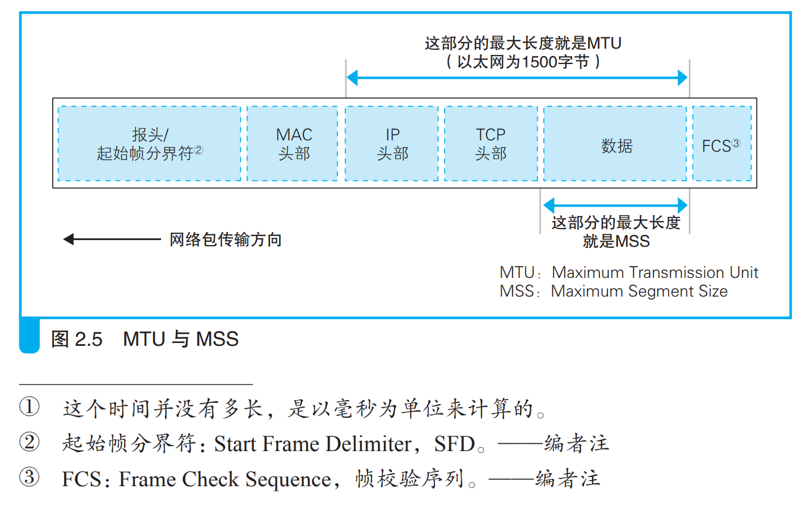
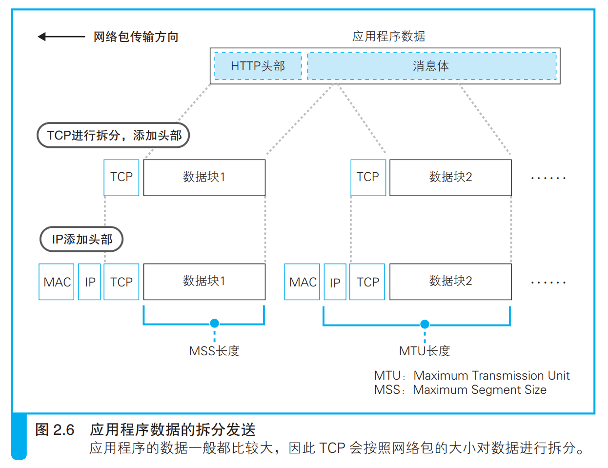

网络是怎样连接的

- [第二章-用电信号传输TCP/IP数据-探索协议栈和网卡](#第二章-用电信号传输tcpip数据-探索协议栈和网卡)
  - [2.1-创建套接字](#21-创建套接字)
    - [2.1.1-协议栈内部结构](#211-协议栈内部结构)
    - [2.1.2-套接字的实体就是通信控制信息](#212-套接字的实体就是通信控制信息)
    - [2.1.3-调用 socket 时的操作](#213-调用-socket-时的操作)
  - [2.2-连接服务器](#22-连接服务器)
    - [2.2.1-连接是什么意思](#221-连接是什么意思)
    - [2.2.2-负责保存控制信息的头部](#222-负责保存控制信息的头部)
    - [2.2.3-连接操作的实际过程](#223-连接操作的实际过程)
  - [2.3-收发数据](#23-收发数据)
    - [2.3.1-将 HTTP 请求消息交给协议栈](#231-将-http-请求消息交给协议栈)
    - [2.3.2-对较大的数据进行拆分](#232-对较大的数据进行拆分)
    - [2.3.3-使用 ACK 号确认网络包已收到](#233-使用-ack-号确认网络包已收到)
    - [2.3.4-根据网络包平均往返时间调整ACK号等待时间](#234-根据网络包平均往返时间调整ack号等待时间)
    - [2.3.5-使用窗口有效管理ACK号](#235-使用窗口有效管理ack号)
    - [2.3.6-ACK与窗口的合并](#236-ack与窗口的合并)
    - [2.3.7-接收HTTP响应消息](#237-接收http响应消息)
  - [2.4-从服务器断开并删除套接字](#24-从服务器断开并删除套接字)
    - [2.4.1-数据发送完毕后断开连接](#241-数据发送完毕后断开连接)

# 第二章-用电信号传输TCP/IP数据-探索协议栈和网卡

## 2.1-创建套接字

### 2.1.1-协议栈内部结构

协议栈就是网络控制软件；
* TCP, Transmisson Control Protocol
* UDP, User Datagram Protocol
* IP, Internet Protocol
* ICMP, Internet Control Messsage Protocol
* ARP, Address Resolution Protocol

IP 协议负责将网络包发送给通信对象；IP 协议还包含 ICMP 协议和 ARP 协议；

ICMP 协议用于告知网络包传送过程中产生的错误以及各种控制消息；

ARP 协议用于根据 IP 地址查询相应的以太网 MAC 地址；

网卡驱动程序负责控制网卡硬件，网卡负责完成实际的收发工作；

### 2.1.2-套接字的实体就是通信控制信息

套接字只是一个概念而已，并不存在实体；

如果一定要定义一个实体的话，可以说存放控制信息的内存空间就是套接字的实体；协议栈在在执行操作时需要参阅这些控制信息；

协议栈是根据套接字中记录的控制信息来工作的。

### 2.1.3-调用 socket 时的操作

> 小写的socket表示程序组件的名称，大写字母开头的Socket表示库，“套接字”表示管道两端的接口；

创建套接字时，首先分配一个套接字所需的空间，然后向其中写入初始状态；

套接字创建完成后，协议栈会返回一个描述符，应用程序会将收到的描述符存放在内存中。描述符是用来识别不同的套接字的；

## 2.2-连接服务器

### 2.2.1-连接是什么意思

连接实际上就是通信双方交换控制信息；

连接操作的目的一：把服务器的IP地址和端口号等信息告知协议栈；
连接操作的目的二：客户端向服务器传达开始通信的请求；

### 2.2.2-负责保存控制信息的头部

通信操作中使用的控制信息分为两类。
1. 头部中记录的信息
2. 套接字（协议栈中的内存空间）中记录的信息

### 2.2.3-连接操作的实际过程

连接操作的第一步是在 TCP 模块处创建表示连接控制信息的头部；

通过 TCP 头部中的发送方和接收方端口号可以找到要连接的套接字；

TCP 模块将信息传递给IP模块并委托它进行发送，服务器IP模块接收到后传递给TCP模块，根据对应的套接字写入相应的信息并将状态改为正在连接；然后服务端TCP模块返回响应，在TCP头部中设置发送方和接收方端口号以及SYN比特（如果服务端不接受连接，那就不设置SYN，而是将RST比特置为1），ACK控制位设置为1。

## 2.3-收发数据

### 2.3.1-将 HTTP 请求消息交给协议栈

数据收发操作是从应用程序调用 write 将要发送的数据交给协议栈开始的；协议栈并不是收到数据立马发出去，而是将数据存放在内部的发送缓冲区中，并等待应用程序的下一段数据；数据积累到一定量的时候进行发送操作；

发送判断要素：
* 每个网络包能容纳的数据长度；
> MTU：Maximum Transmission Unit，最大传输单元  
> MTU：一个网络包的最大长度，以太网中一般为 1500 字节。 
> MSS：Maximum Segment Size，最大分段大小。 TCP 和 IP 的头部加起来一般是 40 字节，因此 MTU 减去这个长度就是 MSS。例如，在以太网中，MTU 为 1500，因此 MSS 就 是 1460。TCP/IP 可以使用一些可选参数（protocol option），如加密等，这时头部的长度会增加，那么 MSS 就会随着头部长度增加而相应缩短。 

* 时间；
> 协议栈的内部有一个计时器，当经过一定时间之后，就会把网络包发送出去；

### 2.3.2-对较大的数据进行拆分

### 2.3.3-使用 ACK 号确认网络包已收到

TCP 具备确认对方是否成功收到网络包，以及当对方没收到时进行重发的功能；

如果确认没有遗漏，接收方会将到目前为止接收到的数据长度加起来，计算出一共已经收到了多少个字节，然后将这个数值写入 TCP 头部的 ACK 号中发送给发送方。

> 返回 ACK 号时，除了要设置 ACK 号的值以外，还需要将控制位中的ACK 比特设为 1，这代表 ACK 号字段有效，接收方也就可以知道这个网络包是用来告知 ACK 号的。

关于客户端序列号是在第一次握手是告知对方的（序列号初始值时随机的，防止被攻击），服务端返回响应是也会告知客户端自己的序列号；

TCP 采用这样的方式确认对方是否收到了数据，在得到对方确认之前，发送过的包都会保存在发送缓冲区中。如果对方没有返回某些包对应的 ACK 号，那么就重新发送这些包。(超时重发)

网卡、集线器、路由器都没有错误补偿机制，一旦检测到错误就直接丢弃相应的包。如果发生网络中断、服务器宕机等问题，那么无论 TCP 怎样重传都不管用，重传超时之后就会强制结束通信，并向应用程序报错；

### 2.3.4-根据网络包平均往返时间调整ACK号等待时间

实际上网络的错误检测和补偿机制非常复杂，对于返回ACK号的等待时间（超时时间），TCP采用动态调整等待时间的方法，等待时间是根据ACK号的返回所需的时间来判断的；

### 2.3.5-使用窗口有效管理ACK号

滑动窗口，就是在发送一个包之后，不等待 ACK 号返回，而是直接发送后续的一系列包。这样一来，等待 ACK 号的这段时间就被有效利用起来。

接收方的最大数据量称为窗口大小，也是TCP调优参数中有名的一个，一般和接收方的缓冲区大小一致； 

### 2.3.6-ACK与窗口的合并

更新窗口大小的时机应该是接收方从缓冲区中取出数据传递给应用程序的时候。

当接收方收到数据时，如果确认内容没有问题，就应该向发送方返回 ACK 号。

如果分开发送这两个包，就很容易导致网络效率下降。合并发送，并且只发送连续包的最后一个合并包即可；

### 2.3.7-接收HTTP响应消息

浏览器调用read程序获取响应消息，控制流程转移到协议栈；如果接收缓冲区中还没有数据，从接收缓冲区中取数据并传递给应用程序的工作就会挂起；但在实际中，协议栈会去继续执行其他工作；

## 2.4-从服务器断开并删除套接字

### 2.4.1-数据发送完毕后断开连接