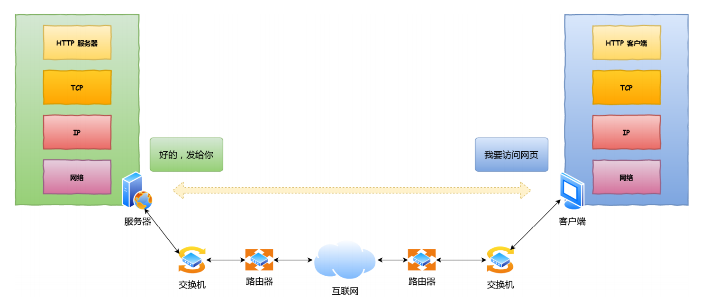
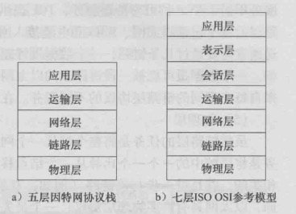
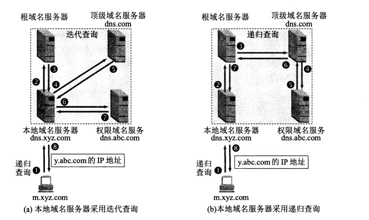
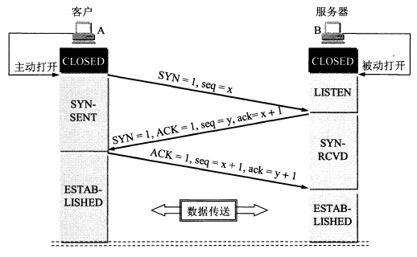
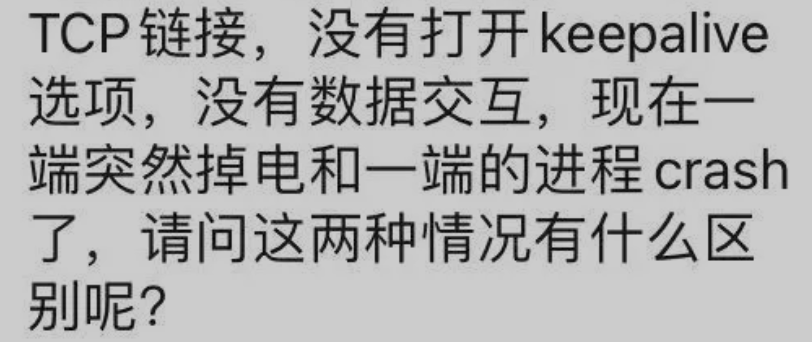
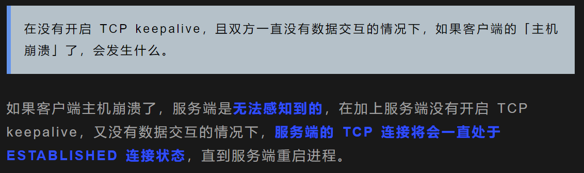
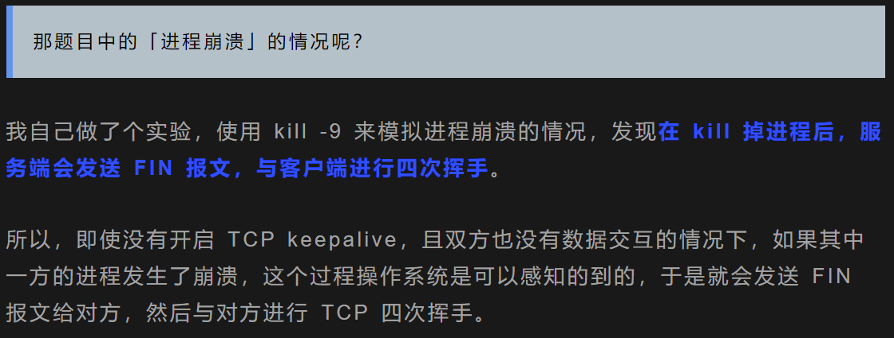
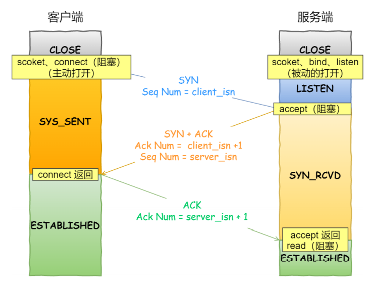

# **CONTENT**

- [**CONTENT**](#content)
  - [**:fire:常用缩写**](#fire常用缩写)
  - [**网络中数据传输整个过程**](#网络中数据传输整个过程)
  - [**基础知识**](#基础知识)
    - [协议层次与模型](#协议层次与模型)
    - [各层单位](#各层单位)
- [**疑问:boom:**](#疑问boom)
  - [**应用层:computer:**](#应用层computer)
    - [HTTP & HTTPS 的区别？](#http--https-的区别)
    - [SSL/TLS 如何保证安全性？](#ssltls-如何保证安全性)
    - [SSL/TLS 工作原理？](#ssltls-工作原理)
    - [密钥交换算法？](#密钥交换算法)
      - [RSA](#rsa)
      - [ECDHE](#ecdhe)
    - [SSL/TLS 工作过程？](#ssltls-工作过程)
    - [说说 HTTP/1.1 相⽐ HTTP/1.0 提⾼了什么性能？](#说说-http11-相-http10-提了什么性能)
    - [HTTP/1.1 和 HTTP/2.0 的区别？](#http11-和-http20-的区别)
    - [优化 HTTP/1.1 协议？](#优化-http11-协议)
    - [HTTP 请求方法？](#http-请求方法)
    - [GET 与 POST 的区别？](#get-与-post-的区别)
    - [HTTP 状态码？](#http-状态码)
    - [HTTPS 安全性实现？](#https-安全性实现)
    - [在浏览器中输入 URL 后执行的全部过程？:bookmark:](#在浏览器中输入-url-后执行的全部过程bookmark)
    - [DNS 是什么？具体原理？](#dns-是什么具体原理)
    - [DNS 递归与迭代查询](#dns-递归与迭代查询)
    - [HTTP 中 Keep-alive 和 TCP 中的 Keep-alive？](#http-中-keep-alive-和-tcp-中的-keep-alive)
  - [**:train:运输层 :fire: :fire:**](#train运输层-fire-fire)
    - [TCP & UDP の区别？](#tcp--udp-の区别)
    - [TCP 报文首部格式？](#tcp-报文首部格式)
    - [UDP 首部格式？](#udp-首部格式)
    - [流量控制与拥塞控制的区别？](#流量控制与拥塞控制的区别)
    - [为什么需要3次握手而不是4次或2次？](#为什么需要3次握手而不是4次或2次)
    - [四次挥手？](#四次挥手)
    - [TIME-WAIT 状态の详细说明？](#time-wait-状态の详细说明)
    - [为什么等待2*MSL？](#为什么等待2msl)
    - [TCP 如何保证可靠性？](#tcp-如何保证可靠性)
    - [TCP保活时异常状况？](#tcp保活时异常状况)
    - [connect 和 accept 发生在哪个那次握手中？](#connect-和-accept-发生在哪个那次握手中)
    - [滑动窗口？](#滑动窗口)
    - [TCP 如何解决窗口关闭时，潜在的死锁现象？](#tcp-如何解决窗口关闭时潜在的死锁现象)
    - [糊涂窗口综合征？](#糊涂窗口综合征)
    - [拥塞控制算法？](#拥塞控制算法)
  - [**网络层 :apple:**](#网络层-apple)
    - [IP 协议？](#ip-协议)
    - [DHCP 协议？](#dhcp-协议)
    - [ping 原理？](#ping-原理)
  - [**信息安全**](#信息安全)
    - [信息安全的四个特性是什么？](#信息安全的四个特性是什么)
    - [加密算法？](#加密算法)

---

<br>


## **:fire:常用缩写**

<br>

|简写|含义|
|:--:|--|
|RTT|往返时间|
|MSS|最大报文长度
|MSL|最长分节生命期，是任何IP数据报能够在因特网中存活的最长时间
|MTU|最大传输单元，一个链路层帧能承载的最大数据量
|DHCP|动态主机分配协议，获取IP地址及配置信息
|NAT|网络地址转换，私有IP转公有IP
|ICMP|互联网控制报文协议
|ARP|地址解析协议：提供将IP地址转换链路层地址/ IP->MAC


|应用层协议|端口号|运输层协议|
|:--:|:--:|:--:|
|DNS|53|UDP/TCP|
|FTP|21(控制连接)，20(数据连接)|TCP|
|TELNET|23|TCP|
|DHCP|67(服务器)，68(客户端)|UDP|
|HTTP|80|TCP|
|HTTPS|443|TCP|
|SMTP|25|TCP|
|POP3|110|TCP|
|IMAP|143|TCP|

<br>

---

## **网络中数据传输整个过程**

[网络过程](/D:/Learn/Coder/CodeBase/%E4%BA%AE%E7%99%BD%E9%A3%8E%E6%A0%BC-%E5%9B%BE%E8%A7%A3%E7%BD%91%E7%BB%9C-%E5%B0%8F%E6%9E%97coding-v3.0.pdf)



---

## **基础知识**

### 协议层次与模型


* **五层因特网协议栈**
    - **应用层**：任务是通过应用进程间的交互来完成特定网络应用
    - **运输层**：负责向两台主机中进程之间的通信提供数据传输服务
    - **网络层**：负责为分组交换网上的不同主机提供通信服务、选择合适的路由（寻址定位，路由）
    - **链路层**：将网络层的数据报封装成帧，使用链路层协议在相邻节点间的链路上传输帧
    - **物理层**：将帧中一个个比特从一个节点移动到下一个节点
* **七层OSI参考模型**
    - **表示层**：使通信的应用程序能够解释交换数据的含义，提供数据压缩、数据加密等服务
    - **会话层**：提供了数据交换的定界和同步功能，包括建立检查点和恢复方案的方法

### 各层单位

* 数据帧（Frame）：是一种信息单位，它的起始点和目的点都是**数据链路层**。
* 数据包（Packet）：也是一种信息单位，它的起始和目的地是**网络层**。
* 数据报（Datagram）：通常是指起始点和目的地都使用**无连接网络服务的的网络层**的信息单元。
* 段（Segment）：通常是指起始点和目的地都是**传输层**的信息单元。
* 消息（message）：是指起始点和目的地都在网络层以上（经常在**应用层**）的信息单元。

[OSI七层各层单位详解](https://www.cnblogs.com/alex-hrg/articles/9809240.html)

# **疑问:boom:**

## **应用层:computer:**

---

### HTTP & HTTPS 的区别？
1. `HTTP` 是超⽂本传输协议，信息是明⽂传输，存在安全⻛险的问题。`HTTPS` 则解决 `HTTP` 不安全的缺陷，在
`TCP` 和 `HTTP` ⽹络层之间加⼊了 `SSL/TLS` 安全协议，使得报⽂能够加密传输。
2. `HTTP` 连接建⽴相对简单， `TCP` 三次握⼿之后便可进⾏ `HTTP` 的报⽂传输。⽽ `HTTPS` 在 `TCP` 三次握⼿之后，还需进⾏ `SSL/TLS` 的握⼿过程，才可进⼊加密报⽂传输。
3. `HTTP` 的端⼝号是 `80`，`HTTPS` 的端⼝号是 `443`。
4. `HTTPS` 协议需要向 `CA（证书权威机构）`申请数字证书，来保证服务器的身份是可信的。

---

### SSL/TLS 如何保证安全性？
* 混合加密算法保证数据的机密性，解决了被窃听的风险；
* 摘要算法用来保证数据的完整性，解决了被篡改的风险；
* 服务器CA数字证书用来保证可信性，解决了被冒充的风险；

---

### SSL/TLS 工作原理？
1.	通过CA体系发送公钥（或者说是数字证书）；

2.	通过非对称加密算法确定对称加密的密钥；

3.	通过对称加密算法进行网络通信。

>**补充**：
由于非对称加密算法比对称加密算法复杂很多，同时处理效率也会低很多，所以在实际的SSL/TLS层工作中，非对称加密算法只用于传输对称加密的密钥，真正在通信的过程中使用的是对称加密算法。

---

### 密钥交换算法？
为了保证对称加密密钥的安全性，所以使⽤非对称加密的⽅式来保护对称加密密钥的协商，这个工作就是密钥交换算法负责；

#### RSA 
* 不具备前向安全

#### ECDHE
* 具备前向安全


---
### SSL/TLS 工作过程？
1.	用户向Web服务器发起访问请求；
2.	Web服务器将自己的CA认证的数字证书发给用户；
3.	用户拿到数字证书，并用自己浏览器内置的CA证书解密得到Web服务器的公钥；
4.	用户使用服务器的公钥对于对称加密算法的密钥进行加密，发送给Web服务器；
5.	服务器收到后，用自己的私钥解密，得到对称加密算法的密钥；
6.	双方使用对称加密算法开始通信。

工作过程包含4次握手（RSA 的）：
1. C:Client Hello - 随机数C，客户端TLS版本号，密码套件列表
2. S:Server Hello, Certificate, Server Hello Done - 随机数S，确认TLS版本号，使用密码套件RSA & 服务器使用证书 & 服务器hello完成
3. C:Client Key Exchange, Change Cipher Spec, Encrypted Handshake Message - 服务器（RSA）公钥加密pre-master & 之后会话密钥加密通信
4. S:Change Cipher Spec, Encrypted Handshake Message - 之后会话密钥通信


---
### 说说 HTTP/1.1 相⽐ HTTP/1.0 提⾼了什么性能？
* 使⽤ TCP ⻓连接的⽅式改善了 HTTP/1.0 短连接造成的性能开销。
* ⽀持管道`pipeline`⽹络传输，只要第⼀个请求发出去了，不必等其回来，就可以发第⼆个请求出去，可以减少整体的响应时间。
  - 存在的问题：队头堵塞；
* 断点续传
* 新增状态码

---
### HTTP/1.1 和 HTTP/2.0 的区别？
* HTTP/2.0 **压缩头部** ( header ) ,通过 `HPACK` 算法，只发送头部相同或相似部分的索引；
* HTTP/2.0 采用**二进制格式**，头信息帧和数据帧；HTTP/1.1 采用的是纯文本形式的报文；
* 数据流，每个请求或回应的所有数据包，称为⼀个数据流（ Stream ）；客户端还可以指定数据流的优先级；优先级高的请求，服务器就先响应该请求；
* 多路复用，⼀个连接中并发多个请求或回应，⽽不⽤按照顺序⼀⼀对应；HTTP/1.1 中串行请求；
* **服务器推送**，HTTP/2.0 还在⼀定程度上改善了传统的「请求 - 应答」⼯作模式，服务不再是被动地响应，也可以主动向客户端发送消息；

---
### 优化 HTTP/1.1 协议？
* 通过缓存技术避免重复的HTTP请求；
  - 客户端收到第⼀个请求的响应后，可以将其缓存在本地磁盘，下次请求的时候，如果缓存没过期，就直接读取本地缓存的响应数据。如果缓存过期，客户端发送请求的时候带上响应数据的摘要，服务器⽐对后发现资源没有变化，就发出不带包体的 304 响应，告诉客户端缓存的响应仍然有效。

* 减少HTTP请求的次数
  - 将原本由客户端处理的᯿定向请求，交给代理服务器处理，这样可以减少᯿定向请求的次数；
  - 将多个小资源合并成⼀个⼤资源再传输，能够减少 HTTP 请求次数以及头部重复传输，再来减少 TCP 连接数，进⽽省去 TCP 握⼿和慢启动的⽹络消耗；
  - 按需访问资源，只访问当前⽤户看得到/⽤得到的资源，当客户往下滑动，再访问接下来的资源，以此达到延迟请求，也就减少了同⼀时间的 HTTP 请求次数。

* 压缩响应资源；选择合适的压缩算法；

---
### HTTP 请求方法？
* **GET**：绝大部分HTTP请求报文使用GET方法
* **POST**：用户提交表单时（如向搜索引擎提供关键字），但提交表单不一定要用POST方法
* **HEAD**：类似于GET，区别在于服务器返回的响应报文中不包含请求对象（常用于故障跟踪）
* **PUT**：用于向服务器上传对象
* **DELETE**：用于删除服务器上的对象

---

### GET 与 POST 的区别？
* **作用：** GET 用于获取资源，而 POST 用于传输实体主体。
* **参数：** GET 和 POST 的请求都能使用额外的参数，但是 GET 的参数是以查询字符串出现在 URL 中，而 POST 的参数存储在实体主体中。
* **安全：** GET 方法是安全的，而 POST 却不是；
  - **安全的方法** 除了 GET 之外还有：HEAD、OPTIONS。
  - **不安全的方法** 除了 POST 之外还有 PUT、DELETE。
* **幂等性：** 在正确实现的条件下，GET，HEAD，PUT 和 DELETE 等方法都是幂等的，而 POST 方法不是；
  - 幂等性：同样的请求被执行一次与连续执行多次的效果是一样的，服务器的状态也是一样的；

---

### HTTP 状态码？

| 状态码 | 类别 | 含义 |
| :---: | :---: | :---: |
| 1XX | Informational（信息性状态码） | 接收的请求正在处理 |
| 2XX | Success（成功状态码） | 请求正常处理完毕 |
| 3XX | Redirection（重定向状态码） | 需要进行附加操作以完成请求 |
| 4XX | Client Error（客户端错误状态码） | 服务器无法处理请求 |
| 5XX | Server Error（服务器错误状态码） | 服务器处理请求出错 |

* **200 OK**：请求成功，信息包含在返回的响应报文中 

<br>

* **301 Moved Permanently**：请求的对象已经被永久转移了，新的URL定义在响应报文的Location首部中。客户机软件自动用新的URL获取对象
* **302	Found**：临时移动。与301类似，但资源只是临时被移动，客户端应继续使用原有URI
* **304 Not Modified**：条件GET的响应报文中的状态码，web服务器告诉web缓存相应对象未被修改

<br>

* **400 Bad Request**：请求不能被服务器理解
* **403 Forbidden**：服务器收到请求，但是拒绝提供服务。服务器通常会在响应报文中给出不提供服务的原因
* **404 Not Found**：被请求的资源不在服务器上

<br>

* **500 Internal Server Error**：服务器内部错误，无法完成请求
* **503	Service Unavailable**：由于超载或系统维护，服务器暂时的无法处理客户端的请求。
* **505 HTTP Version Not Supported**：服务器不支持请求报文使用的HTTP协议版本

---

### HTTPS 安全性实现？
* HTTPS 并不是新协议，而是让 HTTP 先和 SSL（Secure Sockets Layer）通信，再由 SSL 和 TCP 通信，也就是说 HTTPS 使用了隧道进行通信。
* 通过使用 SSL，HTTPS 具有了加密（防窃听）、认证（防伪装）和完整性保护（防篡改）。
  - **加密：** HTTPS 采用 **混合加密** 机制
    - 使用非对称密钥加密方式，传输对称密钥加密方式所需要的 Secret Key，从而保证安全性;
    - 获取到 Secret Key 后，再使用对称密钥加密方式进行通信，从而保证效率。
  - **认证：** 通过使用 **证书** 来对通信方进行认证。
  - **完整性保护：** SSL 提供 **报文摘要** 功能来进行完整性保护。

---

### 在浏览器中输入 URL 后执行的全部过程？[:bookmark:](https://github.com/CyC2018/CS-Notes/blob/master/notes/%E8%AE%A1%E7%AE%97%E6%9C%BA%E7%BD%91%E7%BB%9C%20-%20%E5%BA%94%E7%94%A8%E5%B1%82.md#web-%E9%A1%B5%E9%9D%A2%E8%AF%B7%E6%B1%82%E8%BF%87%E7%A8%8B)
* DHCP 获取主机和网关路由IP
* ARP 解析网关路由 MAC
* DNS 解析域名
* HTTP 请求 -- TCP 握手 -- HTTP 响应

---
### DNS 是什么？具体原理？
DNS，域名系统；

查询步骤：



---
### DNS 递归与迭代查询
[DNS解析原理:递归 VS 迭代](https://www.jianshu.com/p/6b502d0f2ede)

DNS解析流程分为递归查询和迭代查询，递归查询是以本地名称服务器为中心查询，递归查询是默认方式，迭代查询是以DNS客户端，也就是客户机器为中心查询。其实DNS客户端和本地名称服务器是递归，而本地名称服务器和其他名称服务器之间是迭代。

递归：
<div align="center">  </div>

迭代：
<div align="center">  </div>

---
### HTTP 中 Keep-alive 和 TCP 中的 Keep-alive？

[TCP 的 Keepalive 和 HTTP 的 Keep-Alive 是一个东西吗？](https://www.cnblogs.com/xiaolincoding/p/14984584.html)

HTTP 中，Keep-alive 是为了让 TCP 活得更久一点，以便在同一连接上传输更多的 HTTP，提高 socket 的效率；这是在应用层实现的，也叫 HTTP 长连接；

TCP 中，Keep-alive 是一种检测 TCP 连接状况的保鲜机制；这是在运输层TCP 中实现的，由内核操作；

<br>

## **:train:运输层 :fire: :fire:**

---
### TCP & UDP の区别？

* 用户数据报协议 UDP（User Datagram Protocol）是无连接的，尽最大可能交付，没有拥塞控制，面向报文（对于应用程序传下来的报文不合并也不拆分，只是添加 UDP 首部），支持一对一、一对多、多对一和多对多的交互通信。
* 传输控制协议 TCP（Transmission Control Protocol）是面向连接的，提供可靠交付，有流量控制，拥塞控制，提供全双工通信，面向字节流（把应用层传下来的报文看成字节流，把字节流组织成大小不等的数据块），每一条 TCP 连接只能是点对点的（一对一）。

---
### TCP 报文首部格式？

<div align="center">  </div><br>
TCP 首部和 IP 首部一样，都是20个字节 

---
### UDP 首部格式？

<div align="center">  </div><br>

首部字段只有 8 个字节，包括源端口、目的端口、长度、检验和。12 字节的伪首部是为了计算检验和临时添加的。

---
### 流量控制与拥塞控制的区别？
* **流量控制：** 控制的是发送端的发送速度；
  
  如果应用程序读取数据相当慢，而发送方发送数据太多、太快，会很容易使接收方的接收缓存溢出，流量控制就是用来进行发送速度和接收速度的匹配。发送方维护一个"接收窗口"变量，这个变量表示接收方当前可用的缓存空间
* **拥塞控制：** 控制的是整个网络的拥堵情况；
  - 由于IP层不向端系统提供显示的网络拥塞反馈，所以TCP必须使用端到端拥塞控制，而不是网络辅助拥塞控制
  - **TCP连接的两方都记录一个额外的变量：拥塞窗口(CongWin)**，它对一个TCP发送方能向网络中发送流量的速率进行了限制。

**出发点** 不同：流量控制是为了让接收方能来得及接收，而拥塞控制是为了降低整个网络的拥塞程度。

---

### 为什么需要3次握手而不是4次或2次？
<div align="center">  </div><br>

* 四次握手就是将第二步拆分为两个分步骤，影响连接效率和速度；
* 两次握手就另一方的序列号无法确认；
* 第三次握手是为了防止失效的连接请求到达服务器，让服务器错误打开连接。

另一种回答：
* 首要原因是为了防⽌旧的重复连接初始化造成混乱
* 同步双方初始序列号；
* 避免建立冗余无效连接，造成资源浪费；

```bash
# 三次握手
A     -- [SYN + seq(x)] -->        B
A <-- [ACK(x+1) + SYN + seq(y)] -- B
A   -- [seq(x+1) + ACK(y+1)] -->   B
```
> **如果丢包 ？**
* **第二个包，即B发给A的SYN +ACK 中途被丢，没有到达A**：B会周期性超时重传，直到收到A的确认 
* **第三个包，即A发给B的ACK 中途被丢，没有到达B**：A发完ACK，单方面认为TCP为 Established状态，而B显然认为TCP为Active状态
    - **假定此时双方都没有数据发送**：B会周期性超时重传，直到收到A的确认，收到之后B的TCP 连接也为Established状态，双向可以发包
    - **假定此时A有数据发送**：B收到A的 Data + ACK，自然会切换为established 状态，并接受A的Data
    - **假定B有数据发送**：数据发送不了，会一直周期性超时重传SYN + ACK，直到收到A的确认才可以发送数据

---

### 四次挥手？

<div align="center">  </div><br>

* 四次挥手是因为TCP是全双工的，前2次挥手用于关闭一个方向的数据通道，后两次挥手用于关闭另外一个方向的数据通道

---
### TIME-WAIT 状态の详细说明？

[:pencil:](https://www.iteye.com/blog/elf8848-1739571)
* 可靠地实现TCP全双工连接的终止
* 等待迷途分组在网络中消逝
* TCP 协议不允许处于 TIME_WAIT 状态的连接启动一个新的可用连接

---
### 为什么等待2*MSL？
* MSL 是 Maximum Segment Lifetime，报文最⼤⽣存时间，⽹络中可能存在来⾃发送方的数据包，当这些发送方的数据包被接收方处理后⼜会向对方发送响应，所以⼀来⼀回需要等待 2 倍的时间；
* 例如：如果被动关闭方没有收到断开连接的最后的 ACK 报文，就会触发超时重发 FIN 报文，另一方接收到 FIN 后，会重发 ACK 给被动关闭方， ⼀来⼀去正好 2 个 MSL；


---
### TCP 如何保证可靠性？
* 通过超时重传，应答保证数据不会丢失
* 通过校验和保证数据可靠
* 通过序号，ACK，滑动窗口保证数据顺序性和有效性
* 通过拥塞控制缓解网络压力，通过流量控制同步收发速率

---
### TCP保活时异常状况？
* 对端程序是正常工作的。当 TCP 保活的探测报⽂发送给对端, 对端会正常响应，这样 TCP 保活时间会被重置，等待下⼀个 TCP 保活时间的到来。
* 对端程序崩溃并重启。当 TCP 保活的探测报⽂发送给对端后，对端是可以响应的，但由于没有该连接的有效信息，会产⽣⼀个 RST 报⽂，这样很快就会发现 TCP 连接已经被重置；
* 是对端程序崩溃，或对端由于其他原因导致报⽂不可达。当 TCP 保活的探测报⽂发送给对端后，⽯沉⼤海，没有响应，连续⼏次，达到保活探测次数后，TCP 会报告该 TCP 连接已经死亡。

[类似异常处理机制](https://mp.weixin.qq.com/s/XWyKGrkVE_OejOkn0sAEMg)







---
### connect 和 accept 发生在哪个那次握手中？



客户端 connect 成功返回是在第⼆次握⼿，服务端 accept 成功返回是在三次握手成功之后。

---
### 滑动窗口？
* 滑动窗口就是操作系统开辟的一个缓存空间；
* TCP 头部中有一个字段叫window，窗口大小；这个字段是接收段告诉发送端自己缓冲区还可以接收多少数据，于是发送端就可以根据这个接收端的处理能力来发送数据，不会导致接收端处理不过来；

---
### TCP 如何解决窗口关闭时，潜在的死锁现象？
只要TCP连接一方收到对方的零窗口通知，启动一个持续计时器，如果计时器超时，就发送窗口探测报文，对方确认之后，给出自己现在的接收窗口大小；

---

### 糊涂窗口综合征？
接收方太慢，来不及读取接收窗口里的数据，那么就会导致发送方的窗口大小越来越小，但是发送方还是会发送这几个字节；（IP头 + TCP头 有40个字节，可能就只发送了几个字节的数据而已）

解决办法：
* 让接收方不通告小窗口 `<= min(MSS,缓存空间/2)` 给发送方，窗口大小通告为0；
* 让发送发避免发送小数据；
  - Nagle 算法，该算法的思路就是延时处理，满足两者之一就可以发送；
  - 窗口 >= MSS，或者数据大小 >= MSS,
  - 收到之前发送窗口的ack 回包；


---
### 拥塞控制算法？
拥塞窗口cwnd，发送方维护的一个状态量，根据网络的拥塞程度动态变化；

发送端的发送窗口的值 `swnd = min(cwnd,rwnd);` rwnd 接收窗口；

TCP 主要通过四个算法来进行拥塞控制：慢开始、拥塞避免、快重传、快恢复
<div align="center">  </div><br>

* 慢开始：每接收一个ACK，翻倍增加；cwnd < ssthresh(slow start threshold,慢启动门限)； cwnd >= ssthresh，启动拥塞避免；
* 拥塞避免：每接收一个ACK，cwnd 每次 + 1/cwnd；慢慢进入拥塞状况后，开始丢包，就要对丢包重传，进入拥塞发生算法；
* 快重传：在发送方，如果收到三个重复确认ACK，那么可以知道下一个报文段丢失，此时执行快重传；cwnd = cwnd/2; ssthresh = cwnd；在这种情况下，只是丢失个别报文段，而不是网络拥塞。因此执行快恢复；
* 快恢复：令 cwnd = ssthresh + 3，再收到重复ACK，那么cwnd+1，如果收到新数据的ACK，那么cwnd = ssthresh；恢复结束！注意到此时直接进入拥塞避免。

---

<br><br>

## **网络层 :apple:**

---

### IP 协议？
网际协议，与 IP 协议配套使用的还有三个协议：

- 地址解析协议 ARP（Address Resolution Protocol）
  <br>ARP 实现由 IP 地址得到 MAC 地址。
- 网际控制报文协议 ICMP（Internet Control Message Protocol）
  <br>ICMP 是为了更有效地转发 IP 数据报和提高交付成功的机会。
  <br>应用：ping
- 网际组管理协议 IGMP（Internet Group Management Protocol）

---
### DHCP 协议？
动态主机配置协议：
一个组织一旦获得一块地址，就可以为该组织内的主机和路由器接口分配独立的IP地址

DHCP可以提供以下服务：

* 为主机分配IP地址
* 获取子网掩码
* 获取第一跳路由器地址（常称为默认网关）
* 提供本地DNS服务器的地址（记录在/etc/resolv.conf文件中）

由于DHCP具有能将主机连接进一个网络的自动化网络相关方面的能力，故它又常被称为**即插即用协议**；

---
### ping 原理？
ICMP 中的查询报文类型；

回送消息用于进行通信的主机和路由器之间，判断所发送的数据包是否已经成功到达对端的一种消息；ping 命令就是利用这个消息实现的；

可以向对端主机发送回送请求的消息（ ICMP Echo Request Message ，类型 8 ），也可以接收对端主机发回来的回送应答消息（ ICMP Echo Reply Message ，类型 0 ）；


<br><br>

## **信息安全**

---
### 信息安全的四个特性是什么？
**机密性**：防止信息被窃听，对应的技术有对称加密算法和非对称加密算法。

**完整性**：防止信息被篡改，对应的技术有散列算法，数字签名。

**身份认证性**：防止黑客伪装成发送者，对应的技术有数字签名。

**不可否认性**：防止发送者事后否认自己发送过，对应的技术有数字签名。

---
### 加密算法？
在如今的信息安全领域，加密算法可以分为以下四类：
* **哈希算法**
* **对称加密算法**
* **非对称加密算法**
* **数字签名算法**


**哈希算法**

**哈希算法**也称为**信息摘要算法**（或**散列算法**）。常见的哈希算法有**MD5算法**，**SHA算法**。

*  **MD5算法**
原理是将任何信息（不论大小，格式，数量）经过处理后，用一个定长的散列值表示。

* **SHA算法**
与MD5算法类似，将任何信息处理后以某一个散列值表示。例如**linux系统用户的密码**就是使用SHA-512算法进行加密后放在 `/etc/shadow` 文件中。

**对称加密算法**

对称加密算法也就是**加密和解密采用同一个密钥**。
这种加密方式由于需要传输密钥，所以有很大的安全性问题。常见的对称加密算法有**DES**，**AES**。


**非对称加密算法**

非对称加密算法也就是**加密和解密使用的并不是同一个密钥**。
通常有两个密钥，分别称为**公钥**和**私钥**，公钥可以对外公布，私钥只能持有人自己所拥有不能对外公开。非对称加密算法有效的避免了密钥的传输安全性问题。常见的非对称加密算法有**RSA**。


**数字签名算法**

准确的来说，数字签名算法也属于非对称加密算法中的一种。

* **数字签名**

对于明文信息先进行哈希算法求得信息摘要，后再用自身私钥进行加密后求得数字签名。**数字签名的作用是证明该信息是否为本人所写**。

* **数字证书**

将自身的公钥和一些相关信息，交给`CA（certificate authority 认证机构）`并利用CA的私钥进行加密后得到数字证书。**数字证书的作用是传递公钥**。


